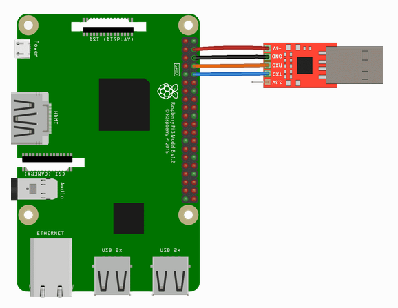

# Lab 1: Raspberry Piを動かす

## はじめに

この課題ではこのコースを通じて使用するRaspberry Pi 3とARM64開発環境をセット
アップしてテストします。必要なツールをインストールし、最初のベアメタル
アプリケーションであるLED点滅プログラムを2つの言語CとRustで書きます。

この課題は4つのフェーズに分かれています。第1フェーズではあなたのマシンから
Piと通信するために必要なソフトウェアをインストールします。また、事前に
コンパイル済みのプログラムを実行することでPiが期待通りに動作することを確認
します。第2フェーズではRaspberry PiのGPIOピン16にLEDを接続し、2つ目の
コンパイル済みプログラムを実行して接続が正常であることを確認します。第3
フェーズではGPIOピン16をオン／オフしてPiに接続されているLEDを点滅させる
Cプログラムを作成・クロスコンパイル・リンクします。最後に、第4フェーズでは
同じプログラムをRustで書いてクロスコンパイルしてリンクします。

## フェーズ 0: 事前チェック

[省略]

### スケルトンコードの取得

lab1用のスケルトンコードを取得するにはgitリポジトリから開発マシンに更新
ファイルをフェッチする必要があります。

```bash
$ git fetch skeleton
$ git merge skeleton/lab1
```

以下がリポジトリのディレクトリ構成です。

```bash
.
├── bin : common binaries/utilities
├── doc : reference documents
├── ext : external files (e.g., resources for testing)
└── tut : tutorial/practices
    ├── 0-rustlings
    └── 1-blinky : this contains files for lab1
```

前のラボでの変更が`tut/0-rustlings`にあるためマージ処理がシームレスに
行われるとは思えません。そうでない場合はコンフリクトを解決して次の
フェーズに進んでください。

リポジトリの中身を自由に探索してください。

## フェーズ 1: Piを焼く

[省略]

### Piの電源をいれる

まず、CP2102モジュールをコンピュータから外します。次に、4本のメス-メスの
ジャンパケーブルを使ってRaspberry PiとCP2102モジュールを接続します。下の表は
CP2102モジュールのどのピンをRaspberry Piのどのピンに接続するかを示しています。
CP2102モジュールのピンの名前はモジュール基板の裏を見ればわかります。

| CP2102 Pin | Pi Physical Pin |
|:-----------|:----------------|
| +5v | 4 |
| GND | 6 |
| RXD | 8 |
| Txd | 10 |

Raspberry Pi 3のピンは次のように番号付けされています。


接続は次のようになります（この図では接続順が異なりますがピンの名前だけ
見てください）。



接続を2回、3回、4回チェックしてください。さらに友達にも接続をチェックして
もらいましょう。間違った配線はRaspberry Piを壊してしまい、このコースの
成績は自動的にFになります。もちろんこれは冗談ですが、Raspberry Pi 3は
高価なのででできるのであれば追加のRaspberry Piを配布したくはありません。
ですので、続ける前に接続をさらにチェックしてください。

接続に革新が持てたらCP2102モジュールをコンピュータに接続しましょう。
すべてうまくいっていればRaspberry Piの赤いLEDが光っているはずです。
おめでとう。これでPiへの電源供給と通信ができるようになりました。

### プログラムの実行

講義で説明したようにRaspberry Piは起動時にボードにあるmicroSDカードから
プログラムをロードします。ここではRaspberry Piがロードするカスタム
プログラムをmicroSDカードにセットします。

リポジトリには`ext/rpi3-gpio16`というテストプログラムがあります。この
プログラムをPiにロードするにはディレクトリにあるファイルをmicroSDカードに
コピーするだけです。microSDカードをUSB microSDカードリーダに挿入し、
リーダをマシンに接続します。すると、新しいボリュームがマシンにマウント
されているはずです(そうならなければ[ツール](https://tc.gts3.org/cs3210/2020/spring/lab/tools.html)
ページを参照してください) 。microSDカードをFAT32ファイルシステムに
フォーマットします。そして、ディレクトリにあるすべてのファイル
（`bootcode.bin`, `config.txt`, `fixup.dat`, `start.elf`, `kernel8.img`を
microSDカードのルートにコピーします。講義で説明したようにこれらはブート
時にGPUが読み込む5つのファイルのうちの4つです。5番目の`kernel8.img`は
これからインストールするブートプログラムです。

**注記: bootcode.bin、config.txt、start.elfとは何か**
> これらの特別な名前のファイルは起動時にRaspberry PiのGPUによって
> 認識され、システムの構成とブートストラップに使用されます。`bootcode.bin`
> はGPUのファーストステージブートローダです。その主な仕事はGPUのセカンド
> ブートローダである`start.elf`をロードすることです。`start.elf`は
> ARM CPUを初期化し、`config.txt`にしたがって構成し、`kernel8.img`を
> メモリにロードし、`kernel8.img`から新しくロードしたコードの実行を
> 開始するようCPUに指示します。

[以降省略]

## フェーズ 2: LEDが光を放つ

[省略]

## フェース 3: 輝くC

このフェーズでは`ext/rpi3-gpio16/kernel8.img`を生成するプログラムをCで
書きます。コードは`tut/1-blinky/phase3/blinky.c`に書きます。Raspberry Pi
用のCとアセンブリプログラムをコンパイルできるようにリポジトリの`bin`
ディレクトリにある`aarch64-none-elf`ターゲット用のクロスコンパイラを
使います。

### ハードウェアと会話する

最近のハードウェアデバイスの大部分はメモリマップドI/Oを通じてソフトウェアと
通信します。概念は単純です。デバイスはマシンのメモリを通してその機能を
公開し、その特定のアドレスを読み書しした場合に何が起こるかという仕様を
提供します。アドレスは通常、レジスタとして知られる32ビットまたは64ビット
の大きさの領域に分けらます。通常、レジスタにはその機能を示す名前が付けら
れています。レジスタにはRead Only、Write Only, Read/Writeのものがあります。

デバイスがどのようなレジスタを公開しているのか、メモリのどこにマッピング
されているのか、レジスタは何をするのか、についてはどうやって知るので
しょうか。デバイスメーカーは一般に「データシート」、「デバイス
マニュアル」、または単に「ドキュメント」と呼ばれるものにこれらの情報を
すべて文書化しています。デバイスがどのように文書化されるかについて広く
普及している形式はなく、文書の質には当たり外れがあります。ハードウェアの
ドキュメントを読んで理解することは技術かつ能力です。

### GPIOメモリマップドインタフェース

Rasperry Piに搭載されている多くのペリフェラルのドキュメントはBroadcomの
[BCM2837 ARM Peripherals Manual](file:///Users/dspace/xv6_memos/book/arm/bcm2837/index.html)
（`doc/BCM2837-ARM-Peripherals.pdf`にあり）にあります。たとえば、GPIOの
ドキュメントは89ページにあります。

**注記: ちょっと待った。BCM2837チップを使うんじゃないのですか？**
> リンク先のマニュアルを開くとBCM2835チップへの言及があちこちにあります。
> これは単にBCM2835チップのドキュメントを取り出し、関連する正誤表を修正し、
> タイトルをBCM2837と修正したためです。
>
> BCM2837とBCM2835は同じペリフェラルを搭載し、相対メモリマップド
> インタフェースも同じです。主な違いはチップの物理メモリの構成が異なる
> ことです。この結果、BCM2837のペリフェラルの基底物理アドレスは`0x3F000000`
> であるのに対し、BCM2835は`0x20000000`になっています。しかし、どちらの
> チップもこの範囲を`0x7E000000`の基底*ペリフェラル*アドレスにマッピング
> しています。つまり、ペリフェラルアドレス`0x7EXXXXXX`はBCM2837では物理
> アドレス`0x3FXXXXX`になります。リンク先の"BCM2837"のドキュメントは
> この変更が記載されています。

この課題では次の3つのレジスタしか使いません。

| レジスタ名 | ペリフェラルアドレス | 説明 | サイズ | read/write |
|:-----------|----------------------|:-----|:------:|:----------:|
| GPFSEL1 | 0x7E200004 | GPIO機能選択 1 | 32ビット | R/W |
| GPFSET0 | 0x7E20001C | GPIOピン出力セット 0 | 32ビット | W |
| GPFCLR0 | 0x7E20002B | GPIOピン出力クリア 0 | 32ビット | W |

この情報はマニュアルの90ページを直接コピーしたものです。

では、91ページと92ページにある`GPFSELn`レジスタの説明を読んでください。
ピンを出力/入力として設定するにはこのレジスタに書き込みます。
GPIOピン 16を出力に設定するにはレジスタ`GPFSEL1`のどのフィールドに
どんな値を書き込む必要がありますか。

次に、95ページの`GPSET0`レジスタと`GPCLR0`レジスタの説明を読んでください。
ピンを設定（オン）するには`GPSET0`に書き込み、ピンをクリア（オフ）する
には`GPCLR0`に書き込みます。ピン 16をセット/クリアするにはこれらの
レジスタのどのフィールドにどんな値を書き込めばよいですか。

### コードを書く

課題スケルトンの`tut/1-blinky/phase3/`ディレクトリにはRaspberry Pi 3で
実行するのに適したバイナリをビルドするためのscaffoldが含まれています。
今のところ、`crt0.S`, `layout.ld`, `Makefile`については説明しません。
その代わりに`blinky.c`に取り組むことになります。

`blinky.c`ではファイルの先頭で関連する3つのレジスタの物理アドレスを
宣言しています。ここでの課題は`main()`関数を完成させて、GPIOピン16を
出力として設定し、LEDを点滅させるために連続的にセットとクリアを行う
ことです。また、初歩的な"sleep"関数を用意しています。これは関数名が
示している時間だけCPUを停止させるものです。これを使ってセットとクリアの
間に一時停止することができます。

プログラムをテストする準備ができたらシェル上で`make`を実行して
コンパイルしてください。すべてがうまくいけば`blinky.bin`というファイルが
作成されます。これはPi上で動作する最初のベアメタルプログラムです。
Raspberry Pi上でプログラムを実行するには`kernel8.img`とリネームして
microSDにコピーし、microSDをアンマウントして、Piに再度挿入します。
カーネルイメージをsdcardにコピーする便利なスクリプトを用意しています。
`make install`を実行してみてください。

期待通りにLEDが点滅したら、フェーズ4に進んでください。

**ヒント:**
> ピン機能の選択、設定、クリアはそれぞれ1行のコードで実装できます。

**ヒント:**
> C言語のビット演算子 `<<`, `|`, `&`, `~` を思い出してください。

**ヒント:**
> C言語の2進数/16進数はそれぞれ0b011、0x03と表記されることを思い出して
> ください。

## フェーズ 4: Rustで書く

このフェーズではフェーズ3と同じプログラムをRustで書きます。コードは
`tut/1-blinky/phase4/src/main.rs`に書きます。

必要なプログラムはすべて`bin/setup.sh`でシステムにインストール済みです。
再度確認しましょう。

```bash
$ make --version
GNU Make 4.1
...
$ rustc --version
rustc 1.37.0-nightly (0af8e872e 2019-06-30)
$ cargo xbuild --version
cargo-xbuild 0.5.20
$ cargo objcopy --version
cargo-objcopy 0.1.7
```

大丈夫ですね。この課題の準備はすべて整いました。

**警告: Rustコンパイラのバージョンを確認する**
> Rustバージョンが`rustc 1.37.0-nightly (0af8e872e 2019-06-30)`と一致する
> ことを確認してください。このバージョンのツールチェーン名は
> `nightly-2019-07-01`です。この課題ではRustのいくつかの不安定な機能
> （インラインアセンブリなど）を使用するため、コンパイラのバージョンが
> 一致していないと互換性がないために偽のコンパイルエラーが発生する可能性が
> あります。

### コードを書く

`tut/1-blinky/phase4/src/main.rs`に必要なコードを書くために必要な
Rustに関する事項は以下のことだけです。

1. `read_volatile()`関数と`write_volatile()`関数を使えば生のポインタ
   (`*mut T`)から読み書きができます。

   たとえば、以下のような宣言をすると

   ```rust
   const A: *mut u32 = 0x12 as *mut u32;
   const B: *mut u32 = 0x34 as *mut u32;
   ```

   アドレス`0x12`に格納されている32ビットの符号なし整数を`0x34`に
   書き込むには次のようにします。

   ```rust
   B.write_volatile(A.read_volatile());
   ```

2. ローカル変数は`let variable_name = expression;`で宣言できます。

   前の例の宣言Aを使うと次のようにするとアドレス`0x12`の値をローカル
   変数`value`に読み込むことができます。

   ```rust
   let value = A.read_volatile();
   ```

3. 関数`fn f(param: usize)`は`f(123)`で呼び出すことができます。
4. `loop`ブロックを使うとブロックを無限に繰り返すことができます。

   ```rust
   loop {
       do_this_agin_and_again();
   }
   ```

5. Rustでは次のビット演算子が定義されています。
    - `!`: ビット反転単項演算子
    - `<<`: 左シフト二項演算子
    - `>>`: 右シフト二項演算子
    - `|:`: ビットOR二項演算子
    - `&`: ビットAND二項演算子

これで`tut/1-blinky/phase4/src/main.rs`にblinkプログラムを実装する
準備ができました。`kmain`関数のCの実装をRustに変換してください。
ファイルの先頭で関連する3つのレジスタの物理アドレスを宣言していることが
分かるでしょう。初歩的な"sleep"関数を用意しています。これは関数名が
示している時間だけCPUを停止させるものです。これを使ってセットとクリアの
間に一時停止することができます。

プログラムをテストする準備ができたらシェル上で`phase4`ディレクトリで
`make`を実行してコンパイルしてください。すべてがうまくいけば
`build/blinky.bin`というファイルが作成されます。`make install`とすることで
`blinky.bin`をmicroSDにインストールすることができます。Rustプログラムが
ledを点滅し始めたら課題0は成功です。提出方法についての次のフェーズに
進んでください。

**ヒント:**
> RustのコードとCのコードはよく似ているはずです。
