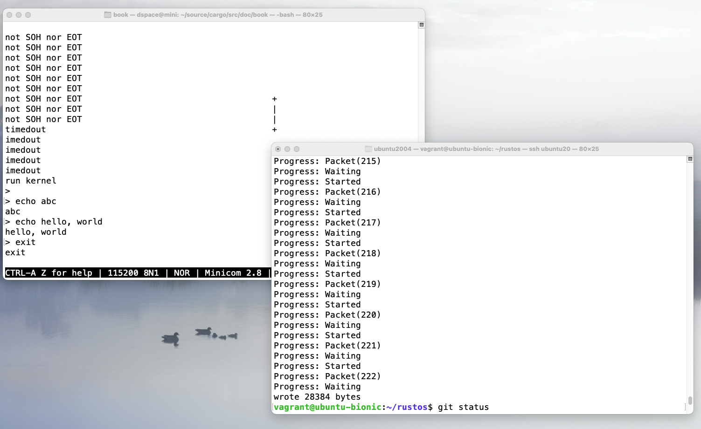
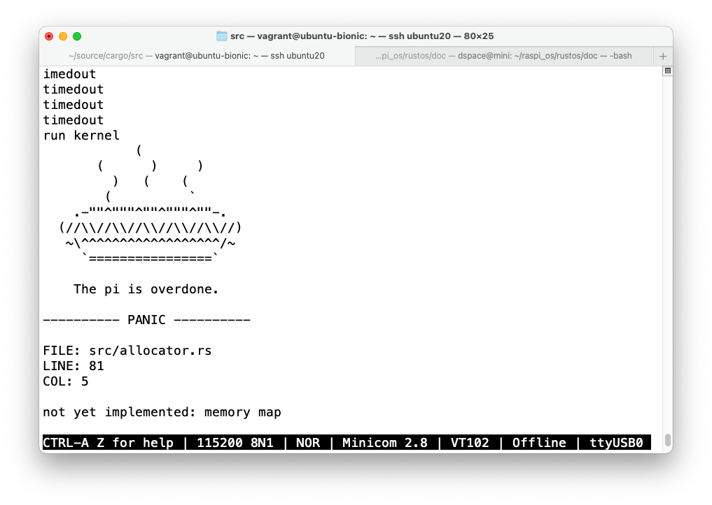
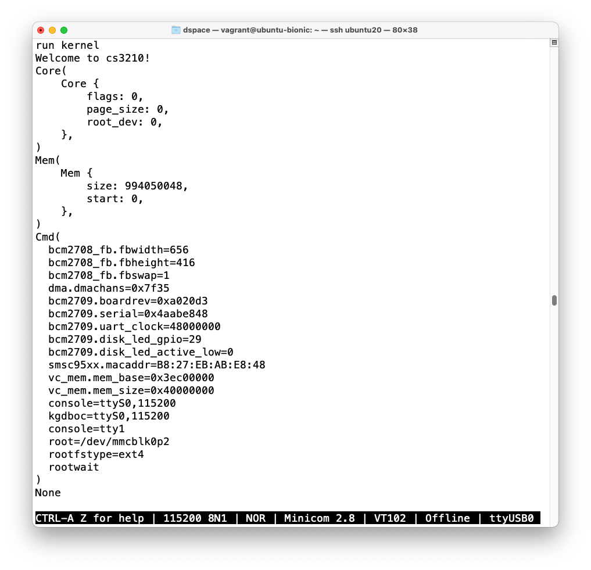

# Lab2, Phase 1, Subphase A: StackVec

## unimplemented()を実装、トレイト未実装の時点

**`cargo check`の結果**

```bash
$ cargo check
    Checking stack-vec v0.1.0 (/home/vagrant/rustos/lib/stack-vec)
warning: unused import: `core::slice`
 --> src/lib.rs:6:5
  |
6 | use core::slice;
  |     ^^^^^^^^^^^
  |
  = note: #[warn(unused_imports)] on by default

warning: unused import: `core::iter::IntoIterator`
 --> src/lib.rs:7:5
  |
7 | use core::iter::IntoIterator;
  |     ^^^^^^^^^^^^^^^^^^^^^^^^

warning: unused imports: `DerefMut`, `Deref`
 --> src/lib.rs:8:17
  |
8 | use core::ops::{Deref, DerefMut};
  |                 ^^^^^  ^^^^^^^^

    Finished dev [unoptimized + debuginfo] target(s) in 0.17s
```

**`cargo test`の結果**

```bash
$ cargo test
   Compiling stack-vec v0.1.0 (/home/vagrant/rustos/lib/stack-vec)
warning: unused import: `core::slice`
 --> src/lib.rs:6:5
  |
6 | use core::slice;
  |     ^^^^^^^^^^^
  |
  = note: #[warn(unused_imports)] on by default

warning: unused import: `core::iter::IntoIterator`
 --> src/lib.rs:7:5
  |
7 | use core::iter::IntoIterator;
  |     ^^^^^^^^^^^^^^^^^^^^^^^^

warning: unused imports: `DerefMut`, `Deref`
 --> src/lib.rs:8:17
  |
8 | use core::ops::{Deref, DerefMut};
  |                 ^^^^^  ^^^^^^^^

warning: unused import: `core::slice`
 --> src/lib.rs:6:5
  |
6 | use core::slice;
  |     ^^^^^^^^^^^
  |
  = note: #[warn(unused_imports)] on by default

warning: unused import: `core::iter::IntoIterator`
 --> src/lib.rs:7:5
  |
7 | use core::iter::IntoIterator;
  |     ^^^^^^^^^^^^^^^^^^^^^^^^

warning: unused imports: `DerefMut`, `Deref`
 --> src/lib.rs:8:17
  |
8 | use core::ops::{Deref, DerefMut};
  |                 ^^^^^  ^^^^^^^^

error[E0599]: no method named `iter` found for type `StackVec<'_, u8>` in the current scope
  --> src/tests.rs:12:23
   |
12 |     for (i, v) in vec.iter().enumerate() {
   |                       ^^^^
   |
  ::: src/lib.rs:20:1
   |
20 | pub struct StackVec<'a, T: 'a> {
   | ------------------------------ method `iter` not found for this

error[E0608]: cannot index into a value of type `StackVec<'_, u8>`
  --> src/tests.rs:36:13
   |
36 |     let _ = stack_vec[0];
   |             ^^^^^^^^^^^^

error[E0608]: cannot index into a value of type `StackVec<'_, u8>`
  --> src/tests.rs:46:13
   |
46 |     let _ = stack_vec[0];
   |             ^^^^^^^^^^^^

error[E0608]: cannot index into a value of type `StackVec<'_, u8>`
  --> src/tests.rs:56:16
   |
56 |     assert_eq!(stack_vec[0], 10);
   |                ^^^^^^^^^^^^

error[E0608]: cannot index into a value of type `StackVec<'_, u8>`
  --> src/tests.rs:62:16
   |
62 |     assert_eq!(stack_vec[0], 10);
   |                ^^^^^^^^^^^^

error[E0608]: cannot index into a value of type `StackVec<'_, u8>`
  --> src/tests.rs:63:16
   |
63 |     assert_eq!(stack_vec[1], 2);
   |                ^^^^^^^^^^^^

error[E0608]: cannot index into a value of type `StackVec<'_, u8>`
  --> src/tests.rs:78:20
   |
78 |         assert_eq!(stack_vec[i], i as u8);
   |                    ^^^^^^^^^^^^

error[E0608]: cannot index into a value of type `StackVec<'_, u8>`
  --> src/tests.rs:87:16
   |
87 |     assert_eq!(stack_vec[0], 0);
   |                ^^^^^^^^^^^^

error[E0608]: cannot index into a value of type `StackVec<'_, u8>`
  --> src/tests.rs:88:16
   |
88 |     assert_eq!(stack_vec[1], 0);
   |                ^^^^^^^^^^^^

error[E0608]: cannot index into a value of type `StackVec<'_, u8>`
  --> src/tests.rs:89:16
   |
89 |     assert_eq!(stack_vec[2], 0);
   |                ^^^^^^^^^^^^

error[E0608]: cannot index into a value of type `StackVec<'_, u8>`
  --> src/tests.rs:91:5
   |
91 |     stack_vec[0] = 100;
   |     ^^^^^^^^^^^^

error[E0608]: cannot index into a value of type `StackVec<'_, u8>`
  --> src/tests.rs:92:5
   |
92 |     stack_vec[1] = 88;
   |     ^^^^^^^^^^^^

error[E0608]: cannot index into a value of type `StackVec<'_, u8>`
  --> src/tests.rs:93:5
   |
93 |     stack_vec[2] = 99;
   |     ^^^^^^^^^^^^

error[E0608]: cannot index into a value of type `StackVec<'_, u8>`
  --> src/tests.rs:95:16
   |
95 |     assert_eq!(stack_vec[0], 100);
   |                ^^^^^^^^^^^^

error[E0608]: cannot index into a value of type `StackVec<'_, u8>`
  --> src/tests.rs:96:16
   |
96 |     assert_eq!(stack_vec[1], 88);
   |                ^^^^^^^^^^^^

error[E0608]: cannot index into a value of type `StackVec<'_, u8>`
  --> src/tests.rs:97:16
   |
97 |     assert_eq!(stack_vec[2], 99);
   |                ^^^^^^^^^^^^

error[E0608]: cannot index into a value of type `StackVec<'_, u8>`
  --> src/tests.rs:99:5
   |
99 |     stack_vec[0] = 23;
   |     ^^^^^^^^^^^^

error[E0608]: cannot index into a value of type `StackVec<'_, u8>`
   --> src/tests.rs:100:16
    |
100 |     assert_eq!(stack_vec[0], 23);
    |                ^^^^^^^^^^^^

error[E0608]: cannot index into a value of type `StackVec<'_, u8>`
   --> src/tests.rs:102:5
    |
102 |     stack_vec[0] = stack_vec[1];
    |     ^^^^^^^^^^^^

error[E0608]: cannot index into a value of type `StackVec<'_, u8>`
   --> src/tests.rs:102:20
    |
102 |     stack_vec[0] = stack_vec[1];
    |                    ^^^^^^^^^^^^

error[E0608]: cannot index into a value of type `StackVec<'_, u8>`
   --> src/tests.rs:103:16
    |
103 |     assert_eq!(stack_vec[0], 88);
    |                ^^^^^^^^^^^^

error[E0599]: no method named `iter` found for type `StackVec<'_, usize>` in the current scope
   --> src/tests.rs:152:23
    |
152 |     assert!(stack_vec.iter().next().is_none());
    |                       ^^^^
    |
   ::: src/lib.rs:20:1
    |
20  | pub struct StackVec<'a, T: 'a> {
    | ------------------------------ method `iter` not found for this

error[E0599]: no method named `iter` found for type `StackVec<'_, usize>` in the current scope
   --> src/tests.rs:158:34
    |
158 |         let mut iter = stack_vec.iter();
    |                                  ^^^^
    |
   ::: src/lib.rs:20:1
    |
20  | pub struct StackVec<'a, T: 'a> {
    | ------------------------------ method `iter` not found for this

error[E0599]: no method named `iter` found for type `StackVec<'_, usize>` in the current scope
   --> src/tests.rs:164:23
    |
164 |     assert!(stack_vec.iter().next().is_none());
    |                       ^^^^
    |
   ::: src/lib.rs:20:1
    |
20  | pub struct StackVec<'a, T: 'a> {
    | ------------------------------ method `iter` not found for this

error[E0599]: no method named `iter` found for type `StackVec<'_, usize>` in the current scope
   --> src/tests.rs:170:31
    |
170 |     for (i, val) in stack_vec.iter().enumerate() {
    |                               ^^^^
    |
   ::: src/lib.rs:20:1
    |
20  | pub struct StackVec<'a, T: 'a> {
    | ------------------------------ method `iter` not found for this

error[E0277]: `&StackVec<'_, usize>` is not an iterator
   --> src/tests.rs:175:16
    |
175 |     for val in &stack_vec {
    |                ^^^^^^^^^^ `&StackVec<'_, usize>` is not an iterator
    |
    = help: the trait `core::iter::Iterator` is not implemented for `&StackVec<'_, usize>`
    = note: required by `core::iter::IntoIterator::into_iter`

error[E0277]: `StackVec<'_, usize>` is not an iterator
   --> src/tests.rs:181:16
    |
181 |     for val in stack_vec {
    |                ^^^^^^^^^ `StackVec<'_, usize>` is not an iterator
    |
    = help: the trait `core::iter::Iterator` is not implemented for `StackVec<'_, usize>`
    = note: required by `core::iter::IntoIterator::into_iter`

error: aborting due to 27 previous errors

Some errors have detailed explanations: E0277, E0599, E0608.
For more information about an error, try `rustc --explain E0277`.
error: Could not compile `stack-vec`.

To learn more, run the command again with --verbose.
```

## トレイトの実装後

```bash
$ cargo check
    Checking stack-vec v0.1.0 (/home/vagrant/rustos/lib/stack-vec)
    Finished dev [unoptimized + debuginfo] target(s) in 0.12s
$ cargo test
   Compiling stack-vec v0.1.0 (/home/vagrant/rustos/lib/stack-vec)
    Finished dev [unoptimized + debuginfo] target(s) in 0.59s
     Running target/debug/deps/stack_vec-134ef3743e92f290

running 12 tests
test tests::as_slice ... ok
test tests::assignment_text_example ... ok
test tests::index_oob ... ok
test tests::errors ... ok
test tests::indexing ... ok
test tests::index_oob_after_truncate ... ok
test tests::len_and_capacity_ok ... ok
test tests::iterator ... ok
test tests::mut_indexing ... ok
test tests::push_just_far_enough ... ok
test tests::pop ... ok
test tests::push_too_far ... ok

test result: ok. 12 passed; 0 failed; 0 ignored; 0 measured; 0 filtered out

   Doc-tests stack-vec

running 0 tests

test result: ok. 0 passed; 0 failed; 0 ignored; 0 measured; 0 filtered out
```

# Lab2, Phase 1, Subphase C: XMODEM

```bash
$ cargo test
   Compiling xmodem v0.1.0 (/home/vagrant/rustos/lib/xmodem)
    Finished dev [unoptimized + debuginfo] target(s) in 1.59s
     Running target/debug/deps/xmodem-5618be3358a92da3

running 13 tests
test tests::test_bad_control ... ok
test tests::read_byte ... ok
test tests::test_cancel_on_unexpected ... ok
test tests::test_eot ... ok
test tests::test_expect_byte ... ok
test tests::test_expect_byte_or_cancel ... ok
test tests::test_expect_can ... ok
test tests::test_can_in_packet_and_checksum ... FAILED
test tests::test_loop ... ok
test tests::test_small_packet_eof_error ... ok
thread 'test tests::test_transmit_reported_bytes ... ok
test tests::test_unexpected_can ... ok
<unnamed>' panicked at 'receive okay: Custom { kind: ConnectionAborted, error: "received CAN" }', src/libcore/result.rs:999:5
thread '<unnamed>' panicked at 'transmit okay: Custom { kind: UnexpectedEof, error: "failed to fill whole buffer" }', src/libcore/result.rs:999:5
test tests::test_raw_transmission ... FAILED

failures:

---- tests::test_can_in_packet_and_checksum stdout ----
thread 'tests::test_can_in_packet_and_checksum' panicked at 'tx okay: Custom { kind: UnexpectedEof, error: "failed to fill whole buffer" }', src/libcore/result.rs:999:5
note: run with `RUST_BACKTRACE=1` environment variable to display a backtrace.

---- tests::test_raw_transmission stdout ----
thread 'tests::test_raw_transmission' panicked at 'tx join okay: Any', src/libcore/result.rs:999:5


failures:
    tests::test_can_in_packet_and_checksum
    tests::test_raw_transmission

test result: FAILED. 11 passed; 2 failed; 0 ignored; 0 measured; 0 filtered out
```

- `self.read_byte(abort_on_can)`を呼び出す際の`abort_on_can`
  引数を正しく設定しているか否かが問題だった

```bash
$ cargo test
   Compiling xmodem v0.1.0 (/home/vagrant/rustos/lib/xmodem)
    Finished dev [unoptimized + debuginfo] target(s) in 1.39s
     Running /home/vagrant/rustos/lib/xmodem/target/debug/deps/xmodem-5618be3358a92da3

running 13 tests
test tests::test_bad_control ... ok
test tests::read_byte ... ok
test tests::test_cancel_on_unexpected ... ok
test tests::test_eot ... ok
test tests::test_expect_byte ... ok
test tests::test_expect_byte_or_cancel ... ok
test tests::test_expect_can ... ok
test tests::test_can_in_packet_and_checksum ... ok
test tests::test_loop ... ok
test tests::test_small_packet_eof_error ... ok
test tests::test_transmit_reported_bytes ... ok
test tests::test_raw_transmission ... ok
test tests::test_unexpected_can ... ok

test result: ok. 13 passed; 0 failed; 0 ignored; 0 measured; 0 filtered out

   Doc-tests xmodem

running 0 tests

test result: ok. 0 passed; 0 failed; 0 ignored; 0 measured; 0 filtered out
```

# Lab2, Phase 1, Subphase D: ttywrite

```bash
$ cargo run -- --help
    Updating crates.io index
  Downloaded serial v0.4.0
  Downloaded serial-unix v0.4.0
  Downloaded serial-core v0.4.0
  Downloaded ioctl-rs v0.1.6
  Downloaded termios v0.2.2
  Downloaded libc v0.2.153
  Downloaded structopt-derive v0.1.6
  Downloaded syn v0.11.11
  Downloaded quote v0.3.15
  Downloaded structopt v0.1.7
  Downloaded unicode-xid v0.0.4
  Downloaded synom v0.11.3
  Downloaded clap v2.34.0
  Downloaded atty v0.2.14
  Downloaded unicode-width v0.1.11
  Downloaded bitflags v1.3.2
  Downloaded ansi_term v0.12.1
  Downloaded textwrap v0.11.0
  Downloaded vec_map v0.8.2
  Downloaded strsim v0.8.0
   Compiling libc v0.2.153
   Compiling unicode-xid v0.0.4
   Compiling unicode-width v0.1.11
   Compiling ansi_term v0.12.1
   Compiling bitflags v1.3.2
   Compiling strsim v0.8.0
   Compiling cfg-if v0.1.10
   Compiling vec_map v0.8.2
   Compiling quote v0.3.15
   Compiling synom v0.11.3
   Compiling textwrap v0.11.0
   Compiling shim v0.1.0 (/home/vagrant/rustos/lib/shim)
   Compiling syn v0.11.11
   Compiling xmodem v0.1.0 (/home/vagrant/rustos/lib/xmodem)
   Compiling atty v0.2.14
   Compiling serial-core v0.4.0
   Compiling termios v0.2.2
   Compiling ioctl-rs v0.1.6
   Compiling clap v2.34.0
error[E0433]: failed to resolve: could not find `stringify` in `_core`
  --> /home/vagrant/.cargo/registry/src/github.com-1ecc6299db9ec823/clap-2.34.0/src/app/settings.rs:7:1
   |
7  | / bitflags! {
8  | |     struct Flags: u64 {
9  | |         const SC_NEGATE_REQS       = 1;
10 | |         const SC_REQUIRED          = 1 << 1;
...  |
51 | |     }
52 | | }
   | |_^ could not find `stringify` in `_core`
   |
   = note: this error originates in a macro outside of the current crate (in Nightly builds, run with -Z external-macro-backtrace for more info)

error[E0433]: failed to resolve: could not find `stringify` in `_core`
  --> /home/vagrant/.cargo/registry/src/github.com-1ecc6299db9ec823/clap-2.34.0/src/args/settings.rs:6:1
   |
6  | / bitflags! {
7  | |     struct Flags: u32 {
8  | |         const REQUIRED         = 1;
9  | |         const MULTIPLE         = 1 << 1;
...  |
28 | |     }
29 | | }
   | |_^ could not find `stringify` in `_core`
   |
   = note: this error originates in a macro outside of the current crate (in Nightly builds, run with -Z external-macro-backtrace for more info)

error: cannot find macro `matches!` in this scope
   --> /home/vagrant/.cargo/registry/src/github.com-1ecc6299db9ec823/clap-2.34.0/src/errors.rs:392:10
    |
392 |         !matches!(
    |          ^^^^^^^

error[E0658]: use of unstable library feature 'mem_take'
  --> /home/vagrant/.cargo/registry/src/github.com-1ecc6299db9ec823/clap-2.34.0/src/args/arg_builder/flag.rs:48:16
   |
48 |             b: mem::take(&mut a.b),
   |                ^^^^^^^^^
   |
   = note: for more information, see https://github.com/rust-lang/rust/issues/61129
   = help: add #![feature(mem_take)] to the crate attributes to enable

error[E0658]: use of unstable library feature 'mem_take'
  --> /home/vagrant/.cargo/registry/src/github.com-1ecc6299db9ec823/clap-2.34.0/src/args/arg_builder/flag.rs:49:16
   |
49 |             s: mem::take(&mut a.s),
   |                ^^^^^^^^^
   |
   = note: for more information, see https://github.com/rust-lang/rust/issues/61129
   = help: add #![feature(mem_take)] to the crate attributes to enable

error[E0658]: use of unstable library feature 'mem_take'
  --> /home/vagrant/.cargo/registry/src/github.com-1ecc6299db9ec823/clap-2.34.0/src/args/arg_builder/option.rs:52:16
   |
52 |             b: mem::take(&mut a.b),
   |                ^^^^^^^^^
   |
   = note: for more information, see https://github.com/rust-lang/rust/issues/61129
   = help: add #![feature(mem_take)] to the crate attributes to enable

error[E0658]: use of unstable library feature 'mem_take'
  --> /home/vagrant/.cargo/registry/src/github.com-1ecc6299db9ec823/clap-2.34.0/src/args/arg_builder/option.rs:53:16
   |
53 |             s: mem::take(&mut a.s),
   |                ^^^^^^^^^
   |
   = note: for more information, see https://github.com/rust-lang/rust/issues/61129
   = help: add #![feature(mem_take)] to the crate attributes to enable

error[E0658]: use of unstable library feature 'mem_take'
  --> /home/vagrant/.cargo/registry/src/github.com-1ecc6299db9ec823/clap-2.34.0/src/args/arg_builder/option.rs:54:16
   |
54 |             v: mem::take(&mut a.v),
   |                ^^^^^^^^^
   |
   = note: for more information, see https://github.com/rust-lang/rust/issues/61129
   = help: add #![feature(mem_take)] to the crate attributes to enable

error[E0658]: use of unstable library feature 'mem_take'
  --> /home/vagrant/.cargo/registry/src/github.com-1ecc6299db9ec823/clap-2.34.0/src/args/arg_builder/positional.rs:62:16
   |
62 |             b: mem::take(&mut a.b),
   |                ^^^^^^^^^
   |
   = note: for more information, see https://github.com/rust-lang/rust/issues/61129
   = help: add #![feature(mem_take)] to the crate attributes to enable

error[E0658]: use of unstable library feature 'mem_take'
  --> /home/vagrant/.cargo/registry/src/github.com-1ecc6299db9ec823/clap-2.34.0/src/args/arg_builder/positional.rs:63:16
   |
63 |             v: mem::take(&mut a.v),
   |                ^^^^^^^^^
   |
   = note: for more information, see https://github.com/rust-lang/rust/issues/61129
   = help: add #![feature(mem_take)] to the crate attributes to enable

   Compiling serial-unix v0.4.0
error[E0599]: no method named `as_deref` found for type `std::option::Option<std::string::String>` in the current scope
  --> /home/vagrant/.cargo/registry/src/github.com-1ecc6299db9ec823/clap-2.34.0/src/app/mod.rs:96:30
   |
96 |         self.p.meta.bin_name.as_deref()
   |                              ^^^^^^^^ help: there is a method with a similar name: `as_ref`

   Compiling structopt-derive v0.1.6
error: aborting due to 11 previous errors

Some errors have detailed explanations: E0433, E0599, E0658.
For more information about an error, try `rustc --explain E0433`.
error: Could not compile `clap`.
warning: build failed, waiting for other jobs to finish...
error: build failed
```

参考: [https://oss.issuehunt.io/r/clap-rs/clap/issues/2691](https://oss.issuehunt.io/r/clap-rs/clap/issues/2691)

```bash
$ cargo run -Z minimal-versions -- --help
    Updating crates.io index
  Downloaded ioctl-rs v0.1.5
  Downloaded cfg-if v0.1.0
  Downloaded structopt v0.1.0
  Downloaded structopt-derive v0.1.0
  Downloaded libc v0.2.20
  Downloaded quote v0.3.12
  Downloaded syn v0.11.4
  Downloaded clap v2.21.1
  Downloaded strsim v0.6.0
  Downloaded vec_map v0.7.0
  Downloaded bitflags v0.8.0
  Downloaded atty v0.2.2
  Downloaded unicode-width v0.1.4
  Downloaded term_size v0.2.3
  Downloaded ansi_term v0.9.0
  Downloaded unicode-segmentation v1.0.1
   Compiling libc v0.2.20
   Compiling strsim v0.6.0
   Compiling bitflags v0.8.0
   Compiling quote v0.3.12
   Compiling ansi_term v0.9.0
   Compiling unicode-width v0.1.4
   Compiling unicode-segmentation v1.0.1
   Compiling cfg-if v0.1.0
   Compiling vec_map v0.7.0
   Compiling termios v0.2.2
   Compiling ioctl-rs v0.1.5
   Compiling atty v0.2.2
   Compiling serial-core v0.4.0
   Compiling term_size v0.2.3
   Compiling syn v0.11.4
   Compiling shim v0.1.0 (/home/vagrant/rustos/lib/shim)
error: cannot find macro `__cfg_if_items!` in this scope
  --> /home/vagrant/rustos/lib/shim/src/lib.rs:9:1
   |
9  | / cfg_if::cfg_if! {
10 | |     if #[cfg(feature = "no_std")] {
11 | |         mod no_std;
12 | |         pub use self::no_std::*;
...  |
16 | |     }
17 | | }
   | |_^
   |
   = note: this error originates in a macro outside of the current crate (in Nightly builds, run with -Z external-macro-backtrace for more info)

error: aborting due to previous error

error: Could not compile `shim`.
warning: build failed, waiting for other jobs to finish...
error: build failed

$ cargo run -- --help
   Compiling ttywrite v0.1.0 (/home/vagrant/rustos/lib/ttywrite)
...
error[E0277]: the trait bound `serial_core::BaudRate: std::str::FromStr` is not satisfied
  --> src/main.rs:16:10
   |
16 | #[derive(StructOpt, Debug)]
   |          ^^^^^^^^^ the trait `std::str::FromStr` is not implemented for `serial_core::BaudRate`

error[E0277]: the trait bound `serial_core::CharSize: std::str::FromStr` is not satisfied
  --> src/main.rs:16:10
   |
16 | #[derive(StructOpt, Debug)]
   |          ^^^^^^^^^ the trait `std::str::FromStr` is not implemented for `serial_core::CharSize`

error[E0277]: the trait bound `serial_core::FlowControl: std::str::FromStr` is not satisfied
  --> src/main.rs:16:10
   |
16 | #[derive(StructOpt, Debug)]
   |          ^^^^^^^^^ the trait `std::str::FromStr` is not implemented for `serial_core::FlowControl`

error[E0277]: the trait bound `serial_core::StopBits: std::str::FromStr` is not satisfied
  --> src/main.rs:16:10
   |
16 | #[derive(StructOpt, Debug)]
   |          ^^^^^^^^^ the trait `std::str::FromStr` is not implemented for `serial_core::StopBits`

error: aborting due to 4 previous errors

$ cargo run -- --help
   Compiling ttywrite v0.1.0 (/home/vagrant/rustos/lib/ttywrite)
error: proc-macro derive panicked
  --> src/main.rs:16:10
   |
16 | #[derive(StructOpt, Debug)]
   |          ^^^^^^^^^
   |
   = help: message: called `Result::unwrap()` on an `Err` value: "failed to parse derive input: \"#[structopt(about = \\\"Write to TTY using the XMODEM protocol by default.\\\")]\\nstruct Opt {\\n    #[structopt(short = \\\"i\\\",\\n                help = \\\"Input file (defaults to stdin if not set)\\\",\\n                parse(from_os_str))]\\n    input: Option<PathBuf>,\\n    #[structopt\\n    (\\n    short = \\\"b\\\" , long = \\\"baud\\\" , parse ( try_from_str = parse_baud_rate ) ,\\n    help = \\\"Set baud rate\\\" , default_value = \\\"115200\\\" )]\\n    baud_rate: BaudRate,\\n    #[structopt(short = \\\"t\\\",\\n                long = \\\"timeout\\\",\\n                parse(try_from_str),\\n
...

```

## crateのバージョンをいくつか変更

- `cfg-if`クレート
   `__cfg_if_items!`マクロは0.1ではあったがその後なくなった。今ではもう"cfg0if = 0.1"指定では
  この古いバージョンを再現できないからか。バージョン1.0では`cfg_if!`マクロ1つにまとめられ、
  他に影響もなさそうなのでバージョンアップした。
- `structopt`クレート
   バージョン0.1.0ではカスタムStringパーサの指定で`parse(try_from_str = "parse_baud_rate")`と
   すると上記2番目のエラーとなり、`parse(try_from_str = parse_baud_rate)`とすると3番目のエラー
   となる。バージョンアップでこのエラーはなくなった。ついでにclapのstructoptのバージョンに
   合わせて指定した。

```diff
$ git diff shim/Cargo.toml ttywrite/Cargo.tomldiff --git a/lib/shim/Cargo.toml b/lib/shim/Cargo.toml
index 179c2b1..210b132 100644
--- a/lib/shim/Cargo.toml
+++ b/lib/shim/Cargo.toml
@@ -11,7 +11,7 @@ authors = [
 edition = "2018"

 [dependencies]
-cfg-if = "0.1"
+cfg-if = "1.0"
 core_io = { version = "0.1.20190701", package = "core_io", optional = true }

 [dev-dependencies]
diff --git a/lib/ttywrite/Cargo.toml b/lib/ttywrite/Cargo.toml
index f83d97c..8dddd3f 100644
--- a/lib/ttywrite/Cargo.toml
+++ b/lib/ttywrite/Cargo.toml
@@ -11,7 +11,8 @@ authors = [
 edition = "2018"

 [dependencies]
-structopt = "0.1.0"
-structopt-derive = "0.1.0"
+structopt = "0.2.0"
+structopt-derive = "0.2.18"
+clap = "2.21"
 serial = "0.4"
 xmodem = { path = "../xmodem/" }
```

```bash
$ cargo run -Z minimal-versions -- --help
   Compiling ttywrite v0.1.0 (/home/vagrant/rustos/lib/ttywrite)
    Finished dev [unoptimized + debuginfo] target(s) in 1.14s
     Running `target/debug/ttywrite --help`
ttywrite 0.1.0
Sergio Benitez <sb@sergio.bz>, Taesoo Kim <taesoo@gatech.edu>, Yechan Bae
<yechan@gatech.edu>, Sujin Park <sujin.park@gatech.edu>, Mansour Alharthi
<mansourah@gatech.edu>
Write to TTY using the XMODEM protocol by default.

USAGE:
    ttywrite [FLAGS] [OPTIONS] <tty_path>

FLAGS:
    -h, --help       Prints help information
    -r, --raw        Disable XMODEM
    -V, --version    Prints version information

OPTIONS:
    -b, --baud <baud_rate>               Set baud rate [default: 115200]
    -w, --width <char_width>
            Set data character width in bits [default: 8]
    -f, --flow-control <flow_control>
            Enable flow control ('hardware' or 'software') [default: none]
    -i <input>
            Input file (defaults to stdin if not set)
    -s, --stop-bits <stop_bits>          Set number of stop bits [default: 1]
    -t, --timeout <timeout>              Set timeout in seconds [default: 10]

ARGS:
    <tty_path>    Path to TTY device

$ cargo run -Z minimal-versions -- -f idk
    Finished dev [unoptimized + debuginfo] target(s) in 0.02s
     Running `target/debug/ttywrite -f idk`
error: The following required arguments were not provided:
    <tty_path>

USAGE:
    ttywrite <tty_path> --baud <baud_rate> --width <char_width> --flow-control <flow_control> --stop-bits <stop_bits> --timeout <timeout>

For more information try --help
```

## ttywrite/test.sh

```bash
$ ./test.sh
$ ./test.sh
Compiling project with 'cargo build'...
   Compiling ttywrite v0.1.0 (/home/vagrant/rustos/lib/ttywrite)
    Finished dev [unoptimized + debuginfo] target(s) in 1.16s
Opening PTYs...
Running test 1/10.
wrote 356 bytes
Running test 2/10.
wrote 303 bytes
Running test 3/10.
wrote 227 bytes
Running test 4/10.
wrote 172 bytes
Running test 5/10.
wrote 292 bytes
Running test 6/10.
wrote 374 bytes
Running test 7/10.
wrote 102 bytes
Running test 8/10.
wrote 396 bytes
Running test 9/10.
wrote 476 bytes
Running test 10/10.
wrote 283 bytes
SUCCESS
./test.sh: line 4: kill: (4349) - No such process
```

## install

```bash
$ cargo install -Z minimal-versions --path .
  Installing ttywrite v0.1.0 (/home/vagrant/rustos/lib/ttywrite)
    Updating crates.io index
   Compiling unicode-segmentation v1.2.0
   Compiling libc v0.2.20
   Compiling strsim v0.6.0
   Compiling unicode-width v0.1.4
   Compiling vec_map v0.7.0
   Compiling bitflags v0.8.0
   Compiling ansi_term v0.9.0
   Compiling proc-macro2 v0.4.4
   Compiling ioctl-rs v0.1.5
   Compiling serial-core v0.4.0
   Compiling atty v0.2.2
   Compiling term_size v0.2.3
   Compiling termios v0.2.2
   Compiling heck v0.3.0
   Compiling clap v2.21.1
   Compiling serial-unix v0.4.0
   Compiling quote v0.6.0
   Compiling serial v0.4.0
   Compiling syn v0.15.0
   Compiling structopt-derive v0.2.18
   Compiling structopt v0.2.0
   Compiling ttywrite v0.1.0 (/home/vagrant/rustos/lib/ttywrite)
    Finished release [optimized] target(s) in 48.30s
  Installing /home/vagrant/.cargo/bin/ttywrite
   Installed package `ttywrite v0.1.0 (/home/vagrant/rustos/lib/ttywrite)` (executable `ttywrite`)
$ ls -l target/release/
total 3328
drwxrwxr-x 8 vagrant vagrant    4096 Apr  3 11:40 build
drwxrwxr-x 2 vagrant vagrant   16384 Apr  3 11:41 deps
drwxrwxr-x 2 vagrant vagrant    4096 Apr  3 11:40 examples
drwxrwxr-x 2 vagrant vagrant    4096 Apr  3 11:40 incremental
drwxrwxr-x 2 vagrant vagrant    4096 Apr  3 11:40 native
-rwxrwxr-x 2 vagrant vagrant 3370736 Apr  3 11:41 ttywrite
-rw-rw-r-- 1 vagrant vagrant     419 Apr  3 11:41 ttywrite.d
```

# Lab2, Phase 2, Subphase E: Shell - console

- 実機で動かない
   kprintlnマクロで首都力している`hello, console`も表示されない
- QEMUでは問題なく動く（ただし、使用しているQEMUのバージョンが古い）

```bash
$ ./bin_¥/qemu-system-aarch64 --version
QEMU emulator version 4.1.94 (v4.2.0-rc4-6-g9b4efa2ede-dirty)
Copyright (c) 2003-2019 Fabrice Bellard and the QEMU Project developers
$ make qemu

    Finished release [optimized] target(s) in 0.97s
+ Building build/kernel.bin [objcopy]
./qemu.sh build/kernel.bin
hello, console
abc
efg
egade
# Ctrl-x a で終了
QEMU: Terminated
```

# Lab2, Phase 2, Subphase E: Shell

```bash
$ ../bin/qemu-system-aarch64 -nographic -M raspi3 -serial null -serial mon:stdio -kernel build/kernel.bin
> echo abc def
abc def
> echo ab\bcd
acd
> echo a b c d e f g h i j k l m n o p q r s t u v w x
a b c d e f g h i j k l m n o p q r s t u v w x
> [3~[C[A[D[B
unknown command: [3~[C[A[D[B
> cat abc
unknown command: cat
> ls .
unknown command: ls
>                       # 空送信
> echo hello, world
hello, world
> exit
exit
QEMU 4.1.94 monitor - type 'help' for more information
(qemu)
```

## shellが実機でも動いた

- ロードアドレスが`0x80000`に変わっていた(`rustos/kern/.cargo/layout.ld`)ので
  `config.txt`を修正したところ実機で動くようになった。
- uartの段階では`0x4000000`だった。これは(`rustos/kern/.cargo/layout.ld`)で
  定義されており、ブートローダ用である。uartまではbootでmakeしていた?

```bash
>$ minicom

Welcome to minicom 2.8

OPTIONS:
Compiled on Jan  4 2021, 00:04:46.
Port /dev/cu.usbserial-AI057C9L, 09:45:48
Using character set conversion

Press Meta-Z for help on special keys

> echo abc
abc
> echo hello, world
hello, world
> exit
exit        # esc-A Zでminicom終了
```


# Linuxでttywriteを実行

- USBシリアルデバイスがVirtualBoxで動いた(USBデバイスを登録)

```bash
$ sudo dmesg
[  112.467096] usb 1-1: new full-speed USB device number 2 using xhci_hcd
[  112.615850] usb 1-1: New USB device found, idVendor=0403, idProduct=6001, bcdDevice= 6.00
[  112.615855] usb 1-1: New USB device strings: Mfr=1, Product=2, SerialNumber=3
[  112.615857] usb 1-1: Product: FT232R USB UART
[  112.615858] usb 1-1: Manufacturer: FTDI
[  112.615859] usb 1-1: SerialNumber: AI057C9L
[  112.643364] usbcore: registered new interface driver usbserial_generic
[  112.643786] usbserial: USB Serial support registered for generic
[  112.653797] usbcore: registered new interface driver ftdi_sio
[  112.653820] usbserial: USB Serial support registered for FTDI USB Serial Device
[  112.653877] ftdi_sio 1-1:1.0: FTDI USB Serial Device converter detected
[  112.653910] usb 1-1: Detected FT232RL
[  112.657566] usb 1-1: FTDI USB Serial Device converter now attached to ttyUSB0
```

## Lab2, Phase 3: ブート

1. 端末1でminicom

```bash
$ minicom

OPTIONS: I18n
Port /dev/ttyUSB0, 17:01:57

Press CTRL-A Z for help on special keys

not SOH nor EOT                                                          |
not SOH nor EOT                                                          |
not SOH nor EOT                                                          |
not SOH nor EOT                                                          +
not SOH nor EOT                                                          |
not SOH nor EOT                                                          |
not SOH nor EOT                                                          |
not SOH nor EOT                                                          |
not SOH nor EOT                                                          |
timedout                                                                 |
```

2. 端末2でttyewriteを実行

```bash
$ ttywrite -i kern/build/kernel.bin -t 750 /dev/ttyUSB0
Progress: Waiting
Progress: Waiting

Failed to send: failed to fill whole buffer
```

このエラーはどこで

```bash
$ cd ~/.rustup/toolchains/nightly-2019-07-01-x86_64-unknown-linux-gnu/lib/rustlib/src/rust/src
$ grep -r "failed to fill whole buffer" *
libstd/io/impls.rs:                                  "failed to fill whole buffer"));
libstd/io/mod.rs:                           "failed to fill whole buffer"))
libstd/sys/unix/ext/fs.rs:                               "failed to fill whole buffer"))
```

### `libstd/io/impls.rs`

```rust
impl Read for &[u8] {
   #[inline]
    fn read_exact(&mut self, buf: &mut [u8]) -> io::Result<()> {
        if buf.len() > self.len() {
            return Err(Error::new(ErrorKind::UnexpectedEof,
                                  "failed to fill whole buffer"));
        }
        let (a, b) = self.split_at(buf.len());

        // First check if the amount of bytes we want to read is small:
        // `copy_from_slice` will generally expand to a call to `memcpy`, and
        // for a single byte the overhead is significant.
        if buf.len() == 1 {
            buf[0] = a[0];
        } else {
            buf.copy_from_slice(a);
        }

        *self = b;
        Ok(())
    }
}
```

### `libstd/io/mod.rs`

```rust
#[stable(feature = "rust1", since = "1.0.0")]
pub trait Read {
    #[stable(feature = "read_exact", since = "1.6.0")]
    fn read_exact(&mut self, mut buf: &mut [u8]) -> Result<()> {
        while !buf.is_empty() {
            match self.read(buf) {
                Ok(0) => break,
                Ok(n) => { let tmp = buf; buf = &mut tmp[n..]; }
                Err(ref e) if e.kind() == ErrorKind::Interrupted => {}
                Err(e) => return Err(e),
            }
        }
        if !buf.is_empty() {     # EOFのあとにもデータあり
            Err(Error::new(ErrorKind::UnexpectedEof,
                           "failed to fill whole buffer"))
        } else {
            Ok(())
        }
    }
}
```

### `libstd/sys/unix/ext/fs.rs`

- 引数にオフセットを取るのでこれではない

```rust
    #[stable(feature = "rw_exact_all_at", since = "1.33.0")]
    fn read_exact_at(&self, mut buf: &mut [u8], mut offset: u64) -> io::Result<(
)> {
        while !buf.is_empty() {
            match self.read_at(buf, offset) {
                Ok(0) => break,
                Ok(n) => {
                    let tmp = buf;
                    buf = &mut tmp[n..];
                    offset += n as u64;
                }
                Err(ref e) if e.kind() == io::ErrorKind::Interrupted => {}
                Err(e) => return Err(e),
            }
        }
        if !buf.is_empty() {
            Err(io::Error::new(io::ErrorKind::UnexpectedEof,
                               "failed to fill whole buffer"))
        } else {
            Ok(())
        }
    }
```

## Linuxでの実行が成功

- 実行環境だけで動くようにttywriteを変更(sysinからの入力機能を削除)
- 端末1でminicom実行、端末2でttywriteを実行
- 端末1でCntl-Aを押下すると転送が開始する
- 転送が終了したら端末1で改行を押すとkernelの実行が開始する



# Lab3: Phase 1, Subphase A: Panic!

PanicInfoのmessageを得ようとして`error[E0658]: use of unstable library feature 'panic_info_message'`のエラーが発生。`#![feature(panic_info_message)]`をcrate rootに
書くよう指示があった。この場合のcrate rootは`kern/main.rs`だった。



## lab3, Phase 1, Subphase B: ATAGS

```bash
$ cd lib/pi
$ cargo build
   Compiling pi v0.1.0 (/home/vagrant/rustos/lib/pi)

    Finished dev [unoptimized + debuginfo] target(s) in 0.38s

$ cargo test
   Compiling pi v0.1.0 (/home/vagrant/rustos/lib/pi)

    Finished dev [unoptimized + debuginfo] target(s) in 0.95s
     Running target/debug/deps/pi-0aadc94077046b1b

running 1 test
test atags::test::test_atags ... ok

test result: ok. 1 passed; 0 failed; 0 ignored; 0 measured; 0 filtered out

   Doc-tests pi

running 0 tests

test result: ok. 0 passed; 0 failed; 0 ignored; 0 measured; 0 filtered out

$ cd ../../kern
$ make
+ Building build/kernel.elf [xbuild/build]
   Compiling kernel v0.1.0 (/home/vagrant/rustos/kern)

    Finished release [optimized] target(s) in 0.86s
+ Building build/kernel.bin [objcopy]
```


