# Lab2, Phase 1, Subphase A: StackVec

## unimplemented()を実装、トレイト未実装の時点

**`cargo check`の結果**

```bash
$ cargo check
    Checking stack-vec v0.1.0 (/home/vagrant/rustos/lib/stack-vec)
warning: unused import: `core::slice`
 --> src/lib.rs:6:5
  |
6 | use core::slice;
  |     ^^^^^^^^^^^
  |
  = note: #[warn(unused_imports)] on by default

warning: unused import: `core::iter::IntoIterator`
 --> src/lib.rs:7:5
  |
7 | use core::iter::IntoIterator;
  |     ^^^^^^^^^^^^^^^^^^^^^^^^

warning: unused imports: `DerefMut`, `Deref`
 --> src/lib.rs:8:17
  |
8 | use core::ops::{Deref, DerefMut};
  |                 ^^^^^  ^^^^^^^^

    Finished dev [unoptimized + debuginfo] target(s) in 0.17s
```

**`cargo test`の結果**

```bash
$ cargo test
   Compiling stack-vec v0.1.0 (/home/vagrant/rustos/lib/stack-vec)
warning: unused import: `core::slice`
 --> src/lib.rs:6:5
  |
6 | use core::slice;
  |     ^^^^^^^^^^^
  |
  = note: #[warn(unused_imports)] on by default

warning: unused import: `core::iter::IntoIterator`
 --> src/lib.rs:7:5
  |
7 | use core::iter::IntoIterator;
  |     ^^^^^^^^^^^^^^^^^^^^^^^^

warning: unused imports: `DerefMut`, `Deref`
 --> src/lib.rs:8:17
  |
8 | use core::ops::{Deref, DerefMut};
  |                 ^^^^^  ^^^^^^^^

warning: unused import: `core::slice`
 --> src/lib.rs:6:5
  |
6 | use core::slice;
  |     ^^^^^^^^^^^
  |
  = note: #[warn(unused_imports)] on by default

warning: unused import: `core::iter::IntoIterator`
 --> src/lib.rs:7:5
  |
7 | use core::iter::IntoIterator;
  |     ^^^^^^^^^^^^^^^^^^^^^^^^

warning: unused imports: `DerefMut`, `Deref`
 --> src/lib.rs:8:17
  |
8 | use core::ops::{Deref, DerefMut};
  |                 ^^^^^  ^^^^^^^^

error[E0599]: no method named `iter` found for type `StackVec<'_, u8>` in the current scope
  --> src/tests.rs:12:23
   |
12 |     for (i, v) in vec.iter().enumerate() {
   |                       ^^^^
   |
  ::: src/lib.rs:20:1
   |
20 | pub struct StackVec<'a, T: 'a> {
   | ------------------------------ method `iter` not found for this

error[E0608]: cannot index into a value of type `StackVec<'_, u8>`
  --> src/tests.rs:36:13
   |
36 |     let _ = stack_vec[0];
   |             ^^^^^^^^^^^^

error[E0608]: cannot index into a value of type `StackVec<'_, u8>`
  --> src/tests.rs:46:13
   |
46 |     let _ = stack_vec[0];
   |             ^^^^^^^^^^^^

error[E0608]: cannot index into a value of type `StackVec<'_, u8>`
  --> src/tests.rs:56:16
   |
56 |     assert_eq!(stack_vec[0], 10);
   |                ^^^^^^^^^^^^

error[E0608]: cannot index into a value of type `StackVec<'_, u8>`
  --> src/tests.rs:62:16
   |
62 |     assert_eq!(stack_vec[0], 10);
   |                ^^^^^^^^^^^^

error[E0608]: cannot index into a value of type `StackVec<'_, u8>`
  --> src/tests.rs:63:16
   |
63 |     assert_eq!(stack_vec[1], 2);
   |                ^^^^^^^^^^^^

error[E0608]: cannot index into a value of type `StackVec<'_, u8>`
  --> src/tests.rs:78:20
   |
78 |         assert_eq!(stack_vec[i], i as u8);
   |                    ^^^^^^^^^^^^

error[E0608]: cannot index into a value of type `StackVec<'_, u8>`
  --> src/tests.rs:87:16
   |
87 |     assert_eq!(stack_vec[0], 0);
   |                ^^^^^^^^^^^^

error[E0608]: cannot index into a value of type `StackVec<'_, u8>`
  --> src/tests.rs:88:16
   |
88 |     assert_eq!(stack_vec[1], 0);
   |                ^^^^^^^^^^^^

error[E0608]: cannot index into a value of type `StackVec<'_, u8>`
  --> src/tests.rs:89:16
   |
89 |     assert_eq!(stack_vec[2], 0);
   |                ^^^^^^^^^^^^

error[E0608]: cannot index into a value of type `StackVec<'_, u8>`
  --> src/tests.rs:91:5
   |
91 |     stack_vec[0] = 100;
   |     ^^^^^^^^^^^^

error[E0608]: cannot index into a value of type `StackVec<'_, u8>`
  --> src/tests.rs:92:5
   |
92 |     stack_vec[1] = 88;
   |     ^^^^^^^^^^^^

error[E0608]: cannot index into a value of type `StackVec<'_, u8>`
  --> src/tests.rs:93:5
   |
93 |     stack_vec[2] = 99;
   |     ^^^^^^^^^^^^

error[E0608]: cannot index into a value of type `StackVec<'_, u8>`
  --> src/tests.rs:95:16
   |
95 |     assert_eq!(stack_vec[0], 100);
   |                ^^^^^^^^^^^^

error[E0608]: cannot index into a value of type `StackVec<'_, u8>`
  --> src/tests.rs:96:16
   |
96 |     assert_eq!(stack_vec[1], 88);
   |                ^^^^^^^^^^^^

error[E0608]: cannot index into a value of type `StackVec<'_, u8>`
  --> src/tests.rs:97:16
   |
97 |     assert_eq!(stack_vec[2], 99);
   |                ^^^^^^^^^^^^

error[E0608]: cannot index into a value of type `StackVec<'_, u8>`
  --> src/tests.rs:99:5
   |
99 |     stack_vec[0] = 23;
   |     ^^^^^^^^^^^^

error[E0608]: cannot index into a value of type `StackVec<'_, u8>`
   --> src/tests.rs:100:16
    |
100 |     assert_eq!(stack_vec[0], 23);
    |                ^^^^^^^^^^^^

error[E0608]: cannot index into a value of type `StackVec<'_, u8>`
   --> src/tests.rs:102:5
    |
102 |     stack_vec[0] = stack_vec[1];
    |     ^^^^^^^^^^^^

error[E0608]: cannot index into a value of type `StackVec<'_, u8>`
   --> src/tests.rs:102:20
    |
102 |     stack_vec[0] = stack_vec[1];
    |                    ^^^^^^^^^^^^

error[E0608]: cannot index into a value of type `StackVec<'_, u8>`
   --> src/tests.rs:103:16
    |
103 |     assert_eq!(stack_vec[0], 88);
    |                ^^^^^^^^^^^^

error[E0599]: no method named `iter` found for type `StackVec<'_, usize>` in the current scope
   --> src/tests.rs:152:23
    |
152 |     assert!(stack_vec.iter().next().is_none());
    |                       ^^^^
    |
   ::: src/lib.rs:20:1
    |
20  | pub struct StackVec<'a, T: 'a> {
    | ------------------------------ method `iter` not found for this

error[E0599]: no method named `iter` found for type `StackVec<'_, usize>` in the current scope
   --> src/tests.rs:158:34
    |
158 |         let mut iter = stack_vec.iter();
    |                                  ^^^^
    |
   ::: src/lib.rs:20:1
    |
20  | pub struct StackVec<'a, T: 'a> {
    | ------------------------------ method `iter` not found for this

error[E0599]: no method named `iter` found for type `StackVec<'_, usize>` in the current scope
   --> src/tests.rs:164:23
    |
164 |     assert!(stack_vec.iter().next().is_none());
    |                       ^^^^
    |
   ::: src/lib.rs:20:1
    |
20  | pub struct StackVec<'a, T: 'a> {
    | ------------------------------ method `iter` not found for this

error[E0599]: no method named `iter` found for type `StackVec<'_, usize>` in the current scope
   --> src/tests.rs:170:31
    |
170 |     for (i, val) in stack_vec.iter().enumerate() {
    |                               ^^^^
    |
   ::: src/lib.rs:20:1
    |
20  | pub struct StackVec<'a, T: 'a> {
    | ------------------------------ method `iter` not found for this

error[E0277]: `&StackVec<'_, usize>` is not an iterator
   --> src/tests.rs:175:16
    |
175 |     for val in &stack_vec {
    |                ^^^^^^^^^^ `&StackVec<'_, usize>` is not an iterator
    |
    = help: the trait `core::iter::Iterator` is not implemented for `&StackVec<'_, usize>`
    = note: required by `core::iter::IntoIterator::into_iter`

error[E0277]: `StackVec<'_, usize>` is not an iterator
   --> src/tests.rs:181:16
    |
181 |     for val in stack_vec {
    |                ^^^^^^^^^ `StackVec<'_, usize>` is not an iterator
    |
    = help: the trait `core::iter::Iterator` is not implemented for `StackVec<'_, usize>`
    = note: required by `core::iter::IntoIterator::into_iter`

error: aborting due to 27 previous errors

Some errors have detailed explanations: E0277, E0599, E0608.
For more information about an error, try `rustc --explain E0277`.
error: Could not compile `stack-vec`.

To learn more, run the command again with --verbose.
```

## トレイトの実装後

```bash
$ cargo check
    Checking stack-vec v0.1.0 (/home/vagrant/rustos/lib/stack-vec)
    Finished dev [unoptimized + debuginfo] target(s) in 0.12s
$ cargo test
   Compiling stack-vec v0.1.0 (/home/vagrant/rustos/lib/stack-vec)
    Finished dev [unoptimized + debuginfo] target(s) in 0.59s
     Running target/debug/deps/stack_vec-134ef3743e92f290

running 12 tests
test tests::as_slice ... ok
test tests::assignment_text_example ... ok
test tests::index_oob ... ok
test tests::errors ... ok
test tests::indexing ... ok
test tests::index_oob_after_truncate ... ok
test tests::len_and_capacity_ok ... ok
test tests::iterator ... ok
test tests::mut_indexing ... ok
test tests::push_just_far_enough ... ok
test tests::pop ... ok
test tests::push_too_far ... ok

test result: ok. 12 passed; 0 failed; 0 ignored; 0 measured; 0 filtered out

   Doc-tests stack-vec

running 0 tests

test result: ok. 0 passed; 0 failed; 0 ignored; 0 measured; 0 filtered out
```

# Lab2, Phase 1, Subphase C: XMODEM

```bash
$ cargo test
   Compiling xmodem v0.1.0 (/home/vagrant/rustos/lib/xmodem)
    Finished dev [unoptimized + debuginfo] target(s) in 1.59s
     Running target/debug/deps/xmodem-5618be3358a92da3

running 13 tests
test tests::test_bad_control ... ok
test tests::read_byte ... ok
test tests::test_cancel_on_unexpected ... ok
test tests::test_eot ... ok
test tests::test_expect_byte ... ok
test tests::test_expect_byte_or_cancel ... ok
test tests::test_expect_can ... ok
test tests::test_can_in_packet_and_checksum ... FAILED
test tests::test_loop ... ok
test tests::test_small_packet_eof_error ... ok
thread 'test tests::test_transmit_reported_bytes ... ok
test tests::test_unexpected_can ... ok
<unnamed>' panicked at 'receive okay: Custom { kind: ConnectionAborted, error: "received CAN" }', src/libcore/result.rs:999:5
thread '<unnamed>' panicked at 'transmit okay: Custom { kind: UnexpectedEof, error: "failed to fill whole buffer" }', src/libcore/result.rs:999:5
test tests::test_raw_transmission ... FAILED

failures:

---- tests::test_can_in_packet_and_checksum stdout ----
thread 'tests::test_can_in_packet_and_checksum' panicked at 'tx okay: Custom { kind: UnexpectedEof, error: "failed to fill whole buffer" }', src/libcore/result.rs:999:5
note: run with `RUST_BACKTRACE=1` environment variable to display a backtrace.

---- tests::test_raw_transmission stdout ----
thread 'tests::test_raw_transmission' panicked at 'tx join okay: Any', src/libcore/result.rs:999:5


failures:
    tests::test_can_in_packet_and_checksum
    tests::test_raw_transmission

test result: FAILED. 11 passed; 2 failed; 0 ignored; 0 measured; 0 filtered out
```

- `self.read_byte(abort_on_can)`を呼び出す際の`abort_on_can`
  引数を正しく設定しているか否かが問題だった

```bash
$ cargo test
   Compiling xmodem v0.1.0 (/home/vagrant/rustos/lib/xmodem)
    Finished dev [unoptimized + debuginfo] target(s) in 1.39s
     Running /home/vagrant/rustos/lib/xmodem/target/debug/deps/xmodem-5618be3358a92da3

running 13 tests
test tests::test_bad_control ... ok
test tests::read_byte ... ok
test tests::test_cancel_on_unexpected ... ok
test tests::test_eot ... ok
test tests::test_expect_byte ... ok
test tests::test_expect_byte_or_cancel ... ok
test tests::test_expect_can ... ok
test tests::test_can_in_packet_and_checksum ... ok
test tests::test_loop ... ok
test tests::test_small_packet_eof_error ... ok
test tests::test_transmit_reported_bytes ... ok
test tests::test_raw_transmission ... ok
test tests::test_unexpected_can ... ok

test result: ok. 13 passed; 0 failed; 0 ignored; 0 measured; 0 filtered out

   Doc-tests xmodem

running 0 tests

test result: ok. 0 passed; 0 failed; 0 ignored; 0 measured; 0 filtered out
```

# Lab2, Phase 1, Subphase D: ttywrite

```bash
$ cargo run -- --help
    Updating crates.io index
  Downloaded serial v0.4.0
  Downloaded serial-unix v0.4.0
  Downloaded serial-core v0.4.0
  Downloaded ioctl-rs v0.1.6
  Downloaded termios v0.2.2
  Downloaded libc v0.2.153
  Downloaded structopt-derive v0.1.6
  Downloaded syn v0.11.11
  Downloaded quote v0.3.15
  Downloaded structopt v0.1.7
  Downloaded unicode-xid v0.0.4
  Downloaded synom v0.11.3
  Downloaded clap v2.34.0
  Downloaded atty v0.2.14
  Downloaded unicode-width v0.1.11
  Downloaded bitflags v1.3.2
  Downloaded ansi_term v0.12.1
  Downloaded textwrap v0.11.0
  Downloaded vec_map v0.8.2
  Downloaded strsim v0.8.0
   Compiling libc v0.2.153
   Compiling unicode-xid v0.0.4
   Compiling unicode-width v0.1.11
   Compiling ansi_term v0.12.1
   Compiling bitflags v1.3.2
   Compiling strsim v0.8.0
   Compiling cfg-if v0.1.10
   Compiling vec_map v0.8.2
   Compiling quote v0.3.15
   Compiling synom v0.11.3
   Compiling textwrap v0.11.0
   Compiling shim v0.1.0 (/home/vagrant/rustos/lib/shim)
   Compiling syn v0.11.11
   Compiling xmodem v0.1.0 (/home/vagrant/rustos/lib/xmodem)
   Compiling atty v0.2.14
   Compiling serial-core v0.4.0
   Compiling termios v0.2.2
   Compiling ioctl-rs v0.1.6
   Compiling clap v2.34.0
error[E0433]: failed to resolve: could not find `stringify` in `_core`
  --> /home/vagrant/.cargo/registry/src/github.com-1ecc6299db9ec823/clap-2.34.0/src/app/settings.rs:7:1
   |
7  | / bitflags! {
8  | |     struct Flags: u64 {
9  | |         const SC_NEGATE_REQS       = 1;
10 | |         const SC_REQUIRED          = 1 << 1;
...  |
51 | |     }
52 | | }
   | |_^ could not find `stringify` in `_core`
   |
   = note: this error originates in a macro outside of the current crate (in Nightly builds, run with -Z external-macro-backtrace for more info)

error[E0433]: failed to resolve: could not find `stringify` in `_core`
  --> /home/vagrant/.cargo/registry/src/github.com-1ecc6299db9ec823/clap-2.34.0/src/args/settings.rs:6:1
   |
6  | / bitflags! {
7  | |     struct Flags: u32 {
8  | |         const REQUIRED         = 1;
9  | |         const MULTIPLE         = 1 << 1;
...  |
28 | |     }
29 | | }
   | |_^ could not find `stringify` in `_core`
   |
   = note: this error originates in a macro outside of the current crate (in Nightly builds, run with -Z external-macro-backtrace for more info)

error: cannot find macro `matches!` in this scope
   --> /home/vagrant/.cargo/registry/src/github.com-1ecc6299db9ec823/clap-2.34.0/src/errors.rs:392:10
    |
392 |         !matches!(
    |          ^^^^^^^

error[E0658]: use of unstable library feature 'mem_take'
  --> /home/vagrant/.cargo/registry/src/github.com-1ecc6299db9ec823/clap-2.34.0/src/args/arg_builder/flag.rs:48:16
   |
48 |             b: mem::take(&mut a.b),
   |                ^^^^^^^^^
   |
   = note: for more information, see https://github.com/rust-lang/rust/issues/61129
   = help: add #![feature(mem_take)] to the crate attributes to enable

error[E0658]: use of unstable library feature 'mem_take'
  --> /home/vagrant/.cargo/registry/src/github.com-1ecc6299db9ec823/clap-2.34.0/src/args/arg_builder/flag.rs:49:16
   |
49 |             s: mem::take(&mut a.s),
   |                ^^^^^^^^^
   |
   = note: for more information, see https://github.com/rust-lang/rust/issues/61129
   = help: add #![feature(mem_take)] to the crate attributes to enable

error[E0658]: use of unstable library feature 'mem_take'
  --> /home/vagrant/.cargo/registry/src/github.com-1ecc6299db9ec823/clap-2.34.0/src/args/arg_builder/option.rs:52:16
   |
52 |             b: mem::take(&mut a.b),
   |                ^^^^^^^^^
   |
   = note: for more information, see https://github.com/rust-lang/rust/issues/61129
   = help: add #![feature(mem_take)] to the crate attributes to enable

error[E0658]: use of unstable library feature 'mem_take'
  --> /home/vagrant/.cargo/registry/src/github.com-1ecc6299db9ec823/clap-2.34.0/src/args/arg_builder/option.rs:53:16
   |
53 |             s: mem::take(&mut a.s),
   |                ^^^^^^^^^
   |
   = note: for more information, see https://github.com/rust-lang/rust/issues/61129
   = help: add #![feature(mem_take)] to the crate attributes to enable

error[E0658]: use of unstable library feature 'mem_take'
  --> /home/vagrant/.cargo/registry/src/github.com-1ecc6299db9ec823/clap-2.34.0/src/args/arg_builder/option.rs:54:16
   |
54 |             v: mem::take(&mut a.v),
   |                ^^^^^^^^^
   |
   = note: for more information, see https://github.com/rust-lang/rust/issues/61129
   = help: add #![feature(mem_take)] to the crate attributes to enable

error[E0658]: use of unstable library feature 'mem_take'
  --> /home/vagrant/.cargo/registry/src/github.com-1ecc6299db9ec823/clap-2.34.0/src/args/arg_builder/positional.rs:62:16
   |
62 |             b: mem::take(&mut a.b),
   |                ^^^^^^^^^
   |
   = note: for more information, see https://github.com/rust-lang/rust/issues/61129
   = help: add #![feature(mem_take)] to the crate attributes to enable

error[E0658]: use of unstable library feature 'mem_take'
  --> /home/vagrant/.cargo/registry/src/github.com-1ecc6299db9ec823/clap-2.34.0/src/args/arg_builder/positional.rs:63:16
   |
63 |             v: mem::take(&mut a.v),
   |                ^^^^^^^^^
   |
   = note: for more information, see https://github.com/rust-lang/rust/issues/61129
   = help: add #![feature(mem_take)] to the crate attributes to enable

   Compiling serial-unix v0.4.0
error[E0599]: no method named `as_deref` found for type `std::option::Option<std::string::String>` in the current scope
  --> /home/vagrant/.cargo/registry/src/github.com-1ecc6299db9ec823/clap-2.34.0/src/app/mod.rs:96:30
   |
96 |         self.p.meta.bin_name.as_deref()
   |                              ^^^^^^^^ help: there is a method with a similar name: `as_ref`

   Compiling structopt-derive v0.1.6
error: aborting due to 11 previous errors

Some errors have detailed explanations: E0433, E0599, E0658.
For more information about an error, try `rustc --explain E0433`.
error: Could not compile `clap`.
warning: build failed, waiting for other jobs to finish...
error: build failed
```

参考: [https://oss.issuehunt.io/r/clap-rs/clap/issues/2691](https://oss.issuehunt.io/r/clap-rs/clap/issues/2691)

```bash
$ cargo run -Z minimal-versions -- --help
    Updating crates.io index
  Downloaded ioctl-rs v0.1.5
  Downloaded cfg-if v0.1.0
  Downloaded structopt v0.1.0
  Downloaded structopt-derive v0.1.0
  Downloaded libc v0.2.20
  Downloaded quote v0.3.12
  Downloaded syn v0.11.4
  Downloaded clap v2.21.1
  Downloaded strsim v0.6.0
  Downloaded vec_map v0.7.0
  Downloaded bitflags v0.8.0
  Downloaded atty v0.2.2
  Downloaded unicode-width v0.1.4
  Downloaded term_size v0.2.3
  Downloaded ansi_term v0.9.0
  Downloaded unicode-segmentation v1.0.1
   Compiling libc v0.2.20
   Compiling strsim v0.6.0
   Compiling bitflags v0.8.0
   Compiling quote v0.3.12
   Compiling ansi_term v0.9.0
   Compiling unicode-width v0.1.4
   Compiling unicode-segmentation v1.0.1
   Compiling cfg-if v0.1.0
   Compiling vec_map v0.7.0
   Compiling termios v0.2.2
   Compiling ioctl-rs v0.1.5
   Compiling atty v0.2.2
   Compiling serial-core v0.4.0
   Compiling term_size v0.2.3
   Compiling syn v0.11.4
   Compiling shim v0.1.0 (/home/vagrant/rustos/lib/shim)
error: cannot find macro `__cfg_if_items!` in this scope
  --> /home/vagrant/rustos/lib/shim/src/lib.rs:9:1
   |
9  | / cfg_if::cfg_if! {
10 | |     if #[cfg(feature = "no_std")] {
11 | |         mod no_std;
12 | |         pub use self::no_std::*;
...  |
16 | |     }
17 | | }
   | |_^
   |
   = note: this error originates in a macro outside of the current crate (in Nightly builds, run with -Z external-macro-backtrace for more info)

error: aborting due to previous error

error: Could not compile `shim`.
warning: build failed, waiting for other jobs to finish...
error: build failed

$ cargo run -- --help
   Compiling ttywrite v0.1.0 (/home/vagrant/rustos/lib/ttywrite)
...
error[E0277]: the trait bound `serial_core::BaudRate: std::str::FromStr` is not satisfied
  --> src/main.rs:16:10
   |
16 | #[derive(StructOpt, Debug)]
   |          ^^^^^^^^^ the trait `std::str::FromStr` is not implemented for `serial_core::BaudRate`

error[E0277]: the trait bound `serial_core::CharSize: std::str::FromStr` is not satisfied
  --> src/main.rs:16:10
   |
16 | #[derive(StructOpt, Debug)]
   |          ^^^^^^^^^ the trait `std::str::FromStr` is not implemented for `serial_core::CharSize`

error[E0277]: the trait bound `serial_core::FlowControl: std::str::FromStr` is not satisfied
  --> src/main.rs:16:10
   |
16 | #[derive(StructOpt, Debug)]
   |          ^^^^^^^^^ the trait `std::str::FromStr` is not implemented for `serial_core::FlowControl`

error[E0277]: the trait bound `serial_core::StopBits: std::str::FromStr` is not satisfied
  --> src/main.rs:16:10
   |
16 | #[derive(StructOpt, Debug)]
   |          ^^^^^^^^^ the trait `std::str::FromStr` is not implemented for `serial_core::StopBits`

error: aborting due to 4 previous errors

$ cargo run -- --help
   Compiling ttywrite v0.1.0 (/home/vagrant/rustos/lib/ttywrite)
error: proc-macro derive panicked
  --> src/main.rs:16:10
   |
16 | #[derive(StructOpt, Debug)]
   |          ^^^^^^^^^
   |
   = help: message: called `Result::unwrap()` on an `Err` value: "failed to parse derive input: \"#[structopt(about = \\\"Write to TTY using the XMODEM protocol by default.\\\")]\\nstruct Opt {\\n    #[structopt(short = \\\"i\\\",\\n                help = \\\"Input file (defaults to stdin if not set)\\\",\\n                parse(from_os_str))]\\n    input: Option<PathBuf>,\\n    #[structopt\\n    (\\n    short = \\\"b\\\" , long = \\\"baud\\\" , parse ( try_from_str = parse_baud_rate ) ,\\n    help = \\\"Set baud rate\\\" , default_value = \\\"115200\\\" )]\\n    baud_rate: BaudRate,\\n    #[structopt(short = \\\"t\\\",\\n                long = \\\"timeout\\\",\\n                parse(try_from_str),\\n
...

```

## crateのバージョンをいくつか変更

- `cfg-if`クレート
   `__cfg_if_items!`マクロは0.1ではあったがその後なくなった。今ではもう"cfg0if = 0.1"指定では
  この古いバージョンを再現できないからか。バージョン1.0では`cfg_if!`マクロ1つにまとめられ、
  他に影響もなさそうなのでバージョンアップした。
- `structopt`クレート
   バージョン0.1.0ではカスタムStringパーサの指定で`parse(try_from_str = "parse_baud_rate")`と
   すると上記2番目のエラーとなり、`parse(try_from_str = parse_baud_rate)`とすると3番目のエラー
   となる。バージョンアップでこのエラーはなくなった。ついでにclapのstructoptのバージョンに
   合わせて指定した。

```diff
$ git diff shim/Cargo.toml ttywrite/Cargo.tomldiff --git a/lib/shim/Cargo.toml b/lib/shim/Cargo.toml
index 179c2b1..210b132 100644
--- a/lib/shim/Cargo.toml
+++ b/lib/shim/Cargo.toml
@@ -11,7 +11,7 @@ authors = [
 edition = "2018"

 [dependencies]
-cfg-if = "0.1"
+cfg-if = "1.0"
 core_io = { version = "0.1.20190701", package = "core_io", optional = true }

 [dev-dependencies]
diff --git a/lib/ttywrite/Cargo.toml b/lib/ttywrite/Cargo.toml
index f83d97c..8dddd3f 100644
--- a/lib/ttywrite/Cargo.toml
+++ b/lib/ttywrite/Cargo.toml
@@ -11,7 +11,8 @@ authors = [
 edition = "2018"

 [dependencies]
-structopt = "0.1.0"
-structopt-derive = "0.1.0"
+structopt = "0.2.0"
+structopt-derive = "0.2.18"
+clap = "2.21"
 serial = "0.4"
 xmodem = { path = "../xmodem/" }
```

```bash
$ cargo run -Z minimal-versions -- --help
   Compiling ttywrite v0.1.0 (/home/vagrant/rustos/lib/ttywrite)
    Finished dev [unoptimized + debuginfo] target(s) in 1.14s
     Running `target/debug/ttywrite --help`
ttywrite 0.1.0
Sergio Benitez <sb@sergio.bz>, Taesoo Kim <taesoo@gatech.edu>, Yechan Bae
<yechan@gatech.edu>, Sujin Park <sujin.park@gatech.edu>, Mansour Alharthi
<mansourah@gatech.edu>
Write to TTY using the XMODEM protocol by default.

USAGE:
    ttywrite [FLAGS] [OPTIONS] <tty_path>

FLAGS:
    -h, --help       Prints help information
    -r, --raw        Disable XMODEM
    -V, --version    Prints version information

OPTIONS:
    -b, --baud <baud_rate>               Set baud rate [default: 115200]
    -w, --width <char_width>
            Set data character width in bits [default: 8]
    -f, --flow-control <flow_control>
            Enable flow control ('hardware' or 'software') [default: none]
    -i <input>
            Input file (defaults to stdin if not set)
    -s, --stop-bits <stop_bits>          Set number of stop bits [default: 1]
    -t, --timeout <timeout>              Set timeout in seconds [default: 10]

ARGS:
    <tty_path>    Path to TTY device

$ cargo run -Z minimal-versions -- -f idk
    Finished dev [unoptimized + debuginfo] target(s) in 0.02s
     Running `target/debug/ttywrite -f idk`
error: The following required arguments were not provided:
    <tty_path>

USAGE:
    ttywrite <tty_path> --baud <baud_rate> --width <char_width> --flow-control <flow_control> --stop-bits <stop_bits> --timeout <timeout>

For more information try --help
```

## ttywrite/test.sh

```bash
$ ./test.sh
$ ./test.sh
Compiling project with 'cargo build'...
   Compiling ttywrite v0.1.0 (/home/vagrant/rustos/lib/ttywrite)
    Finished dev [unoptimized + debuginfo] target(s) in 1.16s
Opening PTYs...
Running test 1/10.
wrote 356 bytes
Running test 2/10.
wrote 303 bytes
Running test 3/10.
wrote 227 bytes
Running test 4/10.
wrote 172 bytes
Running test 5/10.
wrote 292 bytes
Running test 6/10.
wrote 374 bytes
Running test 7/10.
wrote 102 bytes
Running test 8/10.
wrote 396 bytes
Running test 9/10.
wrote 476 bytes
Running test 10/10.
wrote 283 bytes
SUCCESS
./test.sh: line 4: kill: (4349) - No such process
```

## install

```bash
$ cargo install -Z minimal-versions --path .
  Installing ttywrite v0.1.0 (/home/vagrant/rustos/lib/ttywrite)
    Updating crates.io index
   Compiling unicode-segmentation v1.2.0
   Compiling libc v0.2.20
   Compiling strsim v0.6.0
   Compiling unicode-width v0.1.4
   Compiling vec_map v0.7.0
   Compiling bitflags v0.8.0
   Compiling ansi_term v0.9.0
   Compiling proc-macro2 v0.4.4
   Compiling ioctl-rs v0.1.5
   Compiling serial-core v0.4.0
   Compiling atty v0.2.2
   Compiling term_size v0.2.3
   Compiling termios v0.2.2
   Compiling heck v0.3.0
   Compiling clap v2.21.1
   Compiling serial-unix v0.4.0
   Compiling quote v0.6.0
   Compiling serial v0.4.0
   Compiling syn v0.15.0
   Compiling structopt-derive v0.2.18
   Compiling structopt v0.2.0
   Compiling ttywrite v0.1.0 (/home/vagrant/rustos/lib/ttywrite)
    Finished release [optimized] target(s) in 48.30s
  Installing /home/vagrant/.cargo/bin/ttywrite
   Installed package `ttywrite v0.1.0 (/home/vagrant/rustos/lib/ttywrite)` (executable `ttywrite`)
$ ls -l target/release/
total 3328
drwxrwxr-x 8 vagrant vagrant    4096 Apr  3 11:40 build
drwxrwxr-x 2 vagrant vagrant   16384 Apr  3 11:41 deps
drwxrwxr-x 2 vagrant vagrant    4096 Apr  3 11:40 examples
drwxrwxr-x 2 vagrant vagrant    4096 Apr  3 11:40 incremental
drwxrwxr-x 2 vagrant vagrant    4096 Apr  3 11:40 native
-rwxrwxr-x 2 vagrant vagrant 3370736 Apr  3 11:41 ttywrite
-rw-rw-r-- 1 vagrant vagrant     419 Apr  3 11:41 ttywrite.d
```

# Lab2, Phase 2, Subphase E: Shell - console

- 実機で動かない
   kprintlnマクロで首都力している`hello, console`も表示されない
- QEMUでは問題なく動く（ただし、使用しているQEMUのバージョンが古い）

```bash
$ ./bin_¥/qemu-system-aarch64 --version
QEMU emulator version 4.1.94 (v4.2.0-rc4-6-g9b4efa2ede-dirty)
Copyright (c) 2003-2019 Fabrice Bellard and the QEMU Project developers
$ make qemu

    Finished release [optimized] target(s) in 0.97s
+ Building build/kernel.bin [objcopy]
./qemu.sh build/kernel.bin
hello, console
abc
efg
egade
# Ctrl-x a で終了
QEMU: Terminated
```

# Lab2, Phase 2, Subphase E: Shell

```bash
$ ../bin/qemu-system-aarch64 -nographic -M raspi3 -serial null -serial mon:stdio -kernel build/kernel.bin
> echo abc def
abc def
> echo ab\bcd
acd
> echo a b c d e f g h i j k l m n o p q r s t u v w x
a b c d e f g h i j k l m n o p q r s t u v w x
> [3~[C[A[D[B
unknown command: [3~[C[A[D[B
> cat abc
unknown command: cat
> ls .
unknown command: ls
>                       # 空送信
> echo hello, world
hello, world
> exit
exit
QEMU 4.1.94 monitor - type 'help' for more information
(qemu)
```

## shellが実機でも動いた

- ロードアドレスが`0x80000`に変わっていた(`rustos/kern/.cargo/layout.ld`)ので
  `config.txt`を修正したところ実機で動くようになった。
- uartの段階では`0x4000000`だった。これは(`rustos/kern/.cargo/layout.ld`)で
  定義されており、ブートローダ用である。uartまではbootでmakeしていた?

```bash
>$ minicom

Welcome to minicom 2.8

OPTIONS:
Compiled on Jan  4 2021, 00:04:46.
Port /dev/cu.usbserial-AI057C9L, 09:45:48
Using character set conversion

Press Meta-Z for help on special keys

> echo abc
abc
> echo hello, world
hello, world
> exit
exit        # esc-A Zでminicom終了
```


# Linuxでttywriteを実行

- USBシリアルデバイスがVirtualBoxで動いた(USBデバイスを登録)

```bash
$ sudo dmesg
[  112.467096] usb 1-1: new full-speed USB device number 2 using xhci_hcd
[  112.615850] usb 1-1: New USB device found, idVendor=0403, idProduct=6001, bcdDevice= 6.00
[  112.615855] usb 1-1: New USB device strings: Mfr=1, Product=2, SerialNumber=3
[  112.615857] usb 1-1: Product: FT232R USB UART
[  112.615858] usb 1-1: Manufacturer: FTDI
[  112.615859] usb 1-1: SerialNumber: AI057C9L
[  112.643364] usbcore: registered new interface driver usbserial_generic
[  112.643786] usbserial: USB Serial support registered for generic
[  112.653797] usbcore: registered new interface driver ftdi_sio
[  112.653820] usbserial: USB Serial support registered for FTDI USB Serial Device
[  112.653877] ftdi_sio 1-1:1.0: FTDI USB Serial Device converter detected
[  112.653910] usb 1-1: Detected FT232RL
[  112.657566] usb 1-1: FTDI USB Serial Device converter now attached to ttyUSB0
```

## Lab2, Phase 3: ブート

1. 端末1でminicom

```bash
$ minicom

OPTIONS: I18n
Port /dev/ttyUSB0, 17:01:57

Press CTRL-A Z for help on special keys

not SOH nor EOT                                                          |
not SOH nor EOT                                                          |
not SOH nor EOT                                                          |
not SOH nor EOT                                                          +
not SOH nor EOT                                                          |
not SOH nor EOT                                                          |
not SOH nor EOT                                                          |
not SOH nor EOT                                                          |
not SOH nor EOT                                                          |
timedout                                                                 |
```

2. 端末2でttyewriteを実行

```bash
$ ttywrite -i kern/build/kernel.bin -t 750 /dev/ttyUSB0
Progress: Waiting
Progress: Waiting

Failed to send: failed to fill whole buffer
```

このエラーはどこで

```bash
$ cd ~/.rustup/toolchains/nightly-2019-07-01-x86_64-unknown-linux-gnu/lib/rustlib/src/rust/src
$ grep -r "failed to fill whole buffer" *
libstd/io/impls.rs:                                  "failed to fill whole buffer"));
libstd/io/mod.rs:                           "failed to fill whole buffer"))
libstd/sys/unix/ext/fs.rs:                               "failed to fill whole buffer"))
```

### `libstd/io/impls.rs`

```rust
impl Read for &[u8] {
   #[inline]
    fn read_exact(&mut self, buf: &mut [u8]) -> io::Result<()> {
        if buf.len() > self.len() {
            return Err(Error::new(ErrorKind::UnexpectedEof,
                                  "failed to fill whole buffer"));
        }
        let (a, b) = self.split_at(buf.len());

        // First check if the amount of bytes we want to read is small:
        // `copy_from_slice` will generally expand to a call to `memcpy`, and
        // for a single byte the overhead is significant.
        if buf.len() == 1 {
            buf[0] = a[0];
        } else {
            buf.copy_from_slice(a);
        }

        *self = b;
        Ok(())
    }
}
```

### `libstd/io/mod.rs`

```rust
#[stable(feature = "rust1", since = "1.0.0")]
pub trait Read {
    #[stable(feature = "read_exact", since = "1.6.0")]
    fn read_exact(&mut self, mut buf: &mut [u8]) -> Result<()> {
        while !buf.is_empty() {
            match self.read(buf) {
                Ok(0) => break,
                Ok(n) => { let tmp = buf; buf = &mut tmp[n..]; }
                Err(ref e) if e.kind() == ErrorKind::Interrupted => {}
                Err(e) => return Err(e),
            }
        }
        if !buf.is_empty() {     # EOFのあとにもデータあり
            Err(Error::new(ErrorKind::UnexpectedEof,
                           "failed to fill whole buffer"))
        } else {
            Ok(())
        }
    }
}
```

### `libstd/sys/unix/ext/fs.rs`

- 引数にオフセットを取るのでこれではない

```rust
    #[stable(feature = "rw_exact_all_at", since = "1.33.0")]
    fn read_exact_at(&self, mut buf: &mut [u8], mut offset: u64) -> io::Result<(
)> {
        while !buf.is_empty() {
            match self.read_at(buf, offset) {
                Ok(0) => break,
                Ok(n) => {
                    let tmp = buf;
                    buf = &mut tmp[n..];
                    offset += n as u64;
                }
                Err(ref e) if e.kind() == io::ErrorKind::Interrupted => {}
                Err(e) => return Err(e),
            }
        }
        if !buf.is_empty() {
            Err(io::Error::new(io::ErrorKind::UnexpectedEof,
                               "failed to fill whole buffer"))
        } else {
            Ok(())
        }
    }
```

## Linuxでの実行が成功

- 実行環境だけで動くようにttywriteを変更(sysinからの入力機能を削除)
- 端末1でminicom実行、端末2でttywriteを実行
- 端末1でCntl-Aを押下すると転送が開始する
- 転送が終了したら端末1で改行を押すとkernelの実行が開始する


# Lab3: Phase 1, Subphase A: Panic!

PanicInfoのmessageを得ようとして`error[E0658]: use of unstable library feature 'panic_info_message'`のエラーが発生。`#![feature(panic_info_message)]`をcrate rootに
書くよう指示があった。この場合のcrate rootは`kern/main.rs`だった。


## lab3, Phase 1, Subphase B: ATAGS

```bash
$ cd lib/pi
$ cargo build
   Compiling pi v0.1.0 (/home/vagrant/rustos/lib/pi)

    Finished dev [unoptimized + debuginfo] target(s) in 0.38s

$ cargo test
   Compiling pi v0.1.0 (/home/vagrant/rustos/lib/pi)

    Finished dev [unoptimized + debuginfo] target(s) in 0.95s
     Running target/debug/deps/pi-0aadc94077046b1b

running 1 test
test atags::test::test_atags ... ok

test result: ok. 1 passed; 0 failed; 0 ignored; 0 measured; 0 filtered out

   Doc-tests pi

running 0 tests

test result: ok. 0 passed; 0 failed; 0 ignored; 0 measured; 0 filtered out

$ cd ../../kern
$ make
+ Building build/kernel.elf [xbuild/build]
   Compiling kernel v0.1.0 (/home/vagrant/rustos/kern)

    Finished release [optimized] target(s) in 0.86s
+ Building build/kernel.bin [objcopy]
```


## lab3, Phase 1, Sbphace C: Warning Up

### ユーティリティ: `align_up`と`align_down`の実装

- align_utilのテストが成功
- align_upのオーバーフローテストを追加

```bash
$ make test
cargo test --target=x86_64-unknown-linux-gnu
   Compiling kernel v0.1.0 (/home/vagrant/rustos/kern)
    Finished dev [unoptimized + debuginfo] target(s) in 0.69s
     Running target/x86_64-unknown-linux-gnu/debug/deps/kernel-f662d1658ad6b545

running 19 tests
test allocator::tests::align_util::test_align_up ... ok
test allocator::tests::align_util::test_align_down ... ok
test allocator::tests::align_util::test_panics_2 ... ok
test allocator::tests::align_util::test_panics_3 ... ok
test allocator::tests::align_util::test_panics_4 ... ok
test allocator::tests::align_util::test_panics_5 ... ok
test allocator::tests::allocator::bin_alloc ... FAILED
test allocator::tests::allocator::bin_alloc_2 ... FAILED
test allocator::tests::allocator::bin_dealloc_1 ... FAILED
test allocator::tests::allocator::bin_dealloc_2 ... FAILED
test allocator::tests::allocator::bin_dealloc_s ... FAILED
test allocator::tests::allocator::bin_exhausted ... FAILED
test allocator::tests::allocator::bump_alloc ... FAILED
test allocator::tests::allocator::bump_alloc_2 ... FAILED
test allocator::tests::allocator::bump_dealloc_s ... FAILED
test allocator::tests::allocator::bump_exhausted ... FAILED
test allocator::tests::linked_list::example_1 ... ok
test allocator::tests::linked_list::example_2 ... ok
test allocator::tests::linked_list::example_3 ... ok
test allocator::tests::align_util::test_panics_1 ... ok
...
test result: FAILED. 10 passed; 10 failed; 0 ignored; 0 measured; 0 filtered out
```

### ユーティリティ: `memory_map`の実装

- `memory_map()`に`page_size`変数 (4KB) が定義されているが
  どのように使用するかの説明がない
- 当初はこのサイズで開始アドレスはalign_up、終了アドレスはalign_down
  したが、lab4, lab5の説明にもないようなので無視することにした

(1) page_sizeでalign_up/down死た場合

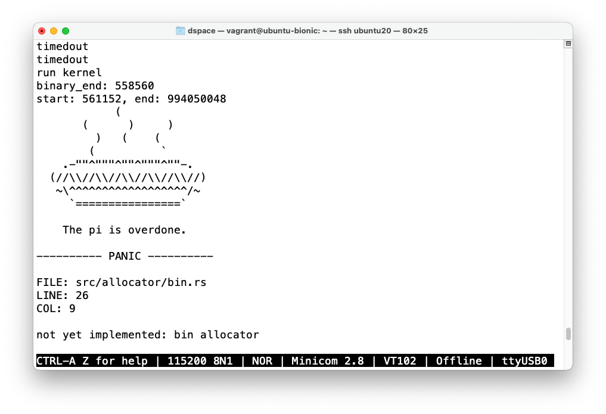

(2) page_sizeを無視した場合

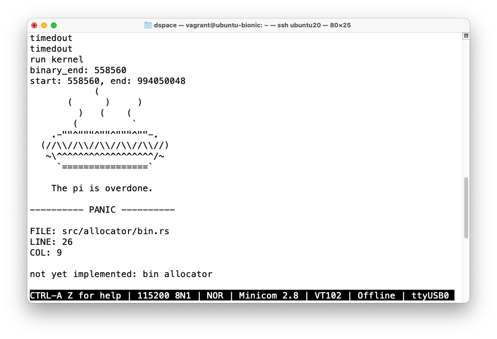

## サブフェーズD: バンプアロケータの実装

### ユニットテスト

```bash
$ make test
cargo test --target=x86_64-unknown-linux-gnu
   Compiling kernel v0.1.0 (/home/vagrant/rustos/kern)
... # 警告メッセージ
    Finished dev [unoptimized + debuginfo] target(s) in 1.46s
     Running target/x86_64-unknown-linux-gnu/debug/deps/kernel-f662d1658ad6b545

running 20 tests
test allocator::tests::align_util::test_align_up ... ok
test allocator::tests::align_util::test_align_down ... ok
test allocator::tests::align_util::test_panics_2 ... ok
test allocator::tests::align_util::test_panics_3 ... ok
test allocator::tests::align_util::test_panics_4 ... ok
test allocator::tests::align_util::test_panics_5 ... ok
test allocator::tests::allocator::bin_alloc ... FAILED
test allocator::tests::allocator::bin_alloc_2 ... FAILED
test allocator::tests::allocator::bin_dealloc_1 ... FAILED
test allocator::tests::allocator::bin_dealloc_2 ... FAILED
test allocator::tests::allocator::bin_dealloc_s ... FAILED
test allocator::tests::allocator::bin_exhausted ... FAILED
test allocator::tests::allocator::bump_alloc ... ok
test allocator::tests::align_util::test_panics_1 ... ok
test allocator::tests::allocator::bump_dealloc_s ... ok
test allocator::tests::allocator::bump_alloc_2 ... ok
test allocator::tests::linked_list::example_1 ... ok
test allocator::tests::linked_list::example_2 ... ok
test allocator::tests::linked_list::example_3 ... ok
test allocator::tests::allocator::bump_exhausted ... ok

failures:
    allocator::tests::allocator::bin_alloc
    allocator::tests::allocator::bin_alloc_2
    allocator::tests::allocator::bin_dealloc_1
    allocator::tests::allocator::bin_dealloc_2
    allocator::tests::allocator::bin_dealloc_s
    allocator::tests::allocator::bin_exhausted

test result: FAILED. 14 passed; 6 failed; 0 ignored; 0 measured; 0 filtered out
```

### 実行テスト

- `for`文は30回に変更

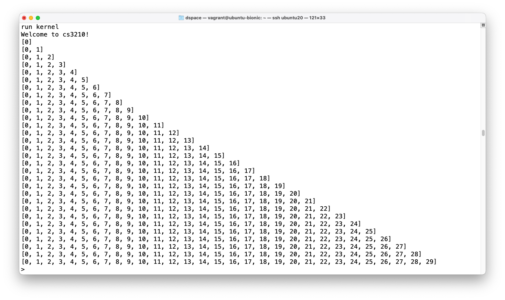

## サブフェーズE: ビンアロケータの実装

1. レイアウトのサイズとアライメントの大きい方で使用するbinを決定する
2. メモリは必要になった段階で(start, end)からbumpしてbinのエントリとする
3. 小さなbin1の後に大きなbin2を取るとアライメントの関係で無駄なスペースが
   できるのでそのスペースをbin2より小さなbinのエントリに使用する

```bash
$ make test
cargo test --target=x86_64-unknown-linux-gnu
   Compiling kernel v0.1.0 (/home/vagrant/rustos/kern)
... # 警告メッセージ
    Finished dev [unoptimized + debuginfo] target(s) in 0.68s
     Running target/x86_64-unknown-linux-gnu/debug/deps/kernel-f662d1658ad6b545

running 20 tests
test allocator::tests::align_util::test_align_down ... ok
test allocator::tests::align_util::test_align_up ... ok
test allocator::tests::align_util::test_panics_1 ... ok
test allocator::tests::align_util::test_panics_2 ... ok
test allocator::tests::align_util::test_panics_4 ... ok
test allocator::tests::align_util::test_panics_3 ... ok
test allocator::tests::align_util::test_panics_5 ... ok
test allocator::tests::allocator::bin_alloc ... ok
test allocator::tests::allocator::bin_dealloc_1 ... ok
test allocator::tests::allocator::bin_dealloc_2 ... ok
test allocator::tests::allocator::bin_alloc_2 ... ok
test allocator::tests::allocator::bin_dealloc_s ... ok
test allocator::tests::allocator::bin_exhausted ... ok
test allocator::tests::allocator::bump_alloc ... ok
test allocator::tests::allocator::bump_dealloc_s ... ok
test allocator::tests::allocator::bump_exhausted ... ok
test allocator::tests::linked_list::example_1 ... ok
test allocator::tests::linked_list::example_2 ... ok
test allocator::tests::linked_list::example_3 ... ok
test allocator::tests::allocator::bump_alloc_2 ... ok

test result: ok. 20 passed; 0 failed; 0 ignored; 0 measured; 0 filtered out
```

## FAT32実装: 1, 2の実装

### 依存クレートでエラー

```bash
$ cargo test -Z minimal-versions -- --nocapture
    Updating crates.io index
  Downloaded autocfg v0.1.4
  Downloaded const-random v0.1.11
  Downloaded rand v0.4.1
  Downloaded const-random-macro v0.1.11
  Downloaded proc-macro-hack v0.5.14
  Downloaded getrandom v0.2.0
  Downloaded libc v0.2.64
  Downloaded cfg-if v0.1.2
   Compiling libc v0.2.64
   Compiling getrandom v0.2.0
   Compiling semver v0.1.20
   Compiling cfg-if v0.1.2
   Compiling proc-macro-hack v0.5.14
   Compiling autocfg v0.1.4
   Compiling cfg-if v1.0.0
   Compiling rustc_version v0.1.7
   Compiling hashbrown v0.6.3
   Compiling core_io v0.1.20190701
   Compiling rand v0.4.1
   Compiling const-random-macro v0.1.11
error[E0432]: unresolved import `proc_macro`
 --> /home/vagrant/.cargo/registry/src/github.com-1ecc6299db9ec823/const-random-macro-0.1.11/src/lib.rs:2:5
  |
2 | use proc_macro::*;
  |     ^^^^^^^^^^ use of undeclared type or module `proc_macro`

error[E0433]: failed to resolve: use of undeclared type or module `TokenTree`
  --> /home/vagrant/.cargo/registry/src/github.com-1ecc6299db9ec823/const-random-macro-0.1.11/src/lib.rs:17:5
   |
17 |     TokenTree::from(Ident::new(ident, Span::call_site())).into()
   |     ^^^^^^^^^ use of undeclared type or module `TokenTree
...
```
- 以下の修正でエラー回避

```bash
$ vi ~/.cargo/registry/src/github.com-1ecc6299db9ec823/const-random-macro-0.1.11/src/lib.rs
extern crate proc_macro;   # 先頭にこの行を追加
```

### E0133 warningが多発

```bash
warning: borrow of packed field is unsafe and requires unsafe function or block (error E0133)
  --> src/mbr.rs:63:61
   |
63 |             .field("relative_sector", &format_args!("{:?}", self.relative_sector))
   |                                                             ^^^^^^^^^^^^^^^^^^^^
   |
   = note: #[warn(safe_packed_borrows)] on by default
   = warning: this was previously accepted by the compiler but is being phased out; it will become a hard error in a future release!
   = note: for more information, see issue #46043 <https://github.com/rust-lang/rust/issues/46043>
   = note: fields of packed structs might be misaligned: dereferencing a misaligned pointer or even just creating a misaligned reference is undefined behavior
```

- これはpacked構造体でアライメントに合わないフィールドに対して発生する
- 以下のようにエラー対象となったフィールドを`&{}`で囲むと回避できる（講義資料で指摘されていた）

```rust
.field("relative_sector", &{ self.relative_sector })
```

### 実装3: ユニットテスト成功

```bash
$ cargo test -Z minimal-versions -- --nocapture
Compiling const-random-macro v0.1.11
   Compiling const-random v0.1.11
   Compiling ahash v0.2.19
   Compiling hashbrown v0.6.3
   Compiling fat32 v0.1.0 (/home/vagrant/rustos/lib/fat32)

   Finished dev [unoptimized + debuginfo] target(s) in 0.93s
     Running target/debug/deps/fat32-daad72bc5314dd73

running 16 tests
test tests::check_ebpb_signature ... ok
test tests::check_mbr_boot_indicator ... ok
test tests::check_mbr_size ... ok
test tests::check_mbr_signature ... ok
test tests::test_ebpb ... ok
test tests::test_mbr ... ok

failures:
    tests::check_entry_sizes
    tests::shuffle_test
    tests::test_all_dir_entries
    tests::test_mock1_files_recursive
    tests::test_mock2_files_recursive
    tests::test_mock3_files_recursive
    tests::test_mock4_files_recursive
    tests::test_root_entries
    tests::test_vfat_init

test result: FAILED. 7 passed; 9 failed; 0 ignored; 0 measured; 0 filtered out
```

## FAT32実装: 4, 5の実装

```bash
$ cargo test -Z minimal-versions
   Compiling fat32 v0.1.0 (/home/vagrant/rustos/lib/fat32)
    Finished dev [unoptimized + debuginfo] target(s) in 1.45s
     Running target/debug/deps/fat32-daad72bc5314dd73

running 16 tests
test tests::check_ebpb_signature ... ok
test tests::check_ebpb_size ... ok
test tests::check_mbr_boot_indicator ... ok
test tests::check_mbr_signature ... ok
test tests::check_mbr_size ... ok
test tests::shuffle_test ... FAILED
test tests::test_mbr ... ok
test tests::test_ebpb ... ok
test tests::test_mock4_files_recursive ... FAILED
test tests::test_vfat_init ... ok                     # <= これが新たにOK

test result: FAILED. 8 passed; 8 failed; 0 ignored; 0 measured; 0 filtered out
```

## FAT32実装: 6-11の実装

- 新しいテストはすべて失敗
- test_mock3_files_recursiveでスタックオーバーフロー

```bash
running 16 tests
test tests::check_ebpb_size ... ok
test tests::check_ebpb_signature ... ok
test tests::check_entry_sizes ... FAILED
test tests::check_mbr_boot_indicator ... ok
test tests::check_mbr_size ... ok
test tests::check_mbr_signature ... ok
test tests::test_all_dir_entries ... FAILED
test tests::test_ebpb ... ok
test tests::shuffle_test ... FAILED
test tests::test_mbr ... ok
test tests::test_mock1_files_recursive ... FAILED


thread 'tests::test_mock3_files_recursive' has overflowed its stack
fatal runtime error: stack overflow
error: process didn't exit successfully: `/home/vagrant/rustos/lib/fat32/target/debug/deps/fat32-daad72bc5314dd73` (signal: 6, SIGABRT: process abort signal)
```

## extディレクトリの内容

```bash
$ parted mock1.fat32.img unit B print
WARNING: You are not superuser.  Watch out for permissions.
Model:  (file)
Disk /home/vagrant/rustos/ext/fat32-imgs/mock1.fat32.img: 201326592B
Sector size (logical/physical): 512B/512B
Partition Table: msdos
Disk Flags:

Number  Start  End         Size        Type     File system  Flags
 1      512B   201326591B  201326080B  primary  fat32        boot

$ parted mock2.fat32.img unit B print
WARNING: You are not superuser.  Watch out for permissions.
Model:  (file)
Disk /home/vagrant/rustos/ext/fat32-imgs/mock2.fat32.img: 201326592B
Sector size (logical/physical): 512B/512B
Partition Table: msdos
Disk Flags:

Number  Start     End         Size        Type     File system  Flags
 1      8388608B  201326591B  192937984B  primary  fat32

$ parted mock3.fat32.img unit B print
WARNING: You are not superuser.  Watch out for permissions.
Model:  (file)
Disk /home/vagrant/rustos/ext/fat32-imgs/mock3.fat32.img: 201326592B
Sector size (logical/physical): 512B/512B
Partition Table: msdos
Disk Flags:

Number  Start     End         Size        Type     File system  Flags
 1      8388608B  201326591B  192937984B  primary  fat32

$ parted mock4.fat32.img unit B print
WARNING: You are not superuser.  Watch out for permissions.
Model:  (file)
Disk /home/vagrant/rustos/ext/fat32-imgs/mock4.fat32.img: 201326592B
Sector size (logical/physical): 512B/512B
Partition Table: msdos
Disk Flags:

Number  Start     End         Size        Type     File system  Flags
 1      8388608B  201326591B  192937984B  primary  fat32
```

### 中身は同じ

```bash
$ sudo mount -o loop,offset=8388608,sizelimit=192937984 mock3.fat32.img /mnt
vagrant@ubuntu-bionic:~/rustos/ext/fat32-imgs$ tree /mnt
/mnt
├── notes
│   ├── lec1
│   │   └── slides.pdf
│   ├── lec2
│   │   ├── code
│   │   │   ├── code.pdf
│   │   │   └── code.rs
│   │   └── paper.pdf
│   ├── lec3
│   │   └── cheat-sheet.pdf
│   ├── lec4
│   │   └── uart-basics.pdf
│   ├── lec5
│   │   ├── fs-dm.pdf
│   │   └── fs-engler.pdf
│   └── lec7
│       └── fat-structs.pdf
├── rpi3-docs
│   ├── ARM
│   │   ├── ARM-Cortex-A53-Manual.pdf
│   │   ├── ARMv8-A-Programmer-Guide.pdf
│   │   ├── ARMv8-Reference-Manual.pdf
│   │   └── ISA-Cheat-Sheet.pdf
│   ├── Broadcom
│   │   ├── BCM2835-ARM-Peripherals.pdf
│   │   ├── BCM2836-ARM-Local-Peripherals.pdf
│   │   └── BCM2837-ARM-Peripherals.pdf
│   ├── EMMC
│   │   ├── Physical-Layer-Simplified-SpecificationV6.0.pdf
│   │   └── SD-Host-Controller-Simplified-SpecificationV4.20.pdf
│   └── RPi3-Schematics.pdf
└── solutions
    ├── 0-blinky
    │   ├── c
    │   │   └── blinky.c
    │   └── rust
    │       └── blinky.rs
    └── 1-shell
        └── ferris-wheel
            ├── compile-fail
            │   └── answers
            ├── compile-pass
            │   └── answers
            └── questions
                └── answers

21 directories, 24 files

$ sudo umount /mnt
```

## 個別にテスト

### `check_entry_sizes()`

```bash
$ cargo test -Z minimal-versions check_entry_sizes
running 1 test
test tests::check_entry_sizes ... FAILED

failures:

---- tests::check_entry_sizes stdout ----
thread 'tests::check_entry_sizes' panicked at 'assertion failed: `(left == right)`
  left: `42`,
 right: `32`: 'vfat::dir::VFatUnknownDirEntry' does not have the expected size of 32', src/tests.rs:171:5
```

- VFatUnknownDirEntryの定義ミスだった

```bash
running 1 test
test tests::check_entry_sizes ... ok

test result: ok. 1 passed; 0 failed; 0 ignored; 0 measured; 15 filtered out
```

### `test_root_entries()`

```bash
cargo test -Z minimal-versions test_root_entries

running 1 test
test tests::test_root_entries ... FAILED

failures:

---- tests::test_root_entries stdout ----

File system hash failed for mock 1 root directory!

--------------- EXPECTED ---------------
-f--	00/00/1980 00:00:00 02/26/2018 00:25:20 00/00/1980 00:00:00 	CS140E
d---	02/26/2018 00:25:20 02/26/2018 00:25:20 02/26/2018 00:00:00 	NOTES
d---	02/26/2018 00:25:20 02/26/2018 00:25:20 02/26/2018 00:00:00 	rpi3-docs
d---	02/26/2018 00:25:20 02/26/2018 00:25:20 02/26/2018 00:00:00 	solutions
---------------- ACTUAL ----------------
-f--	00/00/1980 00:00:00 02/26/2056 00:25:10 00/00/1980 00:00:00 	CS140E.CS140E
d---	02/26/2056 00:25:10 02/26/2056 00:25:10 02/26/2056 00:00:00 	NOTES.NOTES
d---	02/26/2056 00:25:10 02/26/2056 00:25:10 02/26/2056 00:00:00 	rpi3-docs
d---	02/26/2056 00:25:10 02/26/2056 00:25:10 02/26/2056 00:00:00 	solutions
---------------- END ----------------
thread 'tests::test_root_entries' panicked at 'hash mismatch', src/tests.rs:246:5
note: run with `RUST_BACKTRACE=1` environment variable to display a backtrace.


failures:
    tests::test_root_entries

test result: FAILED. 0 passed; 1 failed; 0 ignored; 0 measured; 15 filtered out
```

- metadata.rsとdir.rsにバグあり

```bash
running 1 test
test tests::test_root_entries ... ok

test result: ok. 1 passed; 0 failed; 0 ignored; 0 measured; 15 filtered out
```

### `test_all_dir_entries()`

- mock3のみエラー

```bash
$ diff -uw expected.txt actual.txt
--- expected.txt	2024-04-30 16:03:32.000000000 +0900
+++ actual.txt	2024-04-30 16:03:52.000000000 +0900
@@ -16,40 +16,40 @@
 /NOTES/LEC1
 d---	02/26/2018 00:40:00 02/26/2018 00:40:00 02/26/2018 00:00:00 	.
 d---	02/26/2018 00:40:00 02/26/2018 00:40:00 02/26/2018 00:00:00 	..
--f--	02/26/2018 00:40:00 02/26/2018 00:40:00 02/26/2018 00:00:00 	SLIDES.PDF
+-f--	02/26/2018 00:40:00 02/26/2018 00:40:00 04/29/2024 00:00:00 	SLIDES.PDF

 /NOTES/LEC2
 d---	02/26/2018 00:40:00 02/26/2018 00:40:00 02/26/2018 00:00:00 	.
 d---	02/26/2018 00:40:00 02/26/2018 00:40:00 02/26/2018 00:00:00 	..
 d---	02/26/2018 00:40:00 02/26/2018 00:40:00 02/26/2018 00:00:00 	CODE
--f--	02/26/2018 00:40:00 02/26/2018 00:40:00 02/26/2018 00:00:00 	PAPER.PDF
+-f--	02/26/2018 00:40:00 02/26/2018 00:40:00 04/29/2024 00:00:00 	PAPER.PDF

 /NOTES/LEC2/CODE
 d---	02/26/2018 00:40:00 02/26/2018 00:40:00 02/26/2018 00:00:00 	.
 d---	02/26/2018 00:40:00 02/26/2018 00:40:00 02/26/2018 00:00:00 	..
--f--	02/26/2018 00:40:00 02/26/2018 00:40:00 02/26/2018 00:00:00 	CODE.PDF
--f--	02/26/2018 00:40:00 02/26/2018 00:40:00 02/26/2018 00:00:00 	CODE.RS
+-f--	02/26/2018 00:40:00 02/26/2018 00:40:00 04/29/2024 00:00:00 	CODE.PDF
+-f--	02/26/2018 00:40:00 02/26/2018 00:40:00 04/29/2024 00:00:00 	CODE.RS

 /NOTES/LEC3
 d---	02/26/2018 00:40:00 02/26/2018 00:40:00 02/26/2018 00:00:00 	.
 d---	02/26/2018 00:40:00 02/26/2018 00:40:00 02/26/2018 00:00:00 	..
--f--	02/26/2018 00:40:00 02/26/2018 00:40:00 02/26/2018 00:00:00 	cheat-sheet.pdf
+-f--	02/26/2018 00:40:00 02/26/2018 00:40:00 04/29/2024 00:00:00 	cheat-sheet.pdf

 /NOTES/LEC4
 d---	02/26/2018 00:40:00 02/26/2018 00:40:00 02/26/2018 00:00:00 	.
 d---	02/26/2018 00:40:00 02/26/2018 00:40:00 02/26/2018 00:00:00 	..
--f--	02/26/2018 00:40:00 02/26/2018 00:40:00 02/26/2018 00:00:00 	uart-basics.pdf
+-f--	02/26/2018 00:40:00 02/26/2018 00:40:00 04/29/2024 00:00:00 	uart-basics.pdf

 /NOTES/LEC5
 d---	02/26/2018 00:40:00 02/26/2018 00:40:00 02/26/2018 00:00:00 	.
 d---	02/26/2018 00:40:00 02/26/2018 00:40:00 02/26/2018 00:00:00 	..
--f--	02/26/2018 00:40:00 02/26/2018 00:40:00 02/26/2018 00:00:00 	FS-DM.PDF
--f--	02/26/2018 00:40:00 02/26/2018 00:40:00 02/26/2018 00:00:00 	fs-engler.pdf
+-f--	02/26/2018 00:40:00 02/26/2018 00:40:00 04/29/2024 00:00:00 	FS-DM.PDF
+-f--	02/26/2018 00:40:00 02/26/2018 00:40:00 04/29/2024 00:00:00 	fs-engler.pdf

 /NOTES/LEC7
 d---	02/26/2018 00:40:00 02/26/2018 00:40:00 02/26/2018 00:00:00 	.
 d---	02/26/2018 00:40:00 02/26/2018 00:40:00 02/26/2018 00:00:00 	..
--f--	02/26/2018 00:40:00 02/26/2018 00:40:00 02/26/2018 00:00:00 	fat-structs.pdf
+-f--	02/26/2018 00:40:00 02/26/2018 00:40:00 04/29/2024 00:00:00 	fat-structs.pdf

 /rpi3-docs
 d---	02/26/2018 00:40:00 02/26/2018 00:40:00 02/26/2018 00:00:00 	.
@@ -122,7 +122,7 @@
 /solutions/1-SHELL/ferris-wheel/compile-pass
 d---	02/26/2018 00:40:00 02/26/2018 00:40:00 02/26/2018 00:00:00 	.
 d---	02/26/2018 00:40:00 02/26/2018 00:40:00 02/26/2018 00:00:00 	..
--f--	02/26/2018 00:40:00 02/26/2018 00:40:00 02/26/2018 00:00:00 	ANSWERS
+-f--	02/26/2018 00:40:00 02/26/2018 00:40:00 04/29/2024 00:00:00 	ANSWERS

 /solutions/1-SHELL/ferris-wheel/questions
 d---	02/26/2018 00:40:00 02/26/2018 00:40:00 02/26/2018 00:00:00 	.
```

```bash
$ cd /mnt
$ ls -al notes/lec1
total 903
drwxr-xr-x 2 root root    512 Feb 26  2018 .
drwxr-xr-x 8 root root    512 Feb 26  2018 ..
-rwxr-xr-x 1 root root 923375 Feb 26  2018 slides.pdf
$ ls -al notes/lec2
total 209
drwxr-xr-x 3 root root    512 Feb 26  2018 .
drwxr-xr-x 8 root root    512 Feb 26  2018 ..
drwxr-xr-x 2 root root    512 Feb 26  2018 code
-rwxr-xr-x 1 root root 211518 Feb 26  2018 paper.pdf
```

- 解凍後にmock3.fat32.imgを更新してしまったようだ
- 一旦削除して再解凍したファイルに対してテストしたら問題なかった

```bash
running 1 test
test tests::test_all_dir_entries ... ok

test result: ok. 1 passed; 0 failed; 0 ignored; 0 measured; 15 filtered out
```

## `test_mock1_files_recursive()`

```bash
$ cargo test -Z minimal-versions test_mock1_files_recursive
    Finished dev [unoptimized + debuginfo] target(s) in 0.02s
     Running target/debug/deps/fat32-daad72bc5314dd73

running 1 test
test tests::test_mock1_files_recursive ... FAILED

failures:

---- tests::test_mock1_files_recursive stdout ----
thread 'tests::test_mock1_files_recursive' panicked at 'assertion failed: `(left == right)`
  left: `874160`,
 right: `923375`: expected to read 923375 bytes (file size) but read 874160', src/tests.rs:328:5
note: run with `RUST_BACKTRACE=1` environment variable to display a backtrace.

   #  ls -l notes/lec1/slides.pdf
   #  -rwxr-xr-x 1 root root 923375 Feb 26  2018 slides.pdf

failures:
    tests::test_mock1_files_recursive

test result: FAILED. 0 passed; 1 failed; 0 ignored; 0 measured; 15 filtered out
```

- read_cluster_unaligned()のバグだった

```bash
$ cargo test -Z minimal-versions test_mock1_files_recursive
   Compiling fat32 v
running 1 test
test tests::test_mock1_files_recursive ... ok

test result: ok. 1 passed; 0 failed; 0 ignored; 0 measured; 15 filtered out
```

### `shuffle_test()`

```bash
$ cargo test -Z minimal-versions shuffle_test
    Finished dev [unoptimized + debuginfo] target(s) in 0.02s
     Running target/debug/deps/fat32-daad72bc5314dd73

running 1 test
test tests::shuffle_test ... ok

test result: ok. 1 passed; 0 failed; 0 ignored; 0 measured; 15 filtered out
```

## 全テストOK

```bash
$ cargo test -Z minimal-versions

running 16 tests
test tests::check_ebpb_size ... ok
test tests::check_ebpb_signature ... ok
test tests::check_mbr_boot_indicator ... ok
test tests::check_mbr_signature ... ok
test tests::check_mbr_size ... ok
test tests::check_entry_sizes ... ok
test tests::test_all_dir_entries ... ok
test tests::test_ebpb ... ok
test tests::test_mbr ... ok
test tests::shuffle_test ... ok
test tests::test_mock1_files_recursive ... ok
test tests::test_mock2_files_recursive ... ok
test tests::test_mock3_files_recursive ... ok
test tests::test_root_entries ... ok
test tests::test_vfat_init ... ok
test tests::test_mock4_files_recursive ... ok

test result: ok. 16 passed; 0 failed; 0 ignored; 0 measured; 0 filtered out

   Doc-tests fat32

running 0 tests

test result: ok. 0 passed; 0 failed; 0 ignored; 0 measured; 0 filtered out
```

# lab3: phase 3, Subphase A: SDドライバFFI

- テスト成功

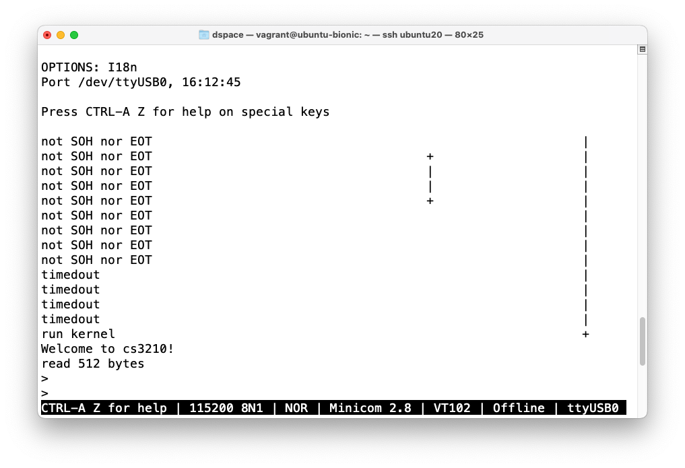

# lab3: phase 3, Subphase B: ファイルシステム

```rust
use fat32::traits::fs::{Entry, File, Dir};         # これらのトレイトをuseしないと関数が未定義といわれる
use fat32::traits::FileSystem as FAT32FileSystem;  # aliasにしないとfs::FileSystemの重複定義と言われる

if let Ok(root) = FILESYSTEM.open(PathBuf::from("/")) {
   let root = root.into_dir().unwrap();
   for entry in root.entries().unwrap() {
      if let Some(f) = entry.as_file() {
            kprintln!("{}: {}", entry.name(), f.size());
      } else {
            kprintln!("{}", entry.name());
      }
   }
}
```

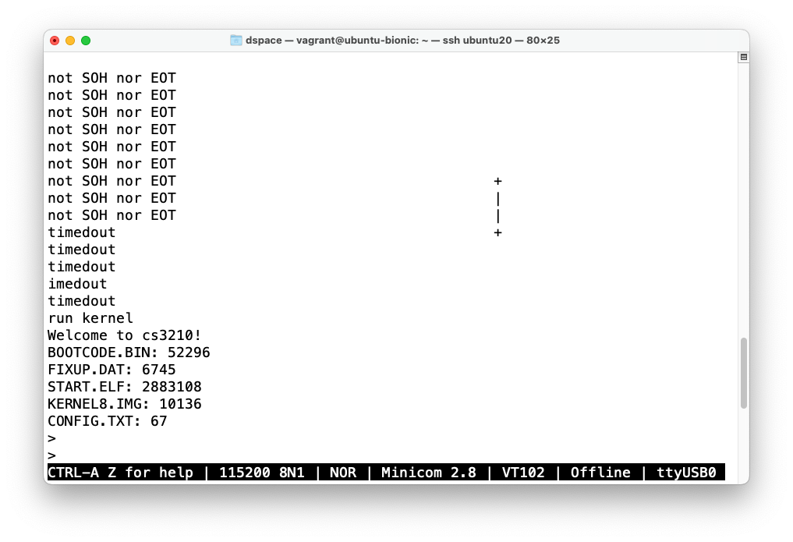

# lab3: phase 4: Mo'shの実装

- cwd, cd, lsまで実装

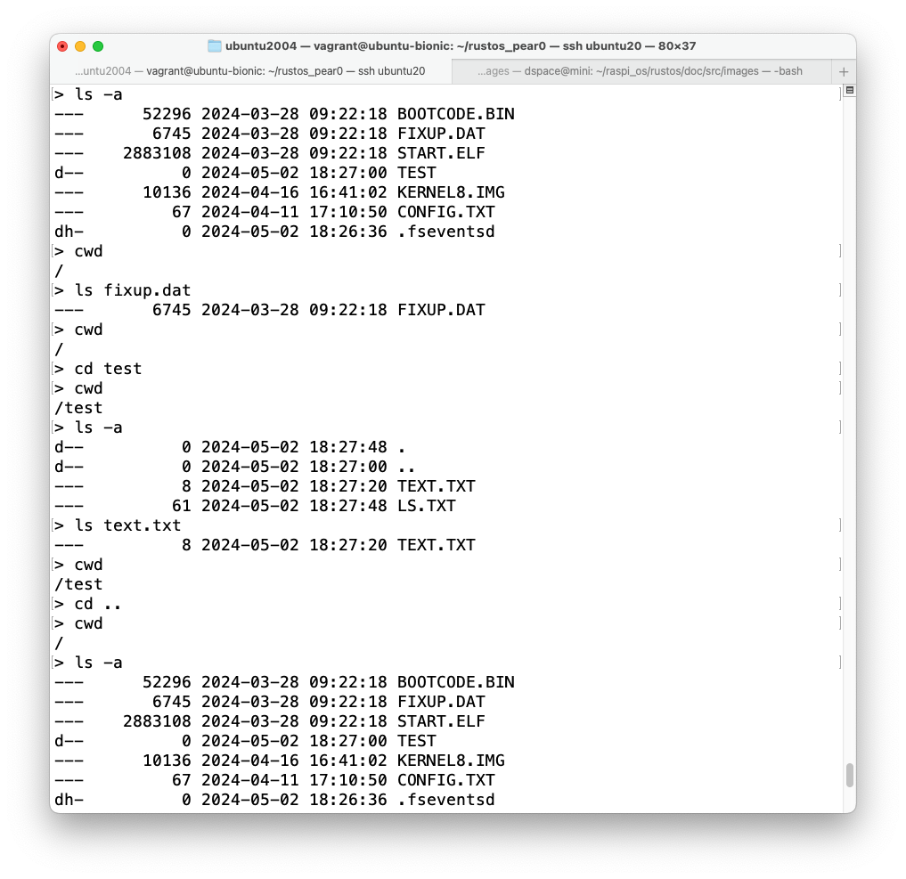

- catも実装

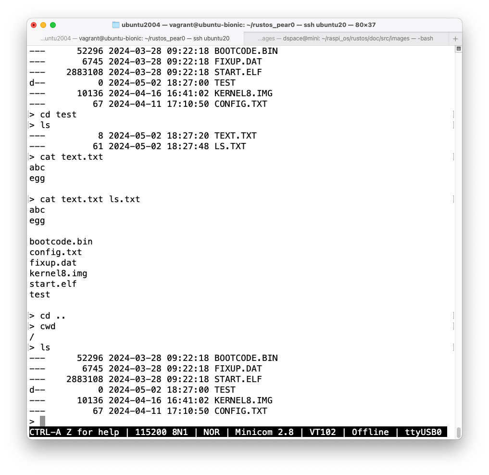

# lab4: phase 1, Subphase C: 現在の例外レベル

```rust
kprintln!("current el = {}", unsafe { aarch64::current_el() });
```

- EL2になっている。

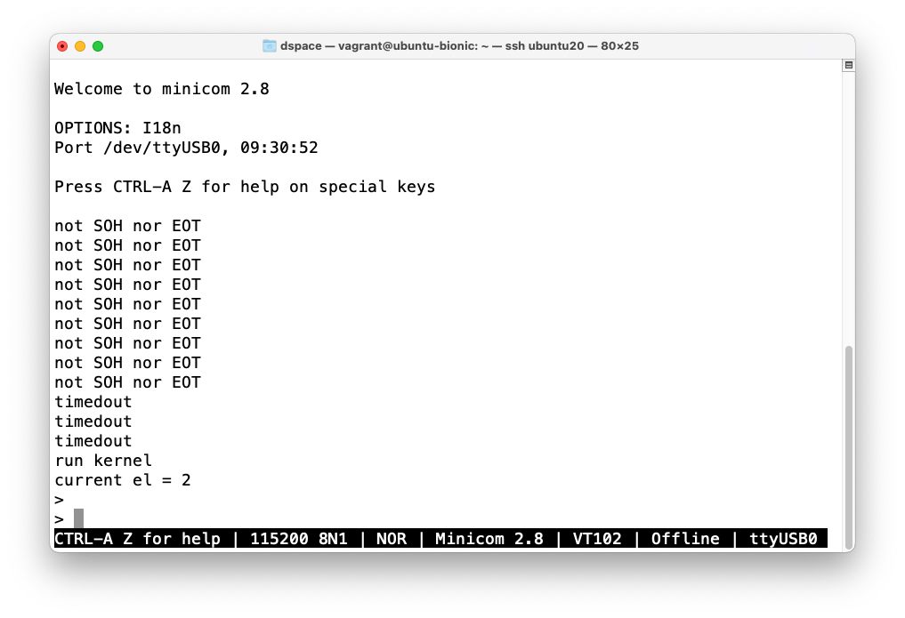

# lab4: phase 1, Subphase C: EL1に切り替える

```rust
   ELR_EL2.set(switch_to_el1 as u64);
   asm::eret();
```

- EL1になっている。

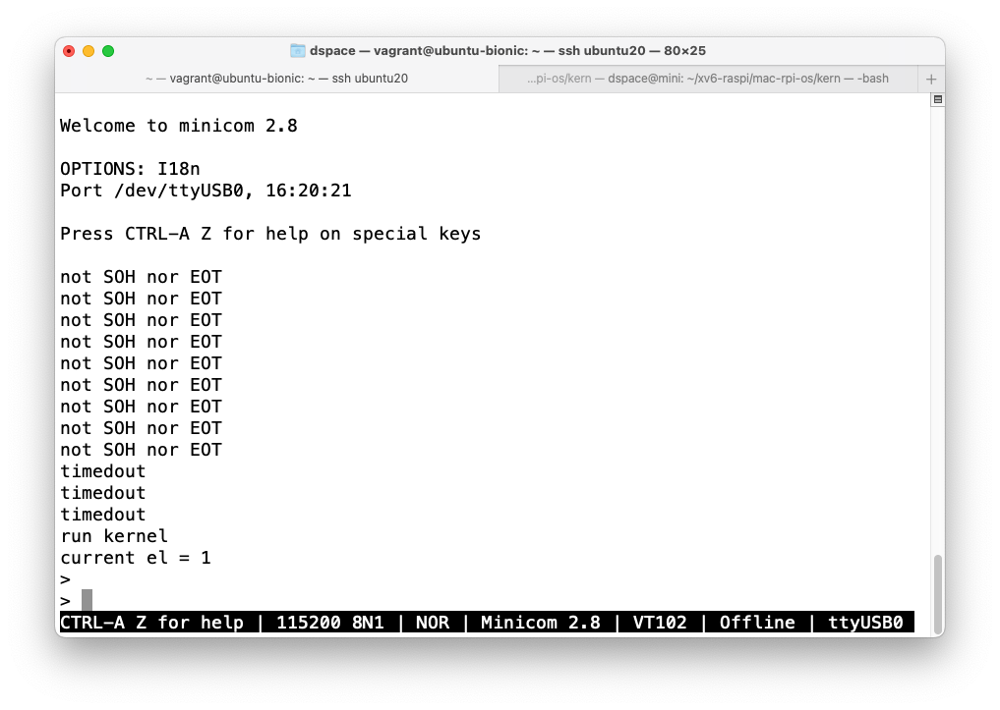

# lab4: phase 1, Subphase D: 例外ベクタ実装

- brk 2

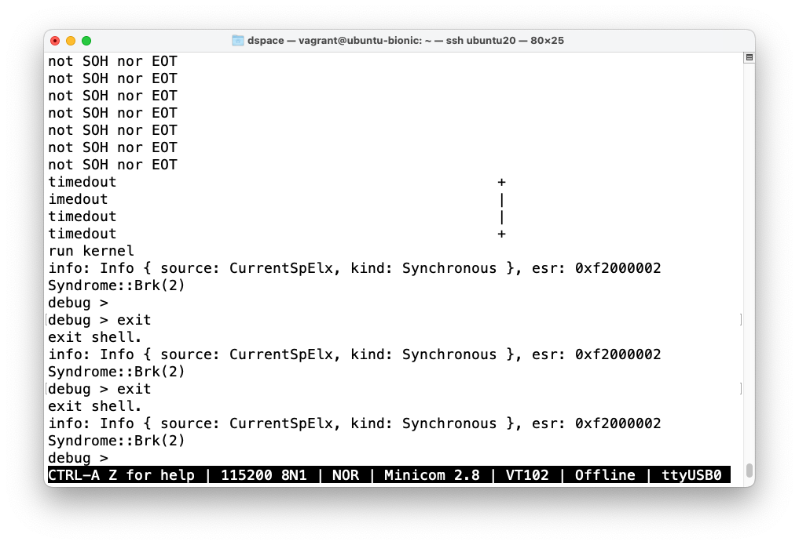

- svc 3

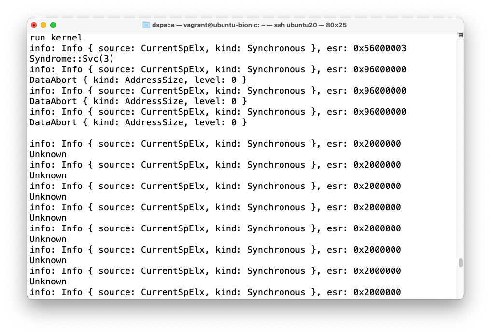

# lab4: phase 1, Subphase E: 例外からの復帰の実装

- QEMUによる実行

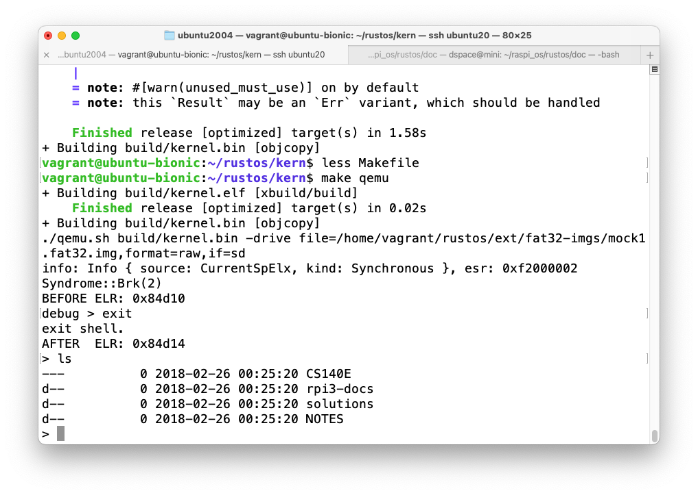

- raspiによる実行

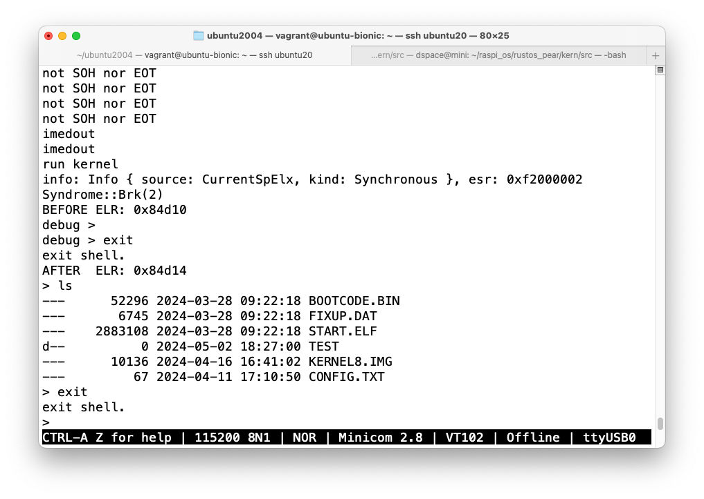

はじめraspiで下のようなエラーになっていたのでQEMUで実行してみたら、
エラーなく実行された。tf.elfの値が明らかにおかしい。
その後、raspiで実行したところエラーなく実行された。この間、何を修正
したのか記憶がない。

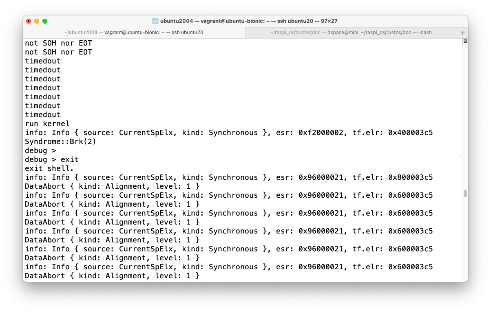

# lab4: phase 2, Subphase B: 最初のプロセスの実装

1. `extern "C" fn start_shell()`を作成
2. トラップフレームの設定
   - tf.elf にはstart_shell()のアドレスをセット
   - tf.spsrをセット、IRQはunset
   - tf.spはプロセスのスタックのtop
   - tf.trdirには最初のプロセスなので1をセット
3. 現在のspにトラップフレームをセット
   context_restoreを呼び出し
   eret()の呼び出し（tr.elfにセットしたstart_shellに戻る）
4. main.rsの`kamin()`を指定通り修正

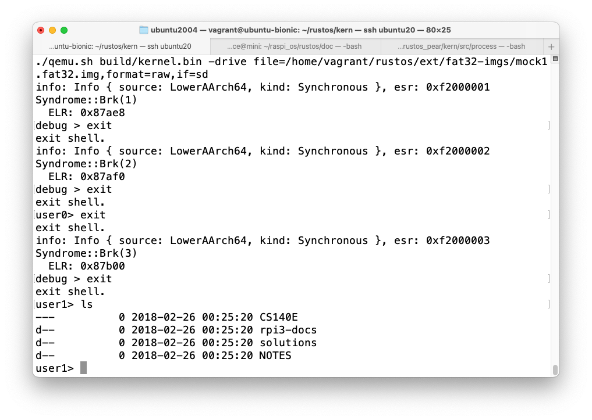

# lab4: phase 2, Subphase C: タイマー割り込み

- Brk割り込み処理中はIRQは保留になる（画面はraspiで実行）

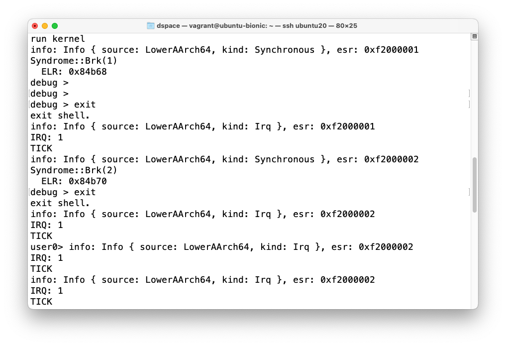

- Brk割り込みを削除すると最初からIRQ割り込みが処理される（画面はQEMUで実行）

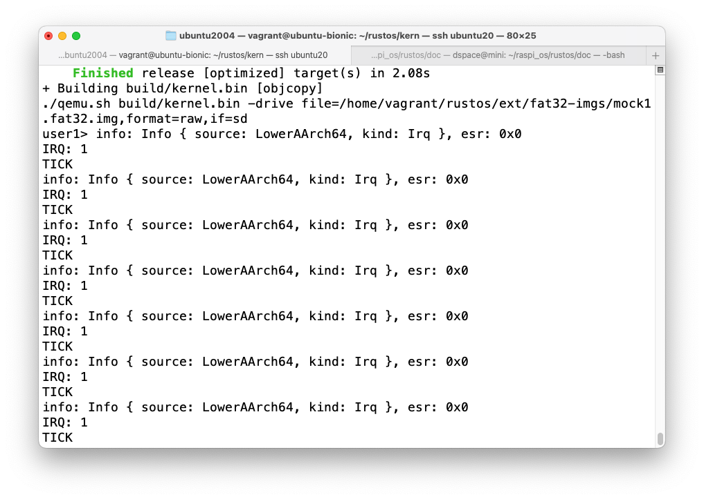

# lab4: phase 2, Subphase D: スケジューラ

- 実装(1)の「mem::replace()関数が役に立つことが証明」は次のことだった

   普通にマッチさせただけでは可変借用を2回することになりエラー

```rust
pub fn is_ready(&mut self) -> bool {
   match &mut self.state {
      State::Ready => true,
      State::Waiting(ref mut event_poll_fn) => {
            if event_poll_fn(self) {
               true
            } else {
               false
            }
      }
      _ => false,
   }
}

error[E0499]: cannot borrow `*self` as mutable more than once at a time
--> src/process/process.rs:117:34
   |
114 |         match &mut self.state {
   |               --------------- first mutable borrow occurs here
...
117 |                 if event_poll_fn(self) {
   |                    ------------- ^^^^ second mutable borrow occurs here
   |                    |
   |                    first borrow later used by call
```

- 次のように`pub fn replace<T>(dest: &mut T, src: T) -> T`を使う

```rust
pub fn is_ready(&mut self) -> bool {
   // ここで現在のstateを取り出し`Ready`に置換する
   let mut state = mem::replace(&mut self.state, State::Ready);
   match state {
      State::Ready => true,
      State::Waiting(ref mut event_poll_fn) => {
            if event_poll_fn(self) {
               // イベントが発生したのでReadyに変えたままでOK
               true
            } else {
               // イベントは発生していないので状態をWaitingに戻しておく
               self.state = state;
               false
            }
      }
      _ => {
            // 状態を元に戻しておく
            self.state = state;
            false
      }
   }
}
```

## コンテキストスイッチ

1. カレントプロセスのトラップフレームを保存

   - `fn schedule_out(&mut self, new_state: State, tf: &mut TrapFrame) -> bool`
   - `tf`をカレントプロセスのトラップフレームにセット（保存）する

2. 次に実行するプロセスのトラップフレームを復元

   - `fn switch_to(&mut self, tf: &mut TrapFrame) -> Option<Id>`
   - 実行するプロセスのトラップフレームを`tf`にセット（復元）する


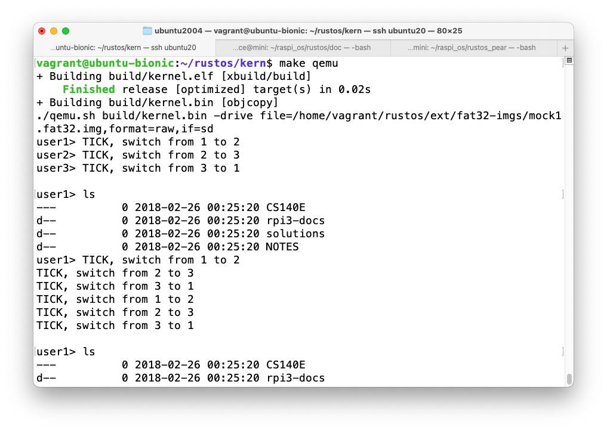

# lab4: phase 2, Subphase E: スリープ

- すべてのプロセスがスリープすると次に実行すべきプロセスがなくなる。
- スケジューラは実行すべきプロセスがないと`wfe`で待機しているがこれは
   割り込みでは起床しない。下のように何も起きない.

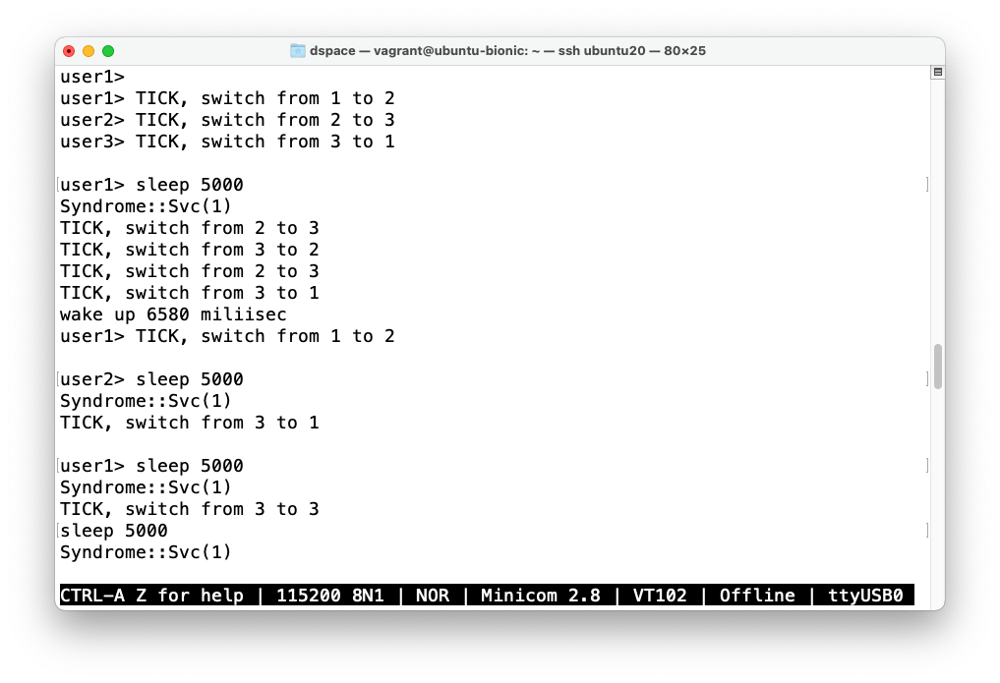

- 実行すべきプロセスがない場合に`wfi`で待機するように変更すると
   割り込みで起床するので起床したプロセスが実行される。

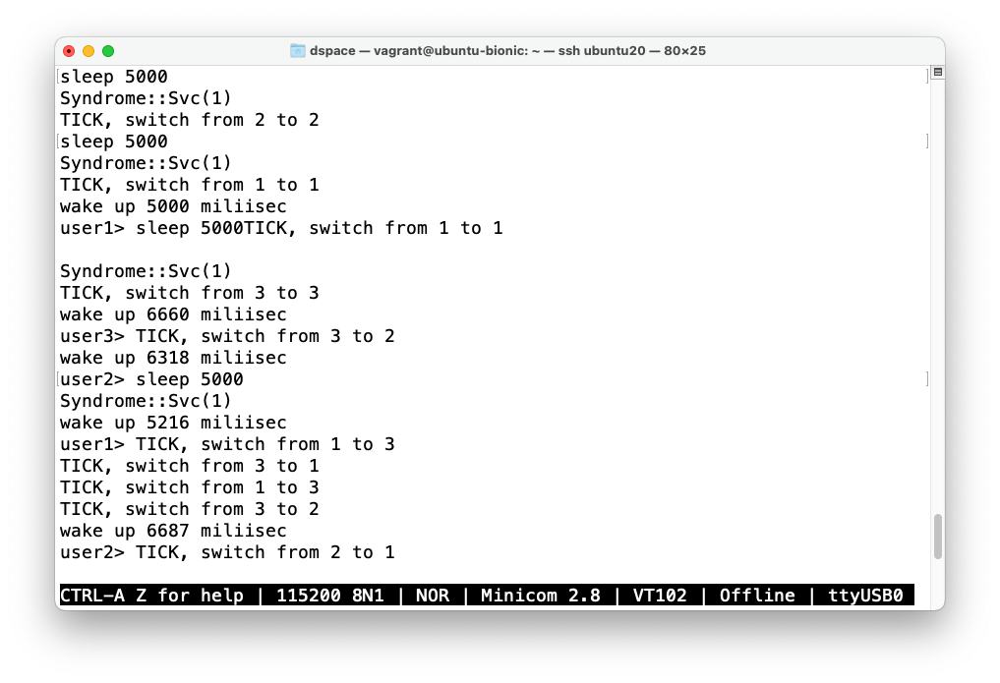

# lab4: phase 3, subphase B: ページテーブル

- エラー

```bash
$ make qemu
+ Building build/kernel.elf [xbuild/build]
    Finished release [optimized] target(s) in 0.02s
+ Building build/kernel.bin [objcopy]
./qemu.sh build/kernel.bin -drive file=/home/vagrant/rustos/ext/fat32-imgs/mock1.fat32.img,format=raw,if=sd
l3[0] addr = 0xd0000
l3[1] addr = 0xe0000
l2.entries[..2]
  VT-> d0000 (d0703)
  VT-> e0000 (e0703)
l3[0].entries[..10]
  VPMIA|KERN-RW-> 00000000 (703)
  VPMIA|KERN-RW-> 00010000 (10703)
  VPMIA|KERN-RW-> 00020000 (20703)
  VPMIA|KERN-RW-> 00030000 (30703)
  VPMIA|KERN-RW-> 00040000 (40703)
  VPMIA|KERN-RW-> 00050000 (50703)
  VPMIA|KERN-RW-> 00060000 (60703)
  VPMIA|KERN-RW-> 00070000 (70703)
  VPMIA|KERN-RW-> 00080000 (80703)
  VPMIA|KERN-RW-> 00090000 (90703)
l3[0] addr = 0x210000
l3[1] addr = 0x220000
allocated at 0xa0000
UserPageTable.alloc at 0x0 V?MIA|USER-RW-> 000a0000 (a0741) # <= Typeが?
copying at 0xffffffffc0000000
l3[0] addr = 0x290000
l3[1] addr = 0x2a0000
allocated at 0x2e0000
UserPageTable.alloc at 0x0 V?MIA|USER-RW-> 002e0000 (2e0741)
copying at 0xffffffffc0000000
process 1 added
process 2 added
            (
       (      )     )
         )   (    (
        (          `
    .-""^"""^""^"""^""-.
  (//\\//\\//\\//\\//\\//)
   ~\^^^^^^^^^^^^^^^^^^/~
     `================`

    The pi is overdone.

---------- PANIC ----------

FILE: src/traps.rs
LINE: 60
COL: 22

Unexpected syndrome InstructionAbort { kind: Translation, level: 3 }
QEMU: Terminated
```

- UserPTのL3EntryのTypeが`?`になるのはバグで修正
- TranslationエラーからUnknownエラーに変化
- デバッグ出力を追加

## カーネルページテーブルの構造

```bash
   0x000C0000: L2Table
   0x000D0000: L3Table[0]
   0x00000000:   Entry[0]    : VPMIA|KERN-RW
      ...
   0x000E0000: L3Table[1]
      ...
   0x3FFF0000:   Entry[8191] : VPDOA|KERN-RW
```

## プロセス1のユーザページテーブルの構造

```bash
   0x00200000: L2Table
   0x00210000: L3Table[0]
   0x000A0000:   Entry[0] : VPMIA|KERN-RW
   0x00220000: L3Table[1]
```

## プロセス2のユーザページテーブルの構造

```bash
   0x00280000: L2Table
   0x00290000: L3Table[0]
   0x002E0000:   Entry[0] : VPMIA|KERN-RW
   0x002A0000: L3Table[1]
```

### 出力ログ

```bash
ininitaiize VMM: call KernPageTabel::new
l3[0] addr = 0xd0000
l3[1] addr = 0xe0000
PT BASE_ADDR: 0x00000000000C0000
memory_map: 0x9c088 - 0x3c000000
l2.entries[..2]
  VT-> 0x00000000000D0000 (0x00000000000D0703)
l3[0].entries[..10]
  VPMIA|KERN-RW-> 0x0000000000000000 (0x0000000000000703)
  VPMIA|KERN-RW-> 0x0000000000010000 (0x0000000000010703)
  VPMIA|KERN-RW-> 0x0000000000020000 (0x0000000000020703)
  VPMIA|KERN-RW-> 0x0000000000030000 (0x0000000000030703)
  VPMIA|KERN-RW-> 0x0000000000040000 (0x0000000000040703)
  VPMIA|KERN-RW-> 0x0000000000050000 (0x0000000000050703)
  VPMIA|KERN-RW-> 0x0000000000060000 (0x0000000000060703)
  VPMIA|KERN-RW-> 0x0000000000070000 (0x0000000000070703)
  VPMIA|KERN-RW-> 0x0000000000080000 (0x0000000000080703)
  VPMIA|KERN-RW-> 0x0000000000090000 (0x0000000000090703)
  VT-> 0x00000000000E0000 (0x00000000000E0703)
l3[1].entries[8180..]
  VPDOA|KERN-RW-> 0x000000003FF40000 (0x000000003FF40607)
  VPDOA|KERN-RW-> 0x000000003FF50000 (0x000000003FF50607)
  VPDOA|KERN-RW-> 0x000000003FF60000 (0x000000003FF60607)
  VPDOA|KERN-RW-> 0x000000003FF70000 (0x000000003FF70607)
  VPDOA|KERN-RW-> 0x000000003FF80000 (0x000000003FF80607)
  VPDOA|KERN-RW-> 0x000000003FF90000 (0x000000003FF90607)
  VPDOA|KERN-RW-> 0x000000003FFA0000 (0x000000003FFA0607)
  VPDOA|KERN-RW-> 0x000000003FFB0000 (0x000000003FFB0607)
  VPDOA|KERN-RW-> 0x000000003FFC0000 (0x000000003FFC0607)
  VPDOA|KERN-RW-> 0x000000003FFD0000 (0x000000003FFD0607)
  VPDOA|KERN-RW-> 0x000000003FFE0000 (0x000000003FFE0607)
  VPDOA|KERN-RW-> 0x000000003FFF0000 (0x000000003FFF0607)

Procwss::new: call UserPageTable::new
l3[0] addr = 0x210000
l3[1] addr = 0x220000
PT BASE_ADDR: 0x0000000000200000
User L3Entry: va 0x00000000 => page: 0x000A0000
  VPMIA|USER-RW-> 0x00000000000A0000 (0x00000000000A0743)
copying at 0xffffffffc0000000

Procwss::new: call UserPageTable::new
l3[0] addr = 0x290000
l3[1] addr = 0x2a0000
PT BASE_ADDR: 0x0000000000280000
User L3Entry: va 0x00000000 => page: 0x002E0000
  VPMIA|USER-RW-> 0x00000000002E0000 (0x00000000002E0743)
copying at 0xffffffffc0000000
process 1 added
process 2 added
            (
       (      )     )
         )   (    (
        (          `
    .-""^"""^""^"""^""-.
  (//\\//\\//\\//\\//\\//)
   ~\^^^^^^^^^^^^^^^^^^/~
     `================`

    The pi is overdone.

---------- PANIC ----------

FILE: src/traps.rs
LINE: 60
COL: 22

Unexpected syndrome Unknown, info: Info { source: LowerAArch64, kind: Synchronous }, esr: 0x2000000, tf: TrapFrame { elr: 18446744072635809792, spsr: 832, sp: 2097152, tpidr: 1, ttbr0: 786432, ttbr1: 2097152, qn: [0, 0, 0, 0, 0, 0, 0, 0, 0, 0, 0, 0, 0, 0, 0, 0, 0, 0, 0, 0, 0, 0, 0, 0, 0, 0, 0, 0, 0, 0, 0, 0], xn: [0, 0, 0, 0, 0, 0, 0, 0, 0, 0, 0, 0, 0, 0, 0, 0, 0, 0, 0, 0, 0, 0, 0, 0, 0, 0, 0, 0, 0, 0, 538312], zero: 0 }
```

- デバッグ出力を変更

```bash
KernPageTable:
  L2Table: 0x000C0000
    [0]: VT-> 0x000D0000
    [0]: VT-> 0x000E0000
  L3Table[0]: 0x000D0000
    [0]:     VPMIA|KERN-RW-> 0x00000000
    [1]:     VPMIA|KERN-RW-> 0x00010000
  L3Table[1]: 0x000E0000
    [8190]:     VPDOA|KERN-RW-> 0x3FFE0000
    [8191]:     VPDOA|KERN-RW-> 0x3FFF0000

UserPageTable:
  L2Table: 0x00200000
    [0]: VT-> 0x00210000
  L3Table: 0x00210000
    VPMIA|USER-RW-> 0x000A0000
UserPageTable:
  L2Table: 0x00280000
    [0]: VT-> 0x00290000
  L3Table: 0x00290000
    VPMIA|USER-RW-> 0x002E0000

# GlobalScheduler::start()で`bl context_restore`実行前のトラップフレーム

tf
  ELR   : 0xFFFFFFFFC0000000
  SPSR  : 0x00000340
  SP    : 0x00200000
  TPIDR : 1
  TTBR0 : 0x000C0000
  TTBR1 : 0x00200000
  x0    : 0x00000000
  x1    : 0x00000000
  x2    : 0x00000000
  x30   : 0x00000000


            (
       (      )     )
         )   (    (
        (          `
    .-""^"""^""^"""^""-.
  (//\\//\\//\\//\\//\\//)
   ~\^^^^^^^^^^^^^^^^^^/~
     `================`

    The pi is overdone.

---------- PANIC ----------

FILE: src/traps.rs
LINE: 60
COL: 22

Unexpected syndrome: DataAbort { kind: Translation, level: 0 }
info: Info { source: CurrentSpElx, kind: Synchronous }
esr : 0x96000004
far : 0xAA0803E05281771C   # <= 明らかにおかしい
tf:
  ELR   : 0x0008D59C       # <= 値が変わっている
  SPSR  : 0x200003C5       # <= 値が変わっている
  SP    : 0x00200000
  TPIDR : 1
  TTBR0 : 0x000C0000
  TTBR1 : 0x00200000
  x0    : 0x00000000
  x1    : 0x00096350
  x2    : 0x00000002
  x30   : 0x00092D18
```

- `EC = 0b100101`

例外レベルを変更せずに実行されるデータアボート。

データアクセスによって発生したMMUフォールト、スタックポインタの
ミスアライメントに起因するもの以外のアライメントフォールト、同期
パリティエラーやECCエラーを含む同期外部アボートに使用される。
デバッグ関連の例外には使用されない。

- `DFSC b[5:0] = 0b000100

Translation fault, level 0.

- bin.rsを変えたが一緒だった

```bash
KernPageTable:
  L2Table: 0x000A0000
    [0]: VT-> 0x000B0000
    [0]: VT-> 0x000C0000
  L3Table[0]: 0x000B0000
    [0]:     VPMIA|KERN-RW-> 0x00000000
    [1]:     VPMIA|KERN-RW-> 0x00010000
  L3Table[1]: 0x000C0000
    [8190]:     VPDOA|KERN-RW-> 0x3FFE0000
    [8191]:     VPDOA|KERN-RW-> 0x3FFF0000

UserPageTable:
  L2Table: 0x001F0000
    [0]: VT-> 0x00200000
  L3Table: 0x00200000
    VPMIA|USER-RW-> 0x00240000
UserPageTable:
  L2Table: 0x00360000
    [0]: VT-> 0x00370000
  L3Table: 0x00370000
    VPMIA|USER-RW-> 0x003B0000
            (
       (      )     )
         )   (    (
        (          `
    .-""^"""^""^"""^""-.
  (//\\//\\//\\//\\//\\//)
   ~\^^^^^^^^^^^^^^^^^^/~
     `================`

    The pi is overdone.

---------- PANIC ----------

FILE: src/traps.rs
LINE: 60
COL: 22

Unexpected syndrome: DataAbort { kind: Translation, level: 0 }
info: Info { source: CurrentSpElx, kind: Synchronous }
esr : 0x96000004
far : 0xAA0803E05281771C
tf:
  ELR   : 0x0008D5F4
  SPSR  : 0x200003C5
  SP    : 0x001E0000
  TPIDR : 1
  TTBR0 : 0x000A0000
  TTBR1 : 0x001F0000
  x0    : 0x00000000
  x1    : 0x000963B0
  x2    : 0x00000002
  x30   : 0x00092D70
```

```bash
KernPageTable:
  L2Table: 0x000C0000
    [0]: VT-> 0x000D0000
    [0]: VT-> 0x000E0000
  L3Table[0]: 0x000D0000
    [0]:     VPMIA|KERN-RW-> 0x00000000
    [1]:     VPMIA|KERN-RW-> 0x00010000
  L3Table[1]: 0x000E0000
    [8190]:     VPDOA|KERN-RW-> 0x3FFE0000
    [8191]:     VPDOA|KERN-RW-> 0x3FFF0000

UserPageTable:
  L2Table: 0x00200000
    [0]: VT-> 0x00210000
  L3Table: 0x00210000
proc1.tf:
  ELR   : 0xFFFFFFFFC0000000
  SPSR  : 0x00000340
  SP    : 0x00200000       # <= これSPのtopで底は0x00100000なので問題なし
  TPIDR : 0
  TTBR0 : 0x000C0000
  TTBR1 : 0x00200000
  x0    : 0x00000000
  x1    : 0x00000000
  x2    : 0x00000000
  x30   : 0x00000000

    VPMIA|USER-RW-> 0x000A0000

UserPageTable:
  L2Table: 0x00280000
    [0]: VT-> 0x00290000
  L3Table: 0x00290000
proc2.tf:
  ELR   : 0xFFFFFFFFC0000000
  SPSR  : 0x00000340
  SP    : 0x00400000
  TPIDR : 0
  TTBR0 : 0x000C0000
  TTBR1 : 0x00280000
  x0    : 0x00000000
  x1    : 0x00000000
  x2    : 0x00000000
  x30   : 0x00000000

    VPMIA|USER-RW-> 0x002E0000
```

## デバッグモードでビルド

- Makefileにターゲット `build-dev`, `qemu-dev` を追加
- デバッグ版のカーネルは何も出力されずにだんまり

```bash
# リリース版
$ ls -l build
total 352
-rwxrwxr-x 1 vagrant vagrant 111336 May 20 14:31 kernel.bin
-rwxrwxr-x 1 vagrant vagrant 244016 May 20 14:31 kernel.elf

# デバッグ版 -O0
$ ls -l build
total 2904
-rwxrwxr-x 1 vagrant vagrant  369512 May 20 14:20 kernel.bin
-rwxrwxr-x 1 vagrant vagrant 2599832 May 20 14:20 kernel.elf

# デバッグ版 -O1
$ ls -l build
total 2596
-rwxrwxr-x 1 vagrant vagrant  177736 May 20 14:27 kernel.bin
-rwxrwxr-x 1 vagrant vagrant 2476168 May 20 14:27 kernel.elf
```

## リリース版にはデバッグ情報がない

- 以下でgdbでqemuに接続すると`b startup`はできる
- ただし、デバッグ情報はないので制約あり
- step実行は突然エラーが発生して原因究明できない
- si (step instruct)で1命令ずつ追うしかない

```bash
$ gdb-multiarch build/kernel.elf
```

- context_saveにブレークポイントをおいて実行

```bash
─── Stack ──────────────────────────────────────────────────────────────────────────
[0] from 0x0000000000088000 in context_save
[1] from 0x0000000000088a14 in vectors
[2] from 0x00000000000933b8 in core::fmt::write::h79f3df6c660635dc
[3] from 0x00000000000933b8 in core::fmt::write::h79f3df6c660635dc
[4] from 0x00000000000933b8 in core::fmt::write::h79f3df6c660635dc
[5] from 0x00000000000933b8 in core::fmt::write::h79f3df6c660635dc
[6] from 0x00000000000933b8 in core::fmt::write::h79f3df6c660635dc
[7] from 0x00000000000933b8 in core::fmt::write::h79f3df6c660635dc
[8] from 0x00000000000933b8 in core::fmt::write::h79f3df6c660635dc
[9] from 0x00000000000933b8 in core::fmt::write::h79f3df6c660635dc
[+]
─── Threads ────────────────────────────────────────────────────────────────────────
[4] id 4 from 0x000000000000030c
[3] id 3 from 0x000000000000030c
[2] id 2 from 0x000000000000030c
[1] id 1 from 0x0000000000088000 in context_save
─── Variables ──────────────────────────────────────────────────────────────────────
────────────────────────────────────────────────────────────────────────────────────
>>> bt
#0  0x0000000000088000 in context_save ()
#1  0x0000000000088a14 in vectors ()
#2  0x00000000000933b8 in core::fmt::write::h79f3df6c660635dc ()  # h79f3df6c660635dcはmangle
#3  0x00000000000933b8 in core::fmt::write::h79f3df6c660635dc ()
   # 933b8:       36000060        tbz     w0, #0, 933c4 <core::fmt::write+0x2d4>
# これが続いてスタックオーバーフローか?
#11467 0x00000000000933b8 in core::fmt::write::h79f3df6c660635dc ()

>>> i r FAR_EL1
FAR_EL1        0xaa0803e05281771c  -6194697025456343268
>>> i r
x0             0x0                 0
x1             0x969f0             616944
x2             0x2                 2
x3             0x0                 0
x4             0x0                 0
x5             0x0                 0
x6             0x0                 0
x7             0x0                 0
x8             0x969f2             616946
x9             0xd                 13
x10            0x969f1             616945
x11            0x38                56
x12            0xaa0803e052817708  -6194697025456343288
x13            0x0                 0
x14            0x0                 0
x15            0x0                 0
x16            0x0                 0
x17            0x0                 0
x18            0x0                 0
x19            0x969f8             616952
x20            0x1                 1
x21            0x0                 0
x22            0x96a08             616968
x23            0x0                 0
x24            0x0                 0
x25            0x0                 0
x26            0x0                 0
x27            0x0                 0
x28            0x0                 0
x29            0x1                 1
x30            0x88a14             559636
sp             0x7ff40             0x7ff40
pc             0x88000             0x88000 <context_save>
cpsr           0x3c5               965
fpsr           0x0                 0
fpcr           0x0                 0
MVFR6_EL1_RESERVED 0x0             0
ESR_EL2        0x0                 0
MVFR7_EL1_RESERVED 0x0             0
TPIDR_EL3      0x0                 0
MAIR_EL3       0x0                 0
ID_AA64PFR1_EL1 0x0                0
ID_AA64PFR2_EL1_RESERVED 0x0       0
AFSR0_EL3      0x0                 0
ID_AA64PFR3_EL1_RESERVED 0x0       0
SCTLR          0x30d01805          818944005
AFSR1_EL3      0x0                 0
ID_AA64ZFR0_EL1 0x0                0
DACR32_EL2     0x0                 0
ID_AA64PFR5_EL1_RESERVED 0x0       0
CPACR          0x300000            3145728
CNTKCTL        0x0                 0
ID_AA64PFR6_EL1_RESERVED 0x0       0
FPEXC32_EL2    0x0                 0
ID_AA64PFR7_EL1_RESERVED 0x0       0
ACTLR_EL1      0x0                 0
ID_AA64DFR0_EL1 0x10305106         271601926
AMAIR_EL3      0x0                 0
ID_AA64DFR1_EL1 0x0                0
ID_AA64DFR2_EL1_RESERVED 0x0       0
ESR_EL3        0x0                 0
ID_AA64DFR3_EL1_RESERVED 0x0       0
ID_AA64AFR0_EL1 0x0                0
ID_AA64AFR1_EL1 0x0                0
ID_AA64AFR2_EL1_RESERVED 0x0       0
CNTFRQ_EL0     0x3b9aca0           62500000
ID_AA64AFR3_EL1_RESERVED 0x0       0
SPSR_EL1       0x200003c5          536871877
ID_AA64ISAR0_EL1 0x11120           69920
DBGBVR         0x0                 0
ELR_EL1        0x8dc3c             580668
ID_AA64ISAR1_EL1 0x0               0
FAR_EL2        0x0                 0
PMEVTYPER0_EL0 0x0                 0
DBGBCR         0x0                 0
ID_AA64ISAR2_EL1_RESERVED 0x0      0
PMEVTYPER1_EL0 0x0                 0
DBGWVR         0x0                 0
ID_AA64ISAR3_EL1_RESERVED 0x0      0
DBGWCR         0x0                 0
PMEVTYPER2_EL0 0x0                 0
ID_AA64ISAR4_EL1_RESERVED 0x0      0
PMEVTYPER3_EL0 0x0                 0
MDCCSR_EL0     0x0                 0
ID_AA64ISAR5_EL1_RESERVED 0x0      0
ID_AA64ISAR6_EL1_RESERVED 0x0      0
HPFAR_EL2      0x0                 0
ID_AA64ISAR7_EL1_RESERVED 0x0      0
CNTVOFF_EL2    0x0                 0
SP_EL0         0x200000            2097152
ID_AA64MMFR0_EL1 0x1122            4386
DBGBVR         0x0                 0
ID_AA64MMFR1_EL1 0x0               0
DBGBCR         0x0                 0
ID_AA64MMFR2_EL1_RESERVED 0x0      0
PMINTENSET_EL1 0x0                 0
DBGWVR         0x0                 0
ID_AA64MMFR3_EL1_RESERVED 0x0      0
PMINTENCLR_EL1 0x0                 0
DBGWCR         0x0                 0
ID_AA64MMFR4_EL1_RESERVED 0x0      0
SCTLR_EL2      0x0                 0
PMCNTENSET_EL0 0x0                 0
PMCR_EL0       0x41002000          1090527232
ID_AA64MMFR5_EL1_RESERVED 0x0      0
PMCNTENCLR_EL0 0x0                 0
FAR_EL3        0x0                 0
CNTHCTL_EL2    0x3                 3
ID_AA64MMFR6_EL1_RESERVED 0x0      0
ACTLR_EL2      0x0                 0
PMOVSCLR_EL0   0x0                 0
MDSCR_EL1      0x0                 0
ID_AA64MMFR7_EL1_RESERVED 0x0      0
CNTP_CTL_EL0   0x0                 0
PMSELR_EL0     0x0                 0
CNTP_CVAL_EL0  0x0                 0
DBGBVR         0x0                 0
DBGBCR         0x0                 0
PMCEID1_EL0    0x0                 0
PMCEID0_EL0    0x20001             131073
DBGWVR         0x0                 0
HCR_EL2        0x80000002          2147483650
PMCCNTR_EL0    0x0                 0
DBGWCR         0x0                 0
MDCR_EL2       0x0                 0
CPTR_EL2       0x0                 0
CNTHP_CTL_EL2  0x0                 0
L2ACTLR        0x0                 0
HSTR_EL2       0x0                 0
TTBR0_EL1      0xc0000             786432
CNTHP_CVAL_EL2 0x0                 0
SCTLR_EL3      0xc50838            12912696
TTBR1_EL1      0x200000            2097152
TCR_EL1        0x2f5227520         12702610720
ELR_EL2        0x89188             561544
SPSR_EL2       0x3c5               965
DBGBVR         0x0                 0
DBGBCR         0x0                 0
HACR_EL2       0x0                 0
VBAR_EL2       0x0                 0
DBGWVR         0x0                 0
PMUSERENR_EL0  0x0                 0
CNTV_CTL_EL0   0x0                 0
DBGWCR         0x0                 0
VBAR           0x88800             559104
ACTLR_EL3      0x0                 0
CNTV_CVAL_EL0  0x0                 0
PMOVSSET_EL0   0x0                 0
SCR_EL3        0x501               1281
SP_EL1         0x7ff60             524128
MDRAR_EL1      0x0                 0
SDER32_EL3     0x0                 0
PMCCFILTR_EL0  0x0                 0
DBGBVR         0x0                 0
CPTR_EL3       0x0                 0
DBGBCR         0x0                 0
SPSR_EL3       0x0                 0
ELR_EL3        0x0                 0
CPUACTLR_EL1   0x0                 0
CPUECTLR_EL1   0x0                 0
VBAR_EL3       0x0                 0
CONTEXTIDR_EL1 0x0                 0
CNTPS_CTL_EL1  0x0                 0
CPUMERRSR_EL1  0x0                 0
RVBAR_EL3      0x0                 0
CNTPS_CVAL_EL1 0x0                 0
L2MERRSR_EL1   0x0                 0
DBGBVR         0x0                 0
MAIR_EL1       0x4404ff            4457727
DBGBCR         0x0                 0
TPIDR_EL1      0x0                 0
AFSR0_EL1      0x0                 0
SP_EL2         0x7fff0             524272
OSLSR_EL1      0xa                 10
AFSR1_EL1      0x0                 0
PAR_EL1        0x0                 0
CBAR_EL1       0x3f000000          1056964608
TTBR0_EL2      0x0                 0
SPSR_IRQ       0x0                 0
MDCR_EL3       0x0                 0
TCR_EL2        0x0                 0
SPSR_ABT       0x0                 0
FPCR           0x0                 0
SPSR_UND       0x0                 0
AMAIR0         0x0                 0
SPSR_FIQ       0x0                 0
FPSR           0x0                 0
ESR_EL1        0x96000004          2516582404
CLIDR          0xa200023           169869347
REVIDR_EL1     0x0                 0
ID_PFR0        0x131               305
VTTBR_EL2      0x0                 0
ID_DFR0        0x3010066           50397286
ID_AFR0        0x0                 0
VTCR_EL2       0x0                 0
ID_MMFR0       0x10101105          269488389
CSSELR         0x0                 0
ID_MMFR1       0x40000000          1073741824
TPIDR_EL0      0x1                 1
AIDR           0x0                 0
TTBR0_EL3      0x0                 0
ID_MMFR2       0x1260000           19267584
TPIDRRO_EL0    0x0                 0
ID_MMFR3       0x2102211           34611729
IFSR32_EL2     0x0                 0
TCR_EL3        0x0                 0
ID_ISAR0       0x2101110           34607376
ID_ISAR1       0x13112111          319889681
PMEVCNTR0_EL0  0x0                 0
ID_ISAR2       0x21232042          555950146
PMEVCNTR1_EL0  0x0                 0
ID_ISAR3       0x1112131           17899825
CTR_EL0        0x84448004          2219081732
TPIDR_EL2      0x0                 0
PMEVCNTR2_EL0  0x0                 0
ID_ISAR4       0x11142             69954
PMEVCNTR3_EL0  0x0                 0
ID_ISAR5       0x11121             69921
MAIR_EL2       0x0                 0
ID_MMFR4       0x0                 0
AFSR0_EL2      0x0                 0
ID_ISAR6       0x0                 0
AFSR1_EL2      0x0                 0
L2CTLR_EL1     0x3000000           50331648
VPIDR_EL2      0x410fd034          1091555380
MVFR0_EL1      0x10110222          269550114
L2ECTLR_EL1    0x0                 0
FAR_EL1        0xaa0803e05281771c  -6194697025456343268
MVFR1_EL1      0x12111111          303108369
MVFR2_EL1      0x43                67
MVFR3_EL1_RESERVED 0x0             0
MVFR4_EL1_RESERVED 0x0             0
AMAIR_EL2      0x0                 0
MVFR5_EL1_RESERVED 0x0             0
VMPIDR_EL2     0x80000000          2147483648
```

## rustcの問題らしい

[Rustでベアメタル(UEFI)するときにprintfデバッグできなくて半年たった話}(https://qiita.com/segfo/items/0a66bdaceab2845e4e1c)に同じような症状が報告されていた。

これによるとリンカオプション`relocate-model=static`にすれば回避できたとのこと。

とりあえず次の修正を行い、カーネルを再コンパイルしたが問題は解決しなかった。
指定場所が違うのか、このケースに該当しないかさらに要検討。

```diff
$ git diff kern/.cargo/config
diff --git a/kern/.cargo/config b/kern/.cargo/config
index b014ebc..863900c 100644
--- a/kern/.cargo/config
+++ b/kern/.cargo/config
@@ -8,6 +8,7 @@ rustflags = [
     "-C", "link-arg=--script=.cargo/layout.ld",
     "-C", "link-arg=--no-dynamic-linker",
     "-C", "link-arg=--no-dynamic-linker",
+    "-C", "relocation-model=static",

     # link to libsd.a
     "-C", "link-arg=-L.cargo",
```

```bash
$ cd kern && make clean && make qemu
$ make qemu-gdb
+ Building build/kernel.elf [xbuild/build]
    Finished release [optimized] target(s) in 0.02s
+ Building build/kernel.bin [objcopy]
./qemu.sh build/kernel.bin -drive file=/home/vagrant/rustos/ext/fat32-imgs/mock1.fat32.img,format=raw,if=sd -s -S
KernPageTable:
  L2Table: 0x000C0000
    [0]: VT-> 0x000D0000
    [0]: VT-> 0x000E0000
  L3Table[0]: 0x000D0000
    [0]: VPMIA|KERN-RW-> 0x00000000
    [1]: VPMIA|KERN-RW-> 0x00010000
  L3Table[1]: 0x000E0000
    [8190]: VPDOA|KERN-RW-> 0x3FFE0000
    [8191]: VPDOA|KERN-RW-> 0x3FFF0000

UserPageTable:
  L2Table: 0x00200000
    [0]: VT-> 0x00210000
  L3Table: 0x00210000
    [0]: VPMIA|USER-RW-> 0x000A0000
UserPageTable:
  L2Table: 0x00280000
    [0]: VT-> 0x00290000
  L3Table: 0x00290000
    [0]: VPMIA|USER-RW-> 0x002E0000
            (
       (      )     )
         )   (    (
        (          `
    .-""^"""^""^"""^""-.
  (//\\//\\//\\//\\//\\//)
   ~\^^^^^^^^^^^^^^^^^^/~
     `================`

    The pi is overdone.

---------- PANIC ----------

FILE: src/traps.rs
LINE: 60
COL: 22

Unexpected syndrome: DataAbort { kind: Translation, level: 0 }
info: Info { source: CurrentSpElx, kind: Synchronous }
esr : 0x96000004
far : 0xAA1F03E1580000D4
tf:
  ELR   : 0x0008D9BC
  SPSR  : 0x200003C5
  SP    : 0x00200000
  TPIDR : 1
  TTBR0 : 0x000C0000
  TTBR1 : 0x00200000
  x0    : 0x00000000
  x1    : 0x00096800
  x2    : 0x00000002
  x30   : 0x00093130
```

## とりあえず解決

- いったん`kprint`を全部コメントアウトして動かくか確認 -> 動いた
- 影響のなさそうな`kprint`からコメントを外して確認 -> 動いた
- `impl fmt::Debug for KernPageTable`のL3エントリのiteratorを外す -> 動いた
- teratorを戻す -> 動いた
- 結局、何もしなかった状態に戻して動いたことになる。原因は不明
- raspi実機でも動いた

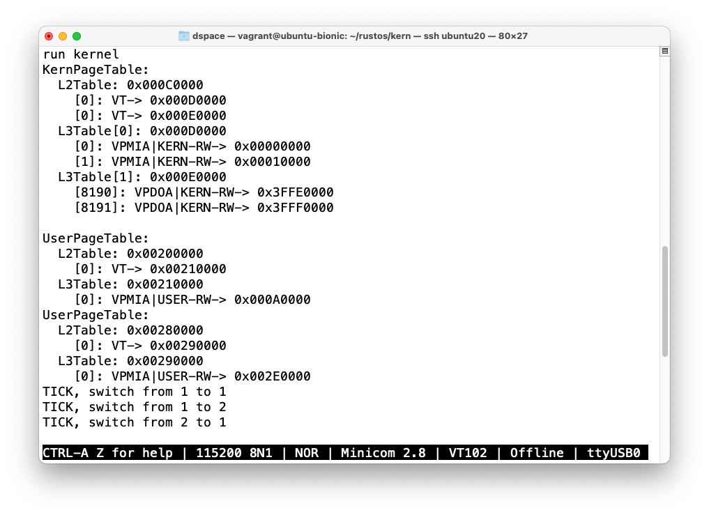

# lab4, フェーズ 4、サブフェーズ A: プログラムのロード

- `Process`構造体から`stack`フィールドを削除
   （Stack構造体はカーネル上の配列を使っているが今後はページを割り当てるため）
- `Process::new()`も不要になった
- ユーザプロセスのスタックのベースアドレスはメモリの最上位アドレスを使うが、
  `USER_IMG_BASE + USER_MAX_VM_SIZE - 1`とすると`usize`の上限を超えるので
  `USER_IMG_BASE - 1 + USER_MAX_VM_SIZE`とする。
- 新規ユーザプロセスの`tf.sp｀は`Process::get_stack_top().as_u64();`であるが
  これは仮想アドレスなので共通でも構わない。
- `FILESYSTEM.open(path)`で返されるのは`Entry`なので`File`への変換が必要

## `fs.img`の中身を確認

```bash
$ cd user
$ sudo parted fs.img unit B print
Model:  (file)
Disk /home/vagrant/rustos/user/fs.img: 128000000B
Sector size (logical/physical): 512B/512B
Partition Table: msdos
Disk Flags:

Number  Start     End         Size        Type     File system  Flags
 1      1048576B  127999999B  126951424B  primary  fat32        lba

$ sudo mount -o loop,offset=1048576,sizelimit=126951424 fs.img /mnt
$ ls -l /mnt
total 8
-rwxr-xr-x 1 root root 6957 May 22 15:48 fib
-rwxr-xr-x 1 root root   24 May 22 15:48 sleep
$ sudo umount /mnt
```

## 実行結果

```bash
./qemu.sh build/kernel.bin -drive file=/home/vagrant/rustos/user/fs.img,format=raw,if=sd
TICK, switch from 1 to 2
TICK, switch from 2 to 3
TICK, switch from 3 to 4
TICK, switch from 4 to 1
TICK, switch from 1 to 2
QEMU: Terminated
```

# lab4, フェーズ 4, サブフェーズ B: ユーザプロセス

- 「_start関数のアドレスの代わりに次のページのアドレスを計算してspレジスタに
   格納してください」の意味がよくわからなかったが以下のようにしたら動いた。

   ```rust
   let new_sp = KERN_STACK_BASE + PAGE_SIZE;
   unsafe { asm!("mov x0, $0
                  mov sp, x0"
                 :: "i"(new_sp)
                 :: "volatile"); }
   ```

- `lib/kernel_api/*`を変更したら`fs.img`を再作成するを忘れていて変更が
   反映されず時間を取られた。
- `TICK`を`10ms`に変更したが、それでも`fib(40)`は非常に時間がかかった
   (QEMUは40秒、実機で18秒かかっている)。最初の項の修正でだんまりになったと
   思って強制終了したコードもあったが、ひょっとしたら単に実行中だったのかも
   しれない。

## 実行結果

```bash
$ make qemu
+ Building build/kernel.elf [xbuild/build]
    Finished release [optimized] target(s) in 0.02s
+ Building build/kernel.bin [objcopy]
./qemu.sh build/kernel.bin -drive file=/home/vagrant/rustos/user/fs.img,format=raw,if=sd
started: 2
ststarted: 4
started: 1
arted: 3
Result[4] = 165580141
time[4]: 40131 ms
Result[2] = 165580141
time[2]: 40958 ms
Result[3] = 165580141
time[3]: 41026 ms
Result[1] = 165580141
time[1]: 41001 ms
```

## ラズパイ実機

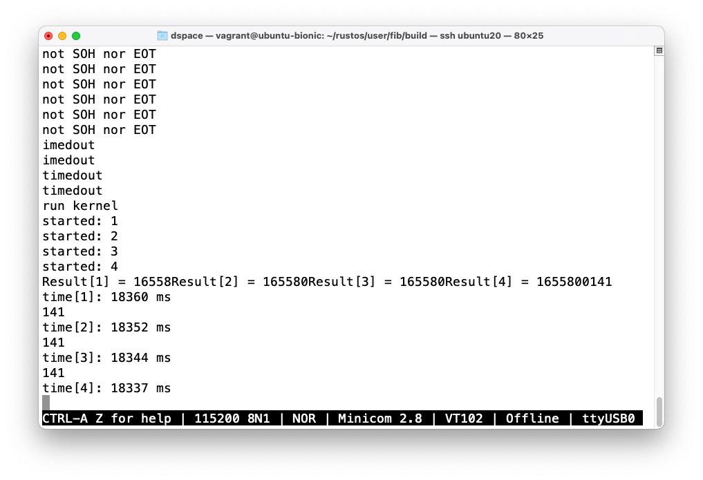

## 「_start関数のアドレスの代わりに次のページのアドレスを計算してspレジスタに格納してください」再考

- カーネルのメモリレイアウトは下のようになっている
- `KERN_STACK_BASE + PAGE_SIZE = 0x9_0000`ではカーネルコードを壊す可能性がある
- `KERN_STACK_BASE - PAGE_SIZE = 0x7_0000`とすればATAGの後ろにはスペースがある
   ので問題なさそう
- 実際、エラーなく実行できたのでとりあえずこれでいく

```bash
0x0000_0000_0000_0000 -----------------

0x0000_0000_0000_0100 -----------------
                         ATAG
0x0000_0000_0007_0000 ----------------- new_sp
     64KB (1 page)
0x0000_0000_0008_0000 ----------------- _start
                         カーネル
0x0000_0000_0009_0000                   <- コードの途中
            (0x9_5c2c)                  現在のカーネルコードの末尾
                         .data, .bss
0x0000_0000_0400_0000 -----------------
                         ローダ
```

# Lab 5: マージ作業

- 割り込み関係が大きく変わり、マージコンフリクトの解消だけでなく
  変更点の修正も必要だった。

## マージ後の実行出力

```bash
./qemu.sh build/kernel.bin -drive file=/home/vagrant/rustos/user/fs.img,format=raw,if=sd
[INFO] text beg: 0000000000080000, end: 000000000009a418
[INFO] bss  beg: 000000000009a3e0, end: 000000000009a418
started: 1
started: 2
started: 3
started: 4
Result[1] = 165580141
time[1]: 34067 ms
Result[3] = 165580141
time[3]: 31947 ms
Result[2] = 165580141
time[2]: 36326 ms
Result[4] = 165580141
time[4]: 33604 ms
```

# Lab 5, フェース 1: マルチコアの有効化, サブフェース A: 他のコアを起床させる

- `SPINNING_BASE`は`*mut usize`型で加算は`add()`を使う。`+`では型が合わないエラーが頻出。足すのはusizeバイト単位（バイト数ではない）
- 物理アドレスの読み書きは`write_volatile()`, `read_volatile()`を使う
- SP変数というのは`aarch64::SP`のことのようだ
- 特殊レジスタの読み書きは`レジスタ名.get_value(フィールド名)`を使える

```rust
pub unsafe fn initialize_app_cores() {
    for core in 1..NCORES {
        let spinning = SPINNING_BASE.add(core);
        spinning.write_volatile(start2 as usize);
    }
...
pub unsafe extern "C" fn start2() -> ! {
    let core = MPIDR_EL1.get_value(MPIDR_EL1::Aff0);
    let stack =  KERN_STACK_BASE - KERN_STACK_SIZE * core as usize;
    asm!("mov sp, $0"
         :: "r"(stack) :: "volatile");
```

## 実行画面

```bash
$ make qemu
./qemu.sh build/kernel.bin -drive file=/home/vagrant/rustos/user/fs.img,format=raw,if=sd
[INFO] text beg: 0000000000080000, end: 000000000009a878
[INFO] bss  beg: 000000000009a840, end: 000000000009a878
[INFO] core 1 started
[INFO] core 3 started
[INFO] core 2 started
started: 1
started: 2
started: 3
started: 4
Result[3] = 165580141
Result[4] = 165580141
time[4]: 34168 ms
Result[1] = 165580141
time[1]: 40474 ms
Result[2] = 165580141
time[2]: 38438 ms
time[3]: 36414 ms
```
# Lab 5, フェース 1: マルチコアの有効化, サブフェース B: Mutex再び

## 実行結果

```bash
# プロセスを4個実行

./qemu.sh build/kernel.bin -drive file=/home/vagrant/rustos/user/fs.img,format=raw,if=sd
[INFO] text beg: 0000000000080000, end: 000000000009bd38
[INFO] bss  beg: 000000000009bd00, end: 000000000009bd38
[INFO] MMU is ready for core-1/@sp=000000000006ff20
[INFO] MMU is ready for core-3/@sp=000000000004ff20
[INFO] MMU is ready for core-2/@sp=000000000005ff20
[INFO] MMU is ready for core-0/@sp=000000000007fef0
[INFO] core 1 started
[01] Started: 107.556ms
[01] Ended: 116.342ms
[INFO] core 2 started
[01] fib(20) = 10946 (8.786ms)
[02] Started: 128.912ms
[02] Ended: 135.614ms
[02] fib(20) = 10946 (6.702ms)
[03] Started: 139.732ms
[03] Ended: 163.219ms
[03] fib(20) = 10946 (23.487ms)
[04] Started: 169.768ms
[04] Ended: 176.984ms
[04] fib(20) = 10946 (7.216ms)
[INFO] core 3 started
QEMU: Terminated

# プロセスを10個実行

./qemu.sh build/kernel.bin -drive file=/home/vagrant/rustos/user/fs.img,format=raw,if=sd
[INFO] text beg: 0000000000080000, end: 000000000009bd38
[INFO] bss  beg: 000000000009bd00, end: 000000000009bd38
[INFO] MMU is ready for core-3/@sp=000000000004ff20
[INFO] MMU is ready for core-2/@sp=000000000005ff20
[INFO] MMU is ready for core-1/@sp=000000000006ff20
[INFO] MMU is ready for core-0/@sp=000000000007fef0
[INFO] core 1 started
[INFO] core 2 started
[INFO] core 3 started
[01] Started: 106.457ms
[01] Ended: 149.365ms
[01] fib(20) = 10946 (42.908ms)
[02] Started: 174.265ms
[02] Ended: 180.81ms
[02] fib(20) = 10946 (6.545ms)
[03] Started: 206.638ms
[03] Ended: 217.626ms
[03] fib(20) = 10946 (10.988ms)
[04] Started: 238.181ms
[04] Ended: 243.737ms
[04] fib(20) = 10946 (5.556ms)
[05] Started: 265.501ms
[05] Ended: 278.421ms
[05] fib(20) = 10946 (12.92ms)
[06] Started: 305.476ms
[06] Ended: 318.059ms
[06] fib(20) = 10946 (12.583ms)
[07] Started: 340.241ms
[07] Ended: 346.752ms
[07] fib(20) = 10946 (6.511ms)
[08] Started: 378.064ms
[08] Ended: 386.479ms
[08] fib(20) = 10946 (8.415ms)
[09] Started: 402.061ms
[09] Ended: 425.474ms
[09] fib(20) = 10946 (23.413ms)
[10] Started: 437.057ms
[10] Ended: 449.415ms
[10] fib(20) = 10946 (12.358ms)
QEMU: Terminated
```

## `TICK`を10ミリ秒するとエラー発生

- 2秒や100ミリ秒では発生せず

```bash
[INFO] text beg: 0000000000080000, end: 000000000009bd38
[INFO] bss  beg: 000000000009bd00, end: 000000000009bd38
[INFO] MMU is ready for core-3/@sp=000000000004ff20
[INFO] MMU is ready for core-1/@sp=000000000006ff20
[INFO] MMU is ready for core-2/@sp=000000000005ff20
[INFO] MMU is ready for core-0/@sp=000000000007fef0
[INFO] core 3 started
[01] Started: 139.798[INFO] core 1 started
            (
       (      )     )
         )   (    (
        (          `
    .-""^"""^""^"""^""-.
  (//\\//\\//\\//\\//\\//)
   ~\^^^^^^^^^^^^^^^^^^/~
     `================`

    The pi is overdone.

---------- PANIC ----------

FILE: src/traps.rs
LINE: 64
COL: 22

Unexpected syndrome: InstructionAbort { kind: Translation, level: 2 }
info: Info { source: CurrentSpElx, kind: Synchronous }
esr : 0x86000006
far : 0x0000000060000340      # <= カーネルメモリ外 (0x80000340のこともあり)
tf:
  ELR   : 0x60000340          # <= このELRが
  SPSR  : 0x800003C5
  SP    : 0xFFFFFFFFFFFFFDB0
  TPIDR : 1
  TTBR0 : 0x000C0000
  TTBR1 : 0x00100000
  x0    : 0x00000002
  x1    : 0x00000000
  x7    : 0x00000001
  x30   : 0x60000340          # <= ここに設定され、復帰時にメモリ外で翻訳エラー

[INFO] core 2 started
```

# Lab 5, Phase 1, SubPhase C

```bash
./qemu.sh build/kernel.bin -drive file=/home/vagrant/rustos/user/fs.img,format=raw,if=sd
[INFO] text beg: 0000000000080000, end: 000000000009caf8
[INFO] bss  beg: 000000000009cac0, end: 000000000009caf8
[INFO] MMU is ready for core-3/@sp=000000000004ff20
[INFO] MMU is ready for core-1/@sp=000000000006ff20
[INFO] MMU is ready for core-2/@sp=000000000005ff20
[INFO] MMU is ready for core-0/@sp=000000000007fef0
[INFO] core 2 started
[INFO] core 1 started
[INFO] core 3 started
[DEBUG] invoke 1
[DEBUG] invoke 1
[DEBUG] invoke 1
[[02] Started: [03] Started: 188.[DEBUG] invoke 1
[DEBUG] invoke 1
[DEBUG] invoke 1
0[DEBUG] invoke 1
[[03] Started: 2030.4331ms] Started: [04
+205.            (
[       (      )     )
0         )   (    (
        (          `
[DEBUG] invoke 1
    .-""^"""^""^"""^""-.
[  (//\\//\\//\\//\\//\\//)
   ~\^^^^^^^^^^^^^^^^^^/~
0     `================`
1
    The pi is overdone.
] Started:
---------- PANIC ----------

[[DEBUG] invoke 1

[DEBUG] invoke 1
FILE: src/traps.rs
[DEBUG] invoke 1
237ms
LINE: 65
[0COL: 22
2
] Ended: 260.957ms
[02] fib(20) = Unexpected syndrome: DataAbort { kind: Permission, level: 3 }
info: Info { source: LowerAArch64, kind: Synchronous }
esr : 0x9200000F
far : 0x000000000000002A
tf:
  ELR   : 0xFFFFFFFFC0001370
  SPSR  : 0x20000340
  SP    : 0xFFFFFFFFFFFFFC70
  TPIDR : 4
  TTBR0 : 0x000C0000
  TTBR1 : 0x00240000
  x0    : 0x00000000
  x1    : 0x00000002
  x7    : 0x00000001
  x30   : 0xFFFFFFFFC00014A4

957[[DEBUG] invoke 1
04] Started: 217.436ms[DEBUG] invoke 1

[0410946[DEBUG] invoke 1
04] Started: 10946
[0[DEBUG] invoke 1
3[DEBUG] invoke 1
[DEBUG] invoke 1

[03] fib(20) = 10946 (86.533ms)
01] Started: 247.88ms
[DEBUG] invoke 1
            (
       (      )     )
         )   (    (
        (          `
    .-""^"""^""^"""^""-.
  (//\\//\\//\\//\\//\\//)
   ~\^^^^^^^^^^^^^^^^^^/~
     `================`

    The pi is overdone.

---------- PANIC ----------

FILE: src/traps.rs
LINE: 65
COL: 22

Unexpected syndrome: DataAbort { kind: Permission, level: 3 }
info: Info { source: LowerAArch64, kind: Synchronous }
esr : 0x9200000F
far : 0x0000000000000009
tf:
  ELR   : 0xFFFFFFFFC0001474
  SPSR  : 0x00000340
  SP    : 0xFFFFFFFFFFFFFE00
  TPIDR : 1
  TTBR0 : 0x000C0000
  TTBR1 : 0x00100000
  x0    : 0x00000000
  x1    : 0x00000000
  x7    : 0x00000001
  x30   : 0xFFFFFFFFC00012EC

            (
       (      )     )
         )   (    (
        (          `
    .-""^"""^""^"""^""-.
  (//\\//\\//\\//\\//\\//)
   ~\^^^^^^^^^^^^^^^^^^/~
     `================`

    The pi is overdone.

[DEBUG] invoke 1
---------- PANIC ----------
 (
FILE: src/traps.rs
LINE: 65
COL: 22
72.72ms
)
Unexpected syndrome: DataAbort { kind: Permission, level: 3 }
info: Info { source: LowerAArch64, kind: Synchronous }
esr : 0x9200000F
far : 0x0000000000000009
tf:
  ELR   : 0xFFFFFFFFC0001474
  SPSR  : 0x00000340
  SP    : 0xFFFFFFFFFFFFFE00
  TPIDR : 1
  TTBR0 : 0x000C0000
  TTBR1 : 0x00100000
  x0    : 0x00000000
  x1    : 0x00000000
  x7    : 0x00000001
  x30   : 0xFFFFFFFFC00012EC

[[DEBUG] invoke 1
01] Ended: 328.402ms
[01] fib(20) = 10946 (80.522ms)
```

## プロセス1個で実行

```bash
./qemu.sh build/kernel.bin -drive file=/home/vagrant/rustos/user/fs.img,format=raw,if=sd
[INFO] text beg: 0000000000080000, end: 000000000009c0f8
[INFO] bss  beg: 000000000009c0c0, end: 000000000009c0f8
[INFO] MMU is ready for core-1/@sp=000000000006ff20
[INFO] MMU is ready for core-2/@sp=000000000005ff20
[INFO] MMU is ready for core-3/@sp=000000000004ff20
[INFO] MMU is ready for core-0/@sp=000000000007fef0
[INFO] core 1 started
[INFO] core 2 started
[INFO] core 3 started
[TRACE] [1] tick
[TRACE] [3] tick
[TRACE] [core-3] switch_to 1, pc: ffffffffc0000000, lr: 0, x29: 0, x28: 0, x27: 50000 (= core3のsp)
[TRACE] [core-1] switch_to 1, pc: ffffffffc0000584, lr: ffffffffc00000a8, x29: 0, x28: 0, x27: 70000 (= core1のsp)   # core3で処理済みのプロセスをcore1でも実行しようとしている
[TRACE] [0] tick
[TRACE] [core-0] switch_to 1, pc: ffffffffc0000584, lr: ffffffffc00000a8, x29: 0, x28: 0, x27: 80000 (= core0のsp)   # core3で処理済みのプロセスをcore0でも実行しようとしている
PID [1] fib(20) = 10946 (666µs)
[TRACE] [0]: kill pid=1
[TRACE] [2] tick
PID [[TRACE] [3] tick
[TRACE] [1] tick
```

## 原因判明

- scheduler::switch_to()で実行すべきプロセスの状態を誤って`State::Ready`に
   していたため、1つのプロセスを複数のコアが処理していた。
- `State::Running`に変更したことでパニックは発生しなくなった。
- プロセスの出力は混ざるのでmutexは依然として正しくない模様

```bash
./qemu.sh build/kernel.bin -drive file=/home/vagrant/rustos/user/fs.img,format=raw,if=sd
[INFO] text beg: 0000000000080000, end: 000000000009caf8
[INFO] bss  beg: 000000000009cac0, end: 000000000009caf8
[INFO] MMU is ready for core-2/@sp=000000000005ff20
[INFO] MMU is ready for core-3/@sp=000000000004ff20
[INFO] MMU is ready for core-1/@sp=000000000006ff20
[INFO] MMU is ready for core-0/@sp=000000000007fef0
[INFO] core 1 started
PID [1] fib(20) = PID [109462] fib(20) = 10946 (839µs)   # PID [1] fib(20) = 10946 (478µs)
 (478µs)                                                 # PID [2] fib(20) = 10946 (839µs)
PID [PID [34] fib(20) = 10946 (404µs)                    # PID [4] fib(20) = 10946 (404µs)
[INFO] core 2 started
] fib(20) = [INFO] core 3 started                        # [INFO] core 3 started
10946 (396µs)                                            # PID [3] fib(20) = 10946 (396µs)
QEMU: Terminated
```

## コア1つで実行

```bash
./qemu.sh build/kernel.bin -drive file=/home/vagrant/rustos/user/fs.img,format=raw,if=sd
[INFO] text beg: 0000000000080000, end: 000000000009caf8
[INFO] bss  beg: 000000000009cac0, end: 000000000009caf8
[INFO] MMU is ready for core-0/@sp=000000000007fef0
PID [2] fib(20) = 10946 (407µs)
PID [1] fib(20) = 10946 (421µs)
PID [3] fib(20) = 10946 (765µs)
PID [4] fib(20) = 10946 (761µs)
QEMU: Terminated
```

# lab5, フェーズ1が実機で動かない

## 6/5時点の知見

- 実機が動かなくなったのはlab5, phase1, subphase Bから
- QEMUではTICKを10ミリ秒にするとエラーが発生する
- lab5のmergeもれはなかった

## mutex周りの問題だった模様だが詳細は不明

- フェーズ1、サブフェーズA

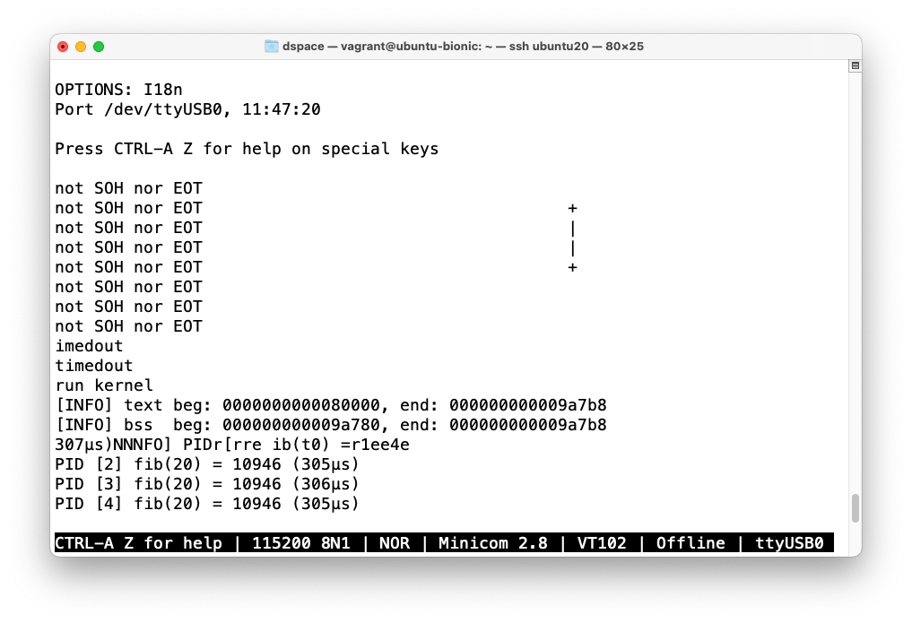

- フェーズ1、サブフェーズB

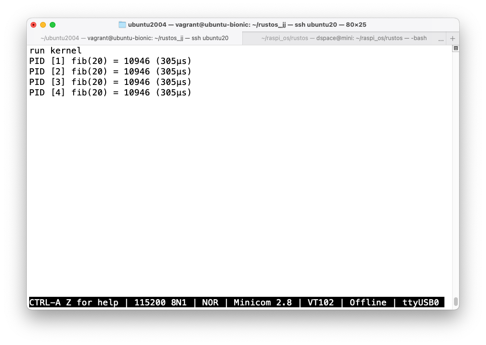

- フェーズ1、サブフェーズC コア1つ

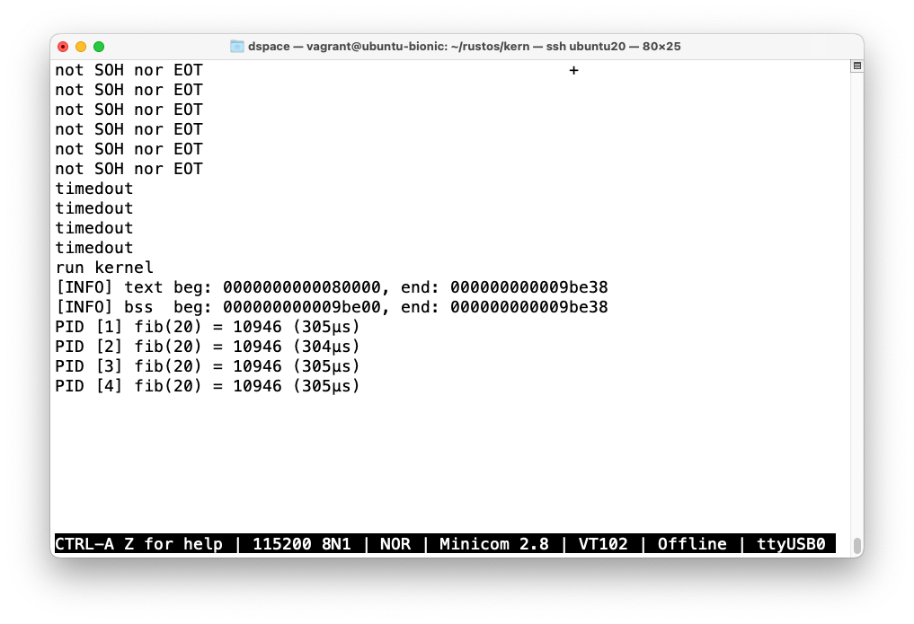

- フェーズ1、サブフェーズC コア4つ

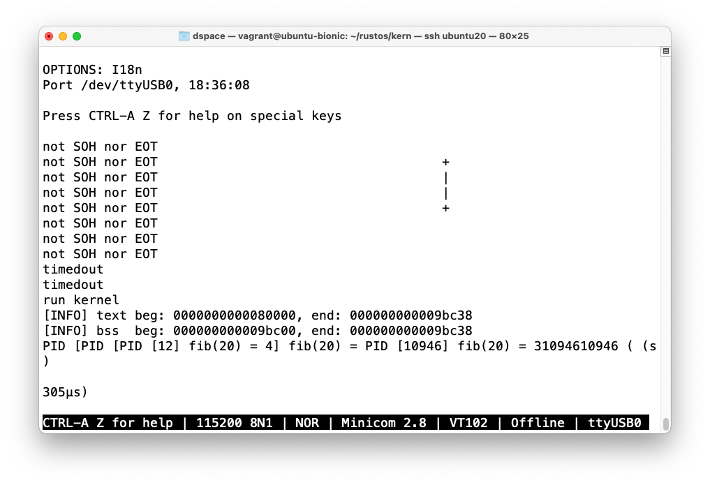

- フェーズ1、サブフェーズC 別プログラム4つ

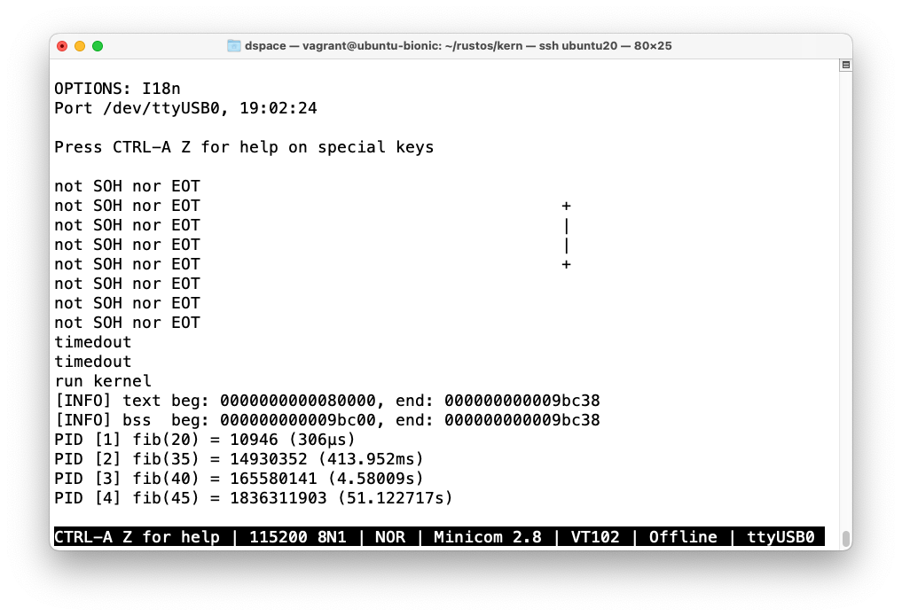
